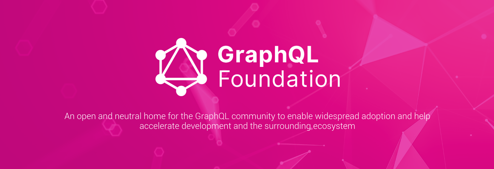
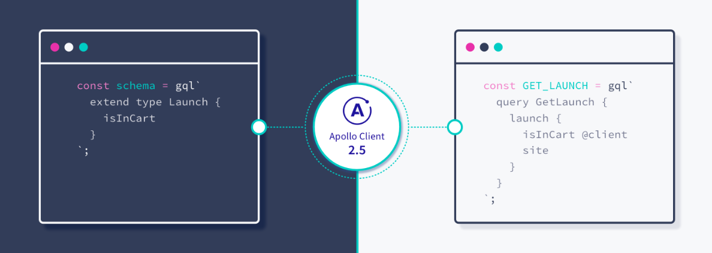
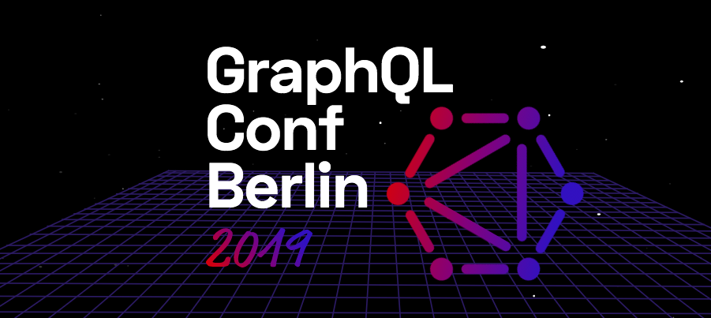
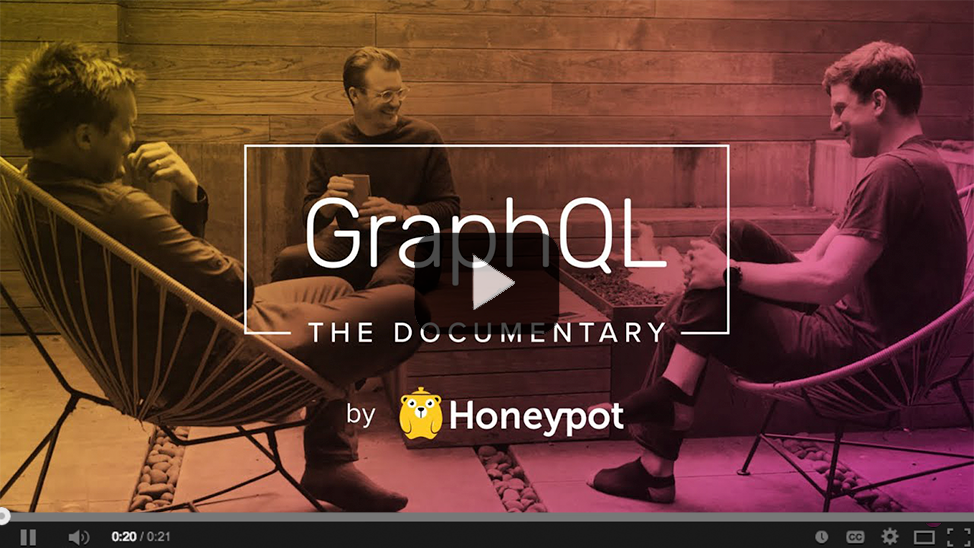
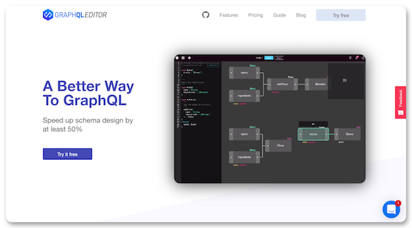

The [npm Inc. was right](https://blog.graphqleditor.com/javascript-predictions-for-2019-by-npm/), 2019 was a great year for GraphQL.
Let's take a look at the all good things that happened for GraphQL in 2019.

## January

**[GraphQL Inspector](https://github.com/kamilkisiela/graphql-inspector)** - a tool published by Kamil Kisiela, that detects changes, similar or duplicated types, validates documents against a schema and looks for deprecated usage.

## March

**[AWS](https://aws.amazon.com/blogs/opensource/aws-joins-the-graphql-foundation/
) & [IBM](https://developer.ibm.com/blogs/ibm-joins-the-graphql-foundation-to-push-for-open-source-adoption/) joins the GraphQL Foundation!** -  GraphQL Foundation is the GraphQL community aiming to enable widespread  GraphQL adoption. AWS & IBM joining it is a strong signal that GraphQL has a bright future.

**[Apollo Client 2.5 was launched](https://blog.apollographql.com/announcing-apollo-client-2-5-c12230cabbb7)** - a new version of Apollo Client was launched which merges local state management into the core library which has enabled a lot of cool features.

## June 

**[Postman v7.2 Supports GraphQL](https://blog.getpostman.com/2019/06/18/postman-v7-2-supports-graphql/)** - Postman joined the group of companies acknowledging the GraphQL qualities and has recently announced the support for GraphQL in their service. The latest release of Postman v7.2 enabled sending GraphQL queries in the request body, GraphQL variables & GraphQL query autocompletion.

**[Apollo Raises $22 Million](https://blog.apollographql.com/apollo-raises-22-million-to-simplify-app-development-ee30502c81b3)** - Apollo raised a nice amount of $22 million to continue its mission to give a GraphQL-based data graph to every app developer in the world

**[GraphQL Conf Berlin](https://www.graphqlconf.org/)** - GraphQL Conf is a non-profit GraphQL conference organized by Prisma and Honeypot where industry experts from all around the world present GraphQL best practices and many more. In case you missed it, talks from GraphQL Conf 2019 are available on [Prisma's YouTube channel](https://www.youtube.com/playlist?list=PLn2e1F9Rfr6kChXoURShhO3A-4r8FLYsO)!

**GraphQL: The Documentary** - the story of why and how GraphQL came to be and the impact it's having on big tech companies worldwide, including Facebook, Twitter, Airbnb & Github.

## July

**[Dgraph raises $11.5 million](https://blog.dgraph.io/post/how-dgraph-labs-raised-series-a/)** - Dgraph is a horizontally scalable and distributed graph database, with a goal to provide enterprise-level scale and throughput, with low enough latency to be serving real-time user queries. Dgraph supports GraphQL-like query syntax, responds in JSON and Protocol Buffers over GRPC and HTTP.

## August

**[Apollo Client supports React Hooks](https://blog.apollographql.com/apollo-client-now-with-react-hooks-676d116eeae2)** - React 16.8 introduced a new way to write stateful components while avoiding the pitfalls of classes - the Hooks. Apollo Client now includes three hooks that you can implement in your app where corresponding higher-order component being used or render prop component: `useQuery`, `useMutation` &`useSubscription`.

## October

**[Apollo Client 3 Beta](https://blog.apollographql.com/previewing-the-apollo-client-3-cache-565fadd6a01e)** - Caching is considered by many developers as one of the GraphQL weaknesses. The Apollo team is on a mission to change that. New released Apollo Client 3 Beta contains some serious cache improvements.

**[Graphql Editor 2.0](https://blog.graphqleditor.com/graphql-editor-new-release/)** - a new version of GraphQL Editor packed with many micro-features to help developers save a lot of time & effort creating their GraphQL based APIs.

**[GraphQL Summit 2019](https://summit.graphql.com/)** - GraphQL Summit is event of the year in GraphQL world. It's a world's largest conference dedicated to GraphQL, this year's edition featured over 60 technical talks across 3 tracks. Conference recordings are available at [Apollo's GraphQL YouTube channel](https://www.youtube.com/watch?v=EDqw-sGVq3k&list=PLpi1lPB6opQyraZSmwFre_FpL00_3nTzV).
