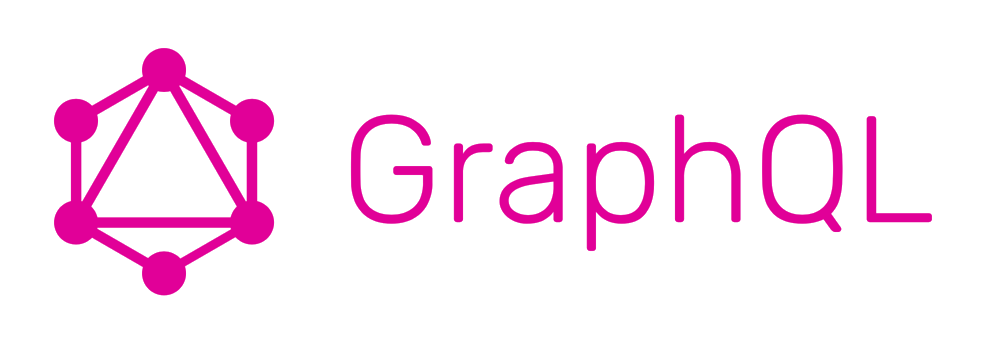

GraphQL is a query language for APIs and a runtime for fulfilling these queries with your existing data. The technology makes it possible for clients to request data that they exactly need, nothing more. GraphQL queries not only have access to the properties of a single source but also easily track references between them. While typical REST APIs require loading from multiple URLs, GraphQL APIs get all the data your app needs in a single request, making applications using GraphQL a lot faster, even on mobile network connections.

As you already know [npm Inc.](https://www.npmjs.com/) claims that the [GraphQL is going to be a tech force to reckon in 2019](https://blog.graphqleditor.com/javascript-predictions-for-2019-by-npm/). There is no better way to start your journey with GraphQL than use the most popular client library which is [Apollo GraphQL](https://www.apollographql.com/).

## What’s Apollo GraphQL?

Apollo is an implementation of GraphQL created to address the specific needs of modern development teams building data-driven applications. It adopts an agile, scalable approach that takes extra care not to modify existing APIs and services. The library puts an emphasis on tooling and workflows. The Apollo GraphQL platform is a stack of open source components, commercial extensions, and cloud services.

Source: [Apollo Docs](https://www.apollographql.com/docs/)

## Most of the core components are open source

Apollo is an open source company, focused on what developers really need, and with a clear mission which is providing a better GraphQL experience for everyone. The collaboration of hundreds of developers working on Apollo Client, Apollo Server, as well as other components of the Apollo platform, makes it an industry-leading solution for GraphQL implementations.

Source: [Apollo](https://www.apollographql.com/)

[Apollo Server](https://github.com/apollographql/apollo-server) is a JavaScript GraphQL server for defining a schema and a set of resolvers that implement each part of that schema. An Apollo Server is extensible which means plugins can hook into each stage of the request pipeline. This is a great feature that allows implementing custom behaviors as add-on packages. Apollo Server works with any GraphQL schema built with GraphQL.js, serverless environments such as AWS Lambda and is open source and community-maintained.

[Apollo Client](https://github.com/apollographql/apollo-client) is a full-featured GraphQL client that manages data and state in your app. It enables a declarative programming style that allows developers to define queries as part of UI components while the client manages all query binding, manages consistency, caching, and much more.  Apollo Client includes integrations with the most popular View lawyers such as React, React Native or Vue.

[Apollo iOS](https://github.com/apollographql/apollo-ios) is a strongly-typed GraphQL caching client for iOS written in Swift. It allows the execution of queries and mutations on a GraphQL server and returns the results as query-specific Swift types. This means that you do not have to deal with parsing JSON or making the client to cast values to the right type manually. Model types are generated from the GraphQL definitions your application's UI.

[Apollo Android](https://github.com/apollographql/apollo-android) is a GraphQL client for generating Java models from GraphQL queries, giving you a typesafe API to work with your GraphQL servers. Although it’s designed mainly for Android, you can use it in any Java/Kotlin app.

[Apollo CLI](https://github.com/apollographql/apollo-tooling) is a simple command line client that merges your GraphQL clients and servers with features such as validation of your GraphQL schema, securing compatibility of your server operations, or generating static types for client-side type security.

## A solution for development teams

GraphQL is all about collaboration. Development teams that work collaboratively on their GraphQL API achieve the best results. To facilitate this collaboration Apollo team created some useful solutions such as:

- Schema Registry - a registry for GraphQL schemas that functions as a central source of truth for a schema, enriched with additional metadata such as field-level usage statistics.

- Client registry — a registry to track each known schema user, both pre-registered and ad-hoc consumers.

- Operation registry — a registry of all the known operations against the schema

- Trace warehouse — a data pipeline that stores a detailed log of every operation performed against your schema. All these registries work collectively to give your development team a good understanding of the API.

- Safelisting - locking your API down to trusted, pre-registered operations. Apollo CLI extracts all the queries from a client codebase and stores it in the operation registry. Separately, an Apollo Server plugin synchronizes the list of pre-registered operations to the server, which then rejects queries that aren’t present in its local copy.

- Schema validation - which tests a proposed schema against the known set of operations observed in production, returning a list of affected clients for each breaking change.

- GraphQL Gateway - a configuration of Apollo Server, along with some add-ons that functions as a GraphQL Gateway. The gateway composes separately deployed “micro-schemas” that reference each other into a single master schema, which looks to a client just like any regular GraphQL schema. To answer queries, the gateway builds a query plan, fetches data from each upstream GraphQL service, and assembles it all back together into a single result. 

