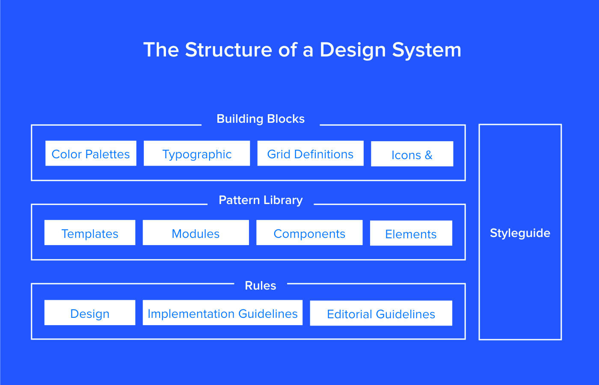
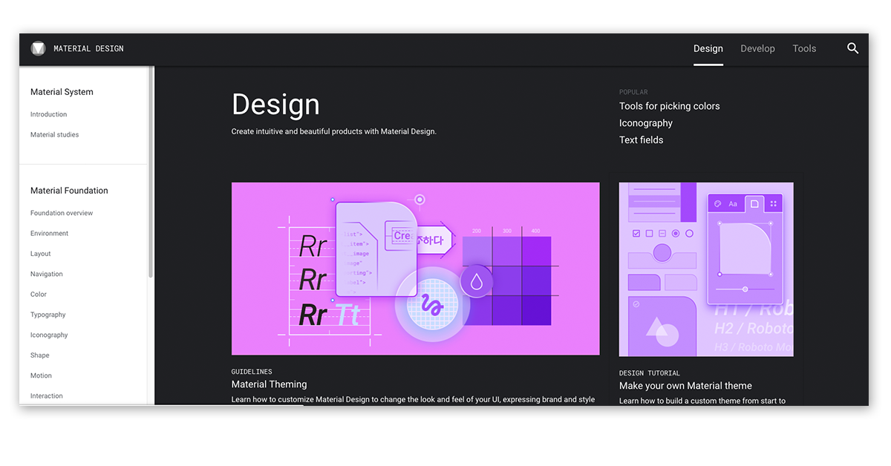
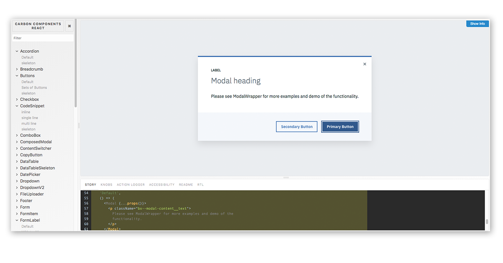
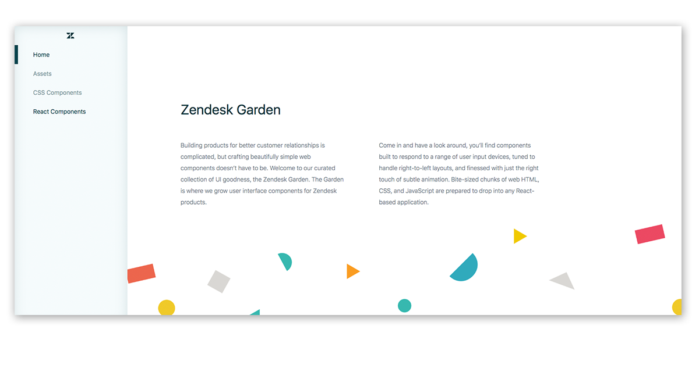
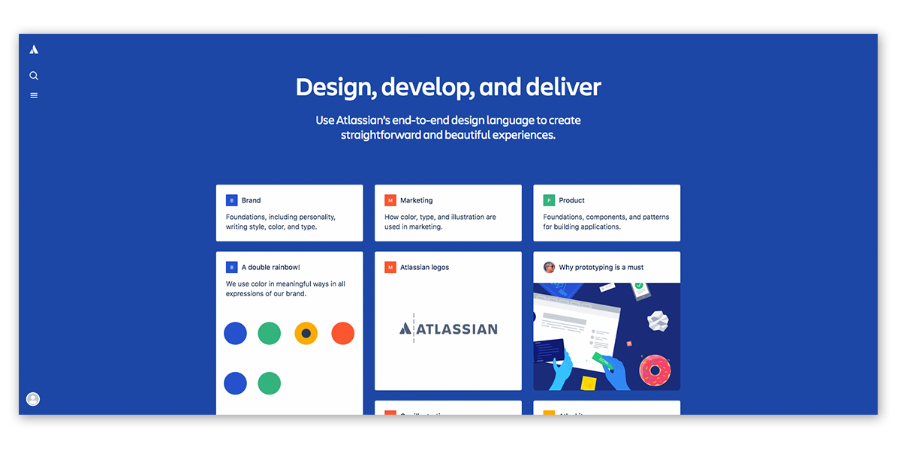
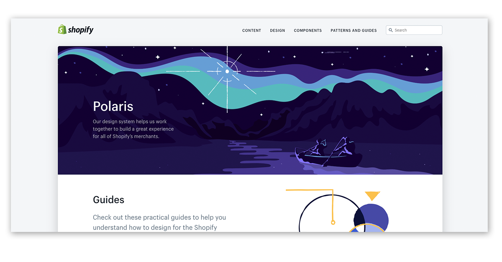

Looking for a way of improving your design-development workflow? You need a design system! Why? Because it will help you work better, much faster & will take your team collaboration to the next level! 

Design system is a very popular concept, arousing a lot of emotions and interest recently ...  even the government of United States of America has one they call [U.S. Web Design System](https://designsystem.digital.gov/).

### What's Design System

A design system is a collection of reusable graphical components, design standards, style guides, which define **a common visual language** for product teams. It accelerates the design process and bridges the gap between teams involved in building a final product by having clear graphics standards, that makes assembling websites from components super easy. So basically the design system is a rulebook for graphical and development teams which we can breakdown like that:

- **Design System** – the complete set of design standards along with principles, patterns & code components to achieve them,

- **Pattern Library** – a subclass of a design system which defines allowed design patterns,

- **Style guide** – a subclass showing how products should look, containing use cases for UI patterns, typography etc.

Source: [Zack Rutherford for Studio by UXPin](https://www.uxpin.com/studio/blog/design-systems-vs-pattern-libraries-vs-style-guides-whats-difference/)

### The benefits

Design systems provide consistency in designing new elements of your company or product visual identification. Design system creates straightforward and beautiful experiences for end-user as well as product team makes collaboration a lot easier for:

- **designers** as they can breakdown the design-process into smaller parts, easier to work on, manage, change than the whole webpage, 

- **developers** so they clear vision of how to build required components to maintain the unified styles,

- **product owners/managers** as component-based approach makes requesting development teams for additional page elements a super easy process

### Examples
You have all probably heard about the famous **[Material Design](https://material.io/)** by Google:

but that's not the only one you can draw inspiration from as big companies like IBM, Audi or Atlassian make their design system publicly available. Here you can take a look at a couple of them:

**[Carbon React Components by IBM](http://react.carbondesignsystem.com/)**

**[Zendesk Garden](https://garden.zendesk.com/)**

**[Atlassian Design System](https://atlassian.design/)**

**[Polaris by Shopify](https://polaris.shopify.com/)**

### Looking for more?

Make sure to visit https://designsystemsrepo.com/design-systems/ for more samples & inspirations!

