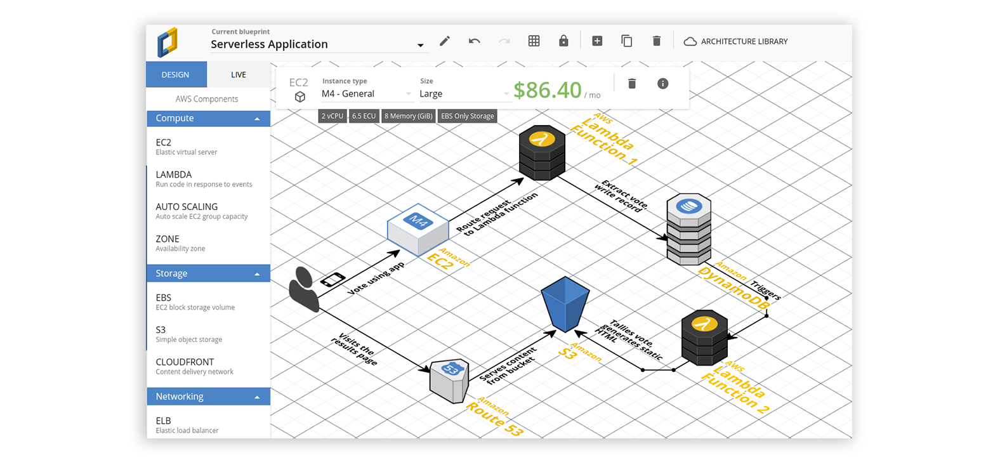
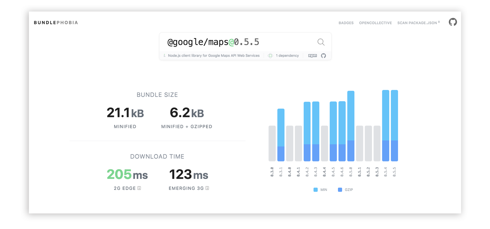
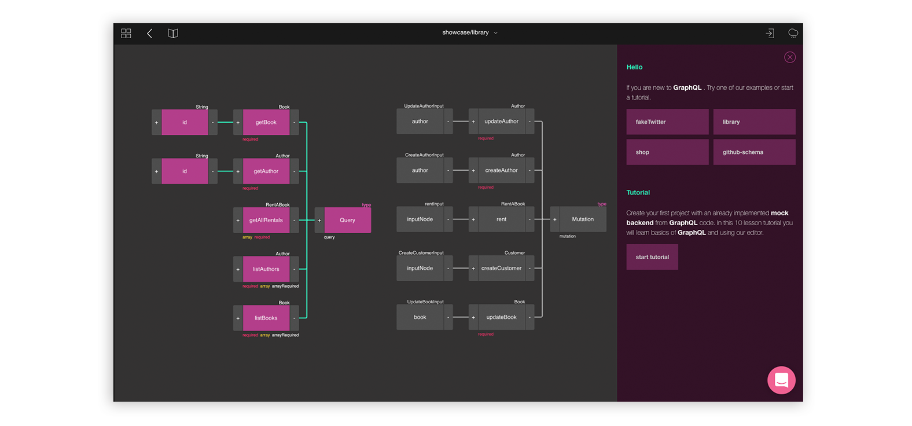
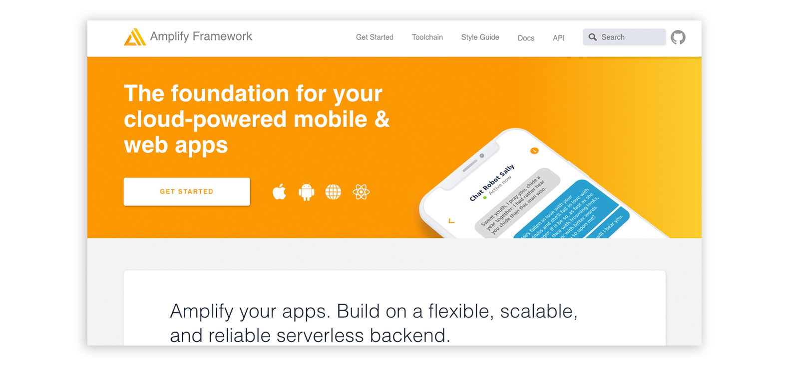
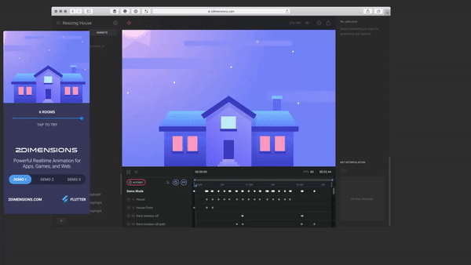

One of the things that differentiate an average developer from a good one is the constant urge for learning and adopting new tools that can simplify one's life. Here is a list of five developer tools that can facilitate your life :)

### [CloudCraft](https://cloudcraft.co/)
**CloudCraft** is a fancy tool allowing you to design your cloud architecture in no time. This tool allows you to build a smart **AWS diagram** and calculate the cost of the services. Isn't that cool?

### [BundlePhobia](https://bundlephobia.com)
> #### **bundle phobia**
> /ˈbʌnd(ə)l fəʊbɪə/
> 
> an irrational fear of possible consequences of adding new npm package to your bundle.

If you live in a constant fear that adding a npm package to your project will destroy it, this is a tool for you. **BundlePhobia** lets you understand the performance cost of `npm install`ing any package before actually adding it to your project.

### [GraphQL Editor](https://graphqleditor.com/)

GraphQL is a query language for APIs, it shows types of data provided by the server and then the client can fetch exactly what it needs in one call rather than making multiple REST API calls. The schema is a crucial part of any GraphQL project and **GraphQL Editor** makes building or understanding existing GraphQL schema a lot easier as you can plan it by linking visual nodes. Features like loading schema from URL/file or a fake backend data can speed up the prototyping of your app by a lot!

### [Amplify Framework](https://aws-amplify.github.io/)

Want to build a cloud base app? This is the only tool you need! **Amplify Framework by AWS** is a library for building fully-featured apps! The framework allows you to easily connect micro-services for:
- *API*
- *Analytics*
- *Authentication*
- *Notifications*
- *Storage* 

and many more with just a few lines of code! The Amplify also offers a vast range of beautiful out-of-the-box **UI components** ready to take your app to the next level!

### [Flare](https://www.2dimensions.com/about-flare)

*Flare* is a powerful design and animation tool, which allows designers and developers to easily add high-quality animation to their apps and games. With Flare you can create:

- *sophisticated interactions* 
- *animated icons*
- *onboarding screens*
- *game characters*

These are real design assets that run in your app - they don't need to be recreated in code! This makes future modifications super easy!

