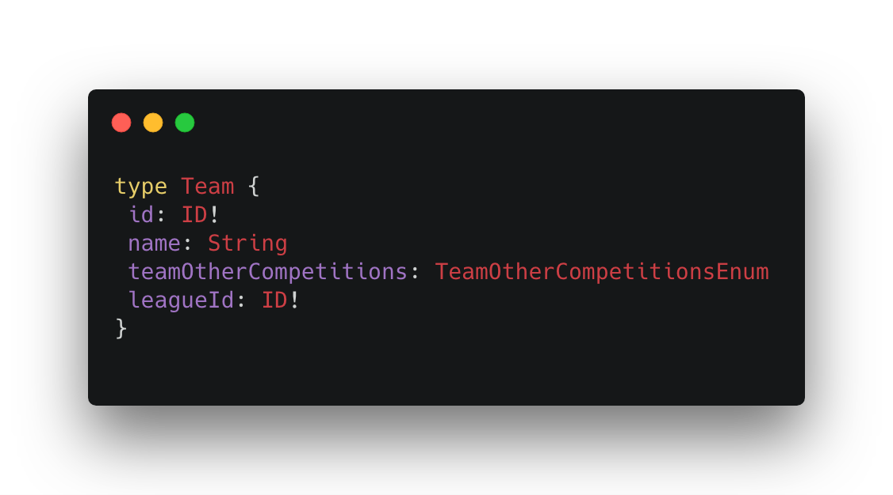
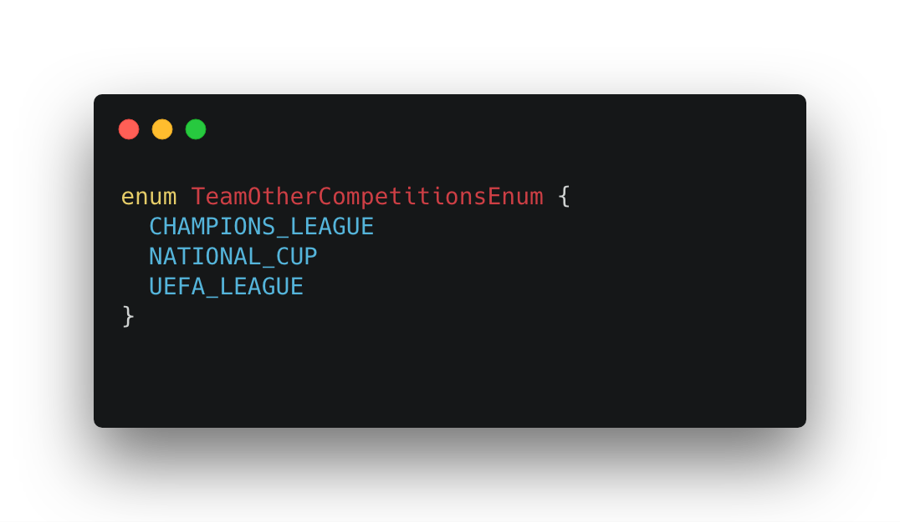
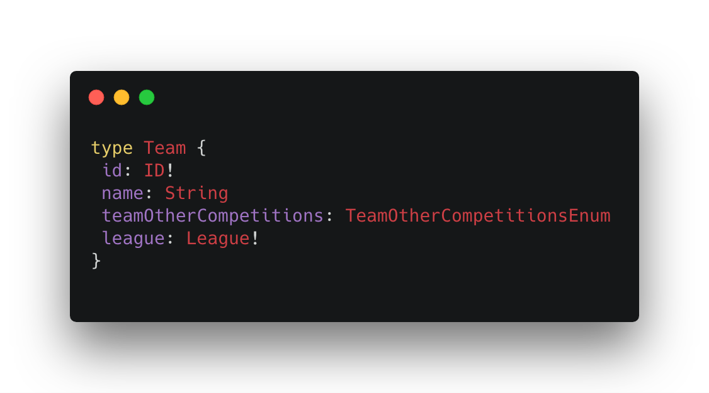
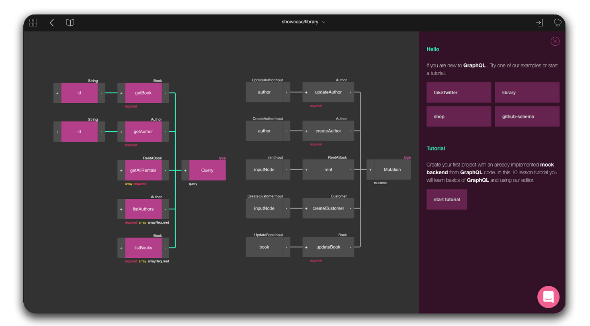

## Being short-sighted
It’s a mistake that can lead to serious complications later on. Thinking about your schema try being as predictive as possible in terms what can be required later on when your project grow. Even if you think that initial odds of this happening seems very low, take a while to plan through possible future elements like additional fields or output/input object types. If there is even a tiny changes that you will need them in the future, having them thought through will prevent your project from breaking changes later on.

> Remember: A schema is a most important part of any [GraphQL](https://graphql.org/) project so make sure to treat it with all due respect!

## Inconsistency in naming

It's really important to keep naming conventions consistent. There are some common practices you shouldn't ignore, like:

- using [camelCase](https://en.wikipedia.org/wiki/Camel_case) for fields
- using [PascalCase](https://en.wikipedia.org/wiki/Camel_case) for the names of types

- using all capital letters for ENUM values

## Flattening objects in queries

There are a lot of mistakes you can make when "speaking" GraphQL. Not only mistakes that might prevent your project form working properly, but also that they won't use GraphQL possibilities to the fullest. A good example is a type we have created above.

The `leageId` is a problem here as this will be seen as an inconsistency. When querying for a team’s league you need to perform two database calls:
- to get the team with the `leagueId`
- to pass the `leagueId` to another query

This is very negligent as GraphQL it's all about reducing the number of database calls. The GraphQL preferable way is nesting the output types which makes it easier to call your database with a single request and [batch your data](https://blog.graphqleditor.com/GraphQL-Performance-issues-and-how-to-handle-them/):

## Not using  graphical interfaces

GraphQL is a very modern "language" so there are a lot of [amazing tools, plugins or editors](https://blog.graphqleditor.com/GraphQL-resources-top-tools-tutorials-for-beginners/) that can speed up the schema design process so why not using them? If you are starting your journey with GraphQL it is a great idea design your first schema with a graphical interface. This will reduce the number of mistakes, speed up your work and learning curve of GraphQL by a lot!

## Not using GraphQL

If you are still focusing on REST you are making a canonical mistake. As none of them is perfect and both have pros & cons, it's really wise to know them both and then make a rational decision which would suit your project better.

