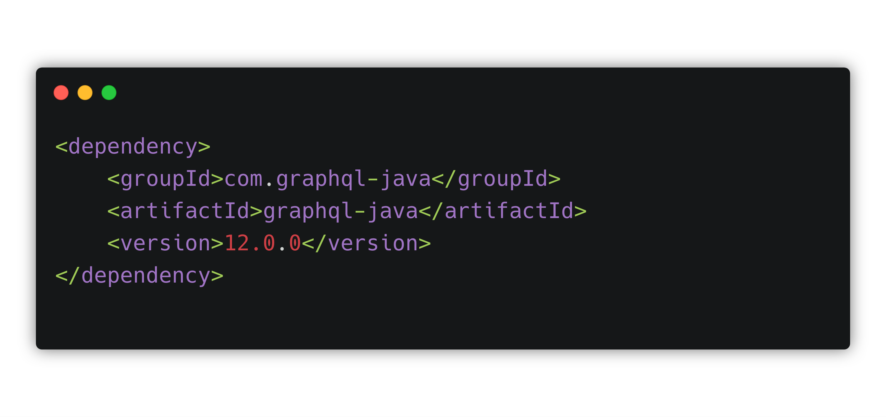
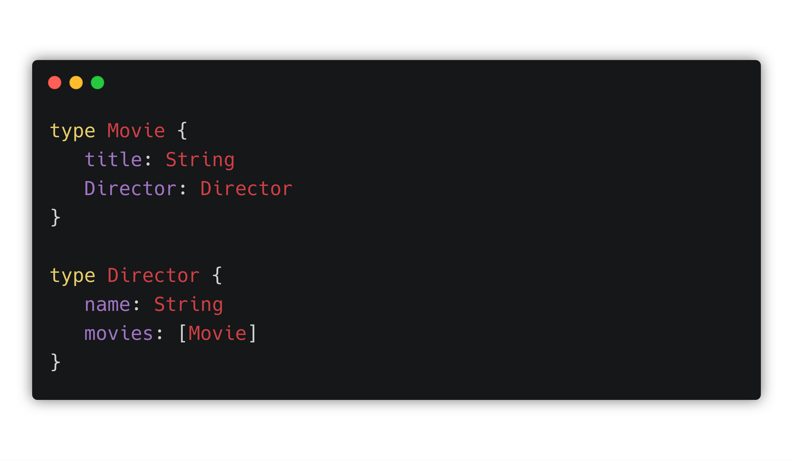
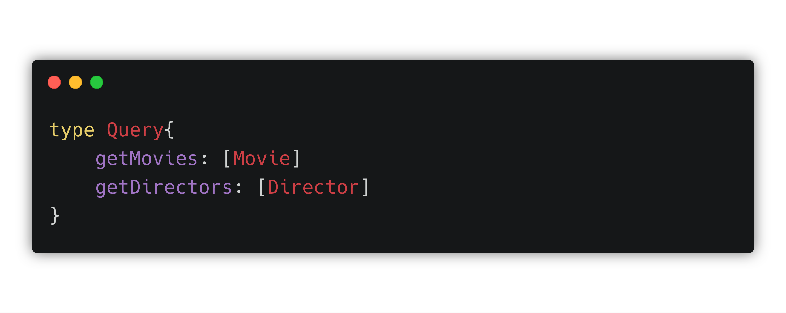
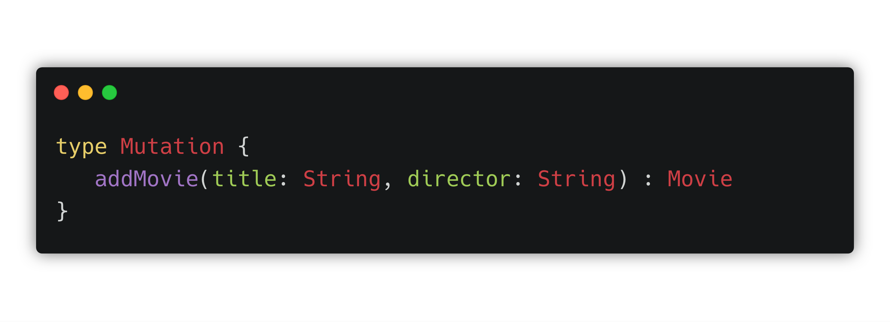

OOne of the best things about GraphQL is that it can be implemented in any language. Today let’s take a look at Java server implementation for GraphQL. Let’s use Maven and assume that we already have set up the project structure. What next?

### Dependencies
To run GraphQL in your Java project you only need one library which is  [GraphQL Java](https://github.com/graphql-java/graphql-java) implementation. However, there are a couple of libs you might find useful when using GraphQL Java:
- [Spring Boot](https://github.com/graphql-java/graphql-java-spring) - GraphQL Java Spring and Spring Boot integration that will handle any HTTP related tasks, expose the GraphQL service on the `/graphql` endpoint of your app and accept `POST` requests containing your GraphQL payload. 
- [GraphQL Java Tools](https://github.com/graphql-java-kickstart/graphql-java-tools) - this library allows you to use the GraphQL SDL to build your graphql-java schema. 
- [GraphQL Java Servlet](https://github.com/graphql-java-kickstart/graphql-java-servlet) - implementation of GraphQL Java Servlet including support for libraries like Relay.js, Apollo etc. and wraps the Java implementation of GraphQL provided by GraphQL Java.

So add dependencies you need to Project Object Model file (pom.xml):

### Define the schema
GraphQL Schema is the centerpiece of any GraphQL implementation so we definitely need one before going any further. To make it easier to understand the operation that a server can perform GraphQL defined a universal schema syntax know as SDL (Schema Definition Language). 

The SDL defines the elements of your project like:

- **`type`** (the most basic GraphQL schema components):

- **`query`** (asking the server for the data) 

- **`mutation`** (manipulating the data):

 The fastest way to define your schema is to use [GraphQL Editor](https://graphqleditor.com/). It allows you to define your schema traditionally (code) or shape it from visual nodes.

### Server

There plenty of servlet containers to choose from, both open source and commercial,  so just pick the one you feel comfortable with. Let's use Jetty for our example and   implement it via a [Maven Plugins](https://maven.apache.org/pom.html#Plugins):

And you are almost there, the next steps are:
- adding some more basic server configurations like right Java version or servlet specification
- creating **`GraphQLEndpoint`** class for exposing your API
- defining resolvers

If you want to read more details about GraphQL Java implementation to take a look at Bojan's tutorial regarding setting up [GraphQL Java](https://www.howtographql.com/graphql-java/1-getting-started/) server on https://www.howtographql.com/
