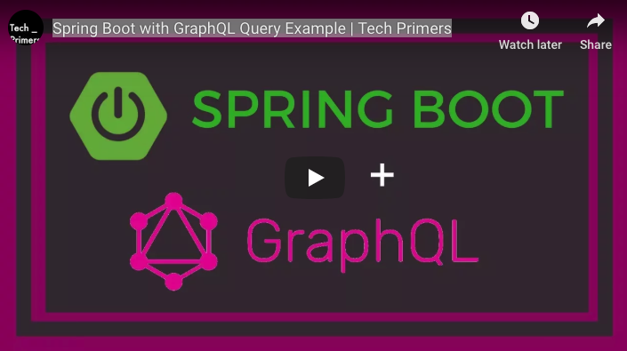
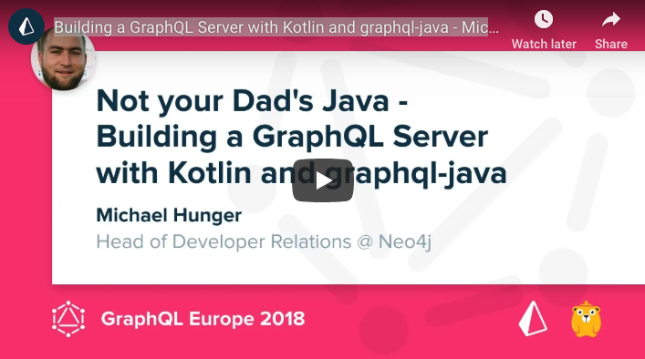
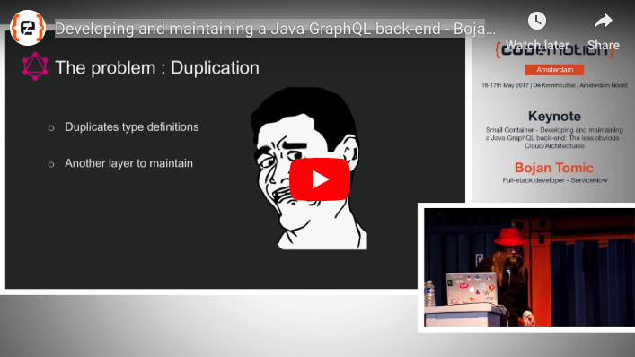

A **GraphQL Java Cheat Sheet** to help you understand what is what in GraphQL Java world. You might find it useful if you:
> - Want to learn GraphQL Java
> - Feel confused by all the Java GraphQL libraries
> - Want to try GraphQL Java in your project, but not sure how to start

### Gradle or Maven?

[Gradle](https://gradle.org/) and [Maven](https://maven.apache.org/) are the most popular build automation tools. 
Which one you should choose? I can not provide you an answer to that question as this decision is to a large extent up to you and it depends on variables like your project's size or how much customization it needs. The tools like [Spring](https://spring.io/) and the constantly increasing amount of integration make it's quite a personal decision. As both approaches have their strengths and weaknesses, I hope this short summary can help you choose the right one for your project.

|                                             |                   Gradle                    |                          Maven                           |
| ------------------------------------------- | :-----------------------------------------: | :------------------------------------------------------: |
| *builds approach*                           |    based on a graph of task dependencies    |       based on a fixed and linear model of phases        |
| *dynamic and transitive dependencies*       |                   **yes**                   |                         **yes**                          |
| *artifact repositories*                     |                   JCenter                   |                      Maven Central                       |
| *private company repository*                |                   **yes**                   |                         **yes**                          |
| *custom rules, resolving version conflicts* |                   **yes**                   |                            no                            |
| *advance task orderings*                    |                   **yes**                   |                            no                            |
| *administering build infrastructure*        | uses wrappers that accept auto provisioning | require an extension to support self-provisioning builds |

To sum up, Gradle is much more powerful than Maven, but in many cases, you won't need to use its fancy features. If you are working on a small project you should consider Maven, if it's a big enterprise application Gradle seems to be the right choice. In the end, it's your personal choice.

### Libraries

There are a couple of GraphQL Java related libraries. The only library that is strictly required is a `graphql-java` which is the GraphQL implementation itself, but there are many others that you might find useful:

- **[graphql-java](https://github.com/graphql-java/graphql-java)**: The alpha and omega of any project, the GraphQL Java implementation itself.

- **[graphql-java-tools](https://github.com/graphql-java-kickstart/graphql-java-tools)**: The library that allows you to use the GraphQL schema language to [build your GraphQL schema](https://graphqleditor.com/). It's inspired by [Apollo's graphql-tools](https://github.com/apollographql/graphql-tools), it parses the given GraphQL schema and allows you to bring your own object to fill in the implementations.

- **[graphql-spring-boot](https://github.com/graphql-java-kickstart/graphql-spring-boot)**: A lib that contains various Spring Boot starters to enable GraphQL related services and features.

- **[graphql-java-servlet](https://github.com/graphql-java-kickstart/graphql-java-servlet)**: The implementation of GraphQL Java Servlet including support for popular libraries like [Relay.js](https://github.com/facebook/relay), [Apollo](https://github.com/apollographql), and [OSGi](https://www.osgi.org/) out of the box; wraps the Java implementation of GraphQL provided by GraphQL Java.

- **[graphql-java-annotations](https://github.com/Enigmatis/graphql-java-annotations)**: The library that offers an annotations-based syntax for GraphQL schema definition.

### DEV.TO GraphQL Java articles

- [First impressions with GraphQL in Java](https://dev.to/committedsw/first-impressions-with-graphql-in-java-5c82) by [@committedsw](https://dev.to/committedsw)
- [Notes from experimenting with GraphQL and Kotlin](https://dev.to/baens/notes-from-experimenting-with-graphql-and-kotlin-k8) by [@baens](https://dev.to/baens)
- [Getting Started with GraphQL Java](https://dev.to/tomekponiat/getting-started-with-graphql-java-13j1) by [@tomekponiat](https://dev.to/tomekponiat)
- [How to Build GraphQL Services in Java with Spring Boot](https://dev.to/sambenskin/howto-build-graphql-services-in-java-with-spring-boot---part-1-38b2) by [@sambenskin](https://dev.to/sambenskin)

### Tutorials and other resources
- [Gradel Tutorials and Guides](https://gradle.org/guides/)
- [Maven in 5 Minutes](https://maven.apache.org/guides/getting-started/maven-in-five-minutes.html)
- [How to get your GraphQL Java server up and running in no time](https://medium.freecodecamp.org/graphql-java-development-stack-in-production-21f402c4c37a)
- [graphql-java Tutorial](https://www.howtographql.com/graphql-java/0-introduction/)
- [Migratiing Builds From Apache Maven](https://docs.gradle.org/current/userguide/migrating_from_maven.html)

### Video tutorials:

**Spring Boot with GraphQL Query Example - Tech Primers**

**Building a GraphQL Server with Kotlin and graphql-java - Michael Hunger** 

**Developing and maintaining a Java GraphQL back-end - Bojan Tomic**

