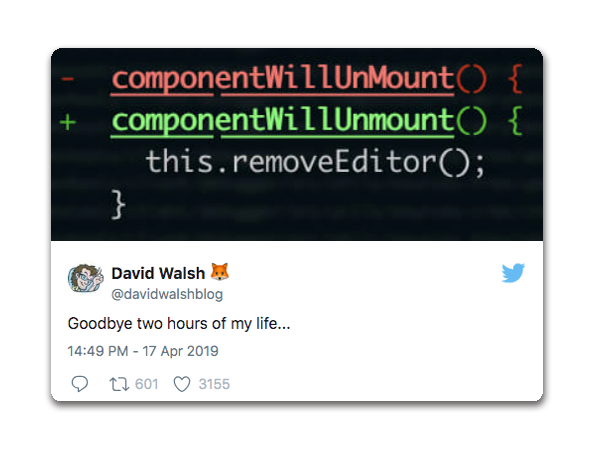
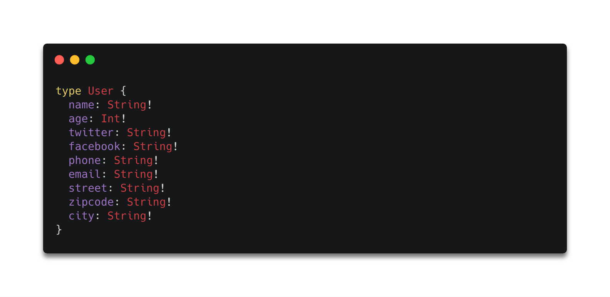
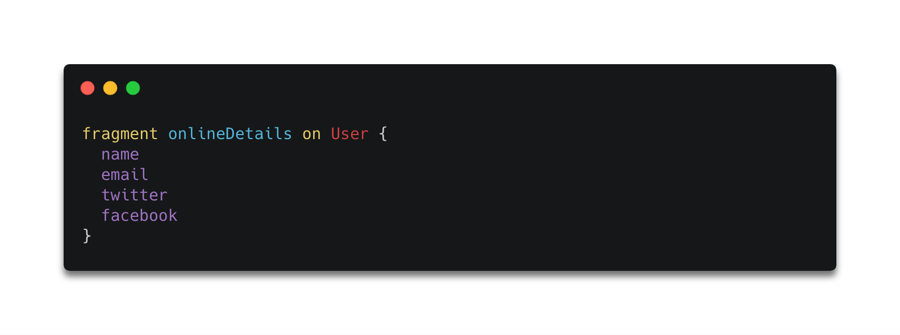
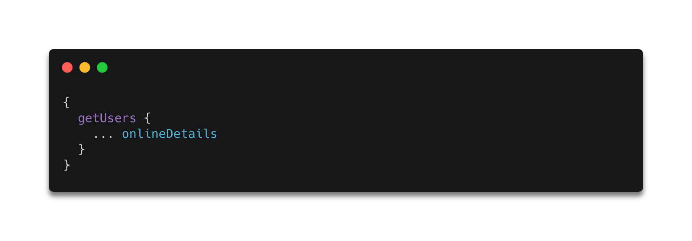

In this short read, I will try to break down for you the concept of GraphQL fragments. What are the fragments in GraphQL and how you can benefit from using them?

### GraphQL Fragments
In [GraphQL](https://graphql.org/) you sometimes need to query for the same fields in multiple queries. This requires defining these fields over again which can lead to tiny, but very annoying errors. 

That's why GraphQL includes reusable units called fragments. Fragments let you construct reusable pieces of query logic (an equivalent to UI component of a [design system](https://blog.graphqleditor.com/Design-System/)). The small part of a query makes, ready to be used where needed, makes our work is way more effective, and possibly lower odds of making a simple typo.

Let's say we have a `user` type containing some standard fields like:

We can use the `fragment` to represent a set of specific fields i.e. *online contact details*:

so when querying for online details we can **referer to the fragment instead of querying for all fields separately**:

Less typing, cleaner code, easier life :)

### The benefits of using fragments

GraphQL fragments allow you to reuse parts of your queries and provide such qualities as:
- **consistency** - higher confidence that you’re always working on the right fields i.e when running mutations you know you update the right data. 
- **better code organization** - fragments improve the structure & reusability of GraphQL code, which is  very handy in terms of team collaboration
- **improved communication with GraphQL server** - querying for fragments isolates a component from any unwanted data.

Sounds good right? So if you are wondering if its worth using GraphQL fragments the answers is simple - YES!

 
