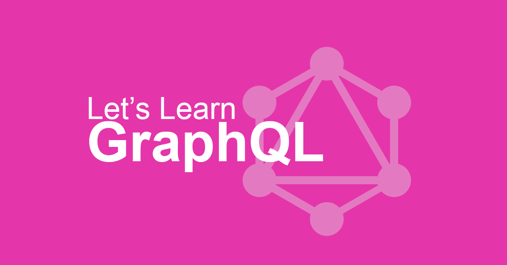

GraphQL popularity is continuously growing. 
If you want to jump on a GraphQL train here is a list of the best tools, extensions, and tutorials to start with. Let's learn it together! 

If you have any interesting resources mail me a tip to tomek@graphqleditor.com and I will update our directory.

### Knowlege base

1. [GrapQL Official Documentation](https://graphql.org/learn/) is definitely the best place to start your GraphQL adventure.
2. [Official Facebook Draft RFC Specification](https://facebook.github.io/graphql/draft/) is a place to go if you are looking for raw knowledge regarding GraphQL project.
3. [GraphQL Weekly](https://graphqlweekly.com/) is a newsletter with news, articles, and everything related to GraphQL
4. [How to GraphQL](https://www.howtographql.com/) is a website which will take you into a journey from GraphQL newbie to releasing your first  GraphQL project.
5. [Explore-tech.org](https://graphql.explore-tech.org/) is a helpful resource for collecting GraphQL tools, especially libraries.

### Tools & Extensions

1. [GraphQL Docs](https://github.com/2fd/graphdoc) is a simple way of generating static documentation for a GraphQL schema in seconds.
2.  [GraphCMS](https://graphcms.com/) a tool that allows you to define the GraphQL API. Create structures, relationships, powerful permissions and manage your content with ease, generally speaking, build a hosted GraphQL back-end for your web project along with tools to manage its content.
3. [GraphQL Editor](https://graphqleditor.com/) makes it easier to understand the GraphQL schema. Create it by combining visual blocks and the editor will transform them into code! Features like loading schema from URL/file or a fake backend data can speed up the prototyping of your app.
4. [Apollo Launchpad](https://launchpad.graphql.com/new) allows you to write a  GraphQL schema in JavaScript making GraphQL code very accessible.
5. [GraphiQL](https://github.com/graphql/graphiql) is a simple IDE tool for testing and documenting GraphQL APIs with a nice graphical interface.
6. [GraphQL Playground](https://github.com/prisma/graphql-playground) a GraphiQL alternative.
7. [Apollo Elements](https://github.com/apollo-elements/apollo-elements) a library for building GraphQL-backed UIs without UI frameworks.

### Blogs

1. https://blog.apollographql.com/
2. https://www.robinwieruch.de/
3. https://graphqlmastery.com/blog
4. https://blog.graphqleditor.com/
5. https://graphql.org/blog/
6. https://blog.hasura.io/tagged/graphql/
 

### Video tutorials
1. [How to build a GraphQL Server](https://www.youtube.com/playlist?list=PLillGF-RfqbYZty73_PHBqKRDnv7ikh68&utm_source=notify_mailer&utm_medium=email&utm_campaign=new_reply_email)

### Communities

1. https://www.reddit.com/r/graphql
2. [ReactiFlux Discord (#graphql)](https://discordapp.com/invite/0ZcbPKXt5bYZVCkR)
3. https://spectrum.chat/apollo

### Let's build this directory together!

Do you know any other useful tools, tutorials or blogs for GraphQL?
Maybe you are running your own blog or developing a GraphQL tool?

Send me a link to tomek@graphqleditor.com and I will post it here :)

