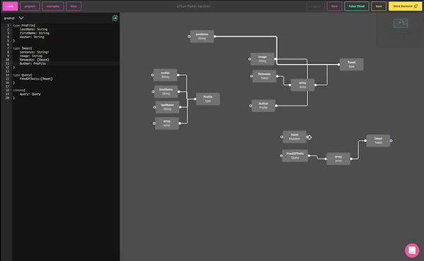

[GraphQL](https://graphql.org/) is a query language for [API](https://en.wikipedia.org/wiki/Application_programming_interface)s that:
provides a complete and understandable description of the data in your API,
allows Clients to ask specifically for what they need,
makes evolving APIs over time a lot easier,
enhance your APIs with amazing tools inaccessible with REST

GraphQL differs from traditional RESTful APIs (we covered that shortly in our [GraphQL vs REST](https://blog.graphqleditor.com/graphql-vs-rest/) blog post) so on your first encounter with the GraphQL you might notice a lot of unfamiliar terms and phrases. As big GraphQL fans, we decided to prepare a sort of GraphQL Dictionary containing the most common GraphQL terms to help you start with GraphQL.


## Argument
Argument is a set of key-value attached to a field. The Arguments can have a form of literal values or variables.

## Alias
Alias is an alternative name assigned to the result of a field to avoid conflicts during data fetching operations i.e. `admin` and `regular`.

```graphql
{
 admin: users(role: admin) {
   id
   firstname
   lastname
 }
 regular: users(role: regular) {
   id
   firstname
   lastname
 }
}
```

## Directive
An explanation preceded by a `@` that encloses the logic for query execution on client/server. GraphQL built-in directives are @skip and @include, and allow to define custom ones.

## Field
A basic unit of data you request from your schema returned as a field in JSON response i.e. `id`and `name`.

```graphql
type User {
 id: Int!
 name: String
}
```

## Fragment
A selection set that can be reused in multiple query operations. A GraphQL fragment is a shared piece of query logic.

## GraphQL Editor
GraphQL Editor makes understanding GraphQL schema a lot easier. Plan your schema by linking visual blocks and GraphQL Editor will transform them into code.



## Introspection
A method to provide precise information about the schema of a GraphQL API. Introspections are prefixed by "__".

## Mutation
One of basic GraphQL operation allowing to manipulate data (create, modify, delete).

```graphql
mutation DeleteTodo($type: String!) {
 deleteTodo(type: $type) {
   id
   type
 }
}
```

## Object Type
It's type in a GraphQL schema that contains fields. `User` is our Object Type here:
```graphql
type User {
  name: String!,
}
```

## Operation
The single query, mutation or subscription, which could be interpreted by execution engine in GraphQL.

## Operation Name
A name for above-mentioned elements. Name make a lot easier identifying, logging or debugging errors in a GraphQL server.

## Query
It's a basic fetch operation to reqest data in GraphQL.

## Query Colocation
One of [GraphQL best practices](https://graphql.org/learn/best-practices/), where you place a GraphQL query in the same location as the app component’s view logic.

## Query whitelisting
A security practice involving defining a list of approved queries that are allowed in your app.

## Resolver
A function tconecting your GraphQL schema elements to backends.  Resolvers turn operations into data; they can return strings, ints, null & other primitives.


## Schema
A GraphQL schema is the central piece of every GraphQL server implementation. The GraphQL schema is responsible for the whole logic of your project and describes functionalities available to the client app.

## Schema Definition Language (SDL)
A GraphQL Schema Definition is a way to define a GraphQL schema. The syntax is a are part of the official GraphQL specification. The main components of each schema are the `types` and their `fields`.

The GraphQL schema for a movie review site could be defined like this:

```graphql
type Review {
 id: String!
 title: String!
 publishedAt: DateTime!
 stars: Int! @default(value: 0)
 feed: Feed @relation(name: "Reviews")
}

type Feed {
 id: String!
 name: String!
 description: String,
 reviews: [Review!]! @relation(name: "Review")
}
```

## Schema Stitching
Merging minor schemas into central GraphQL schema.

## Subscription
Is a real-time operation in GraphQL that is defined in a schema.

```graphql
type Subscription {
 reviewAdded(repoFullName: String!): Review
}
...graphql
subscription onReviewAdded($repoFullName: String!){
 reviewAdded(repoFullName: $repoFullName){
   id
   content
 }
}
```

## Scalar Type
It's GraphQL type that validate the data that GraphQL field resolves. String, Int, Boolean, Float are all built-in scalars that you can do a lot with out of the box. Custom scalar types can be specified in a GraphQL service implementation.


## Type System
It's a set of rules that define the set of data that can be valiudated, queried & executed.

## Variable
It's a value that can be passed to an operation, like `userID` in below example:

```graphql
query GetUser($userId: ID!){
 user(id: $userId){
   name
 }
}
```


