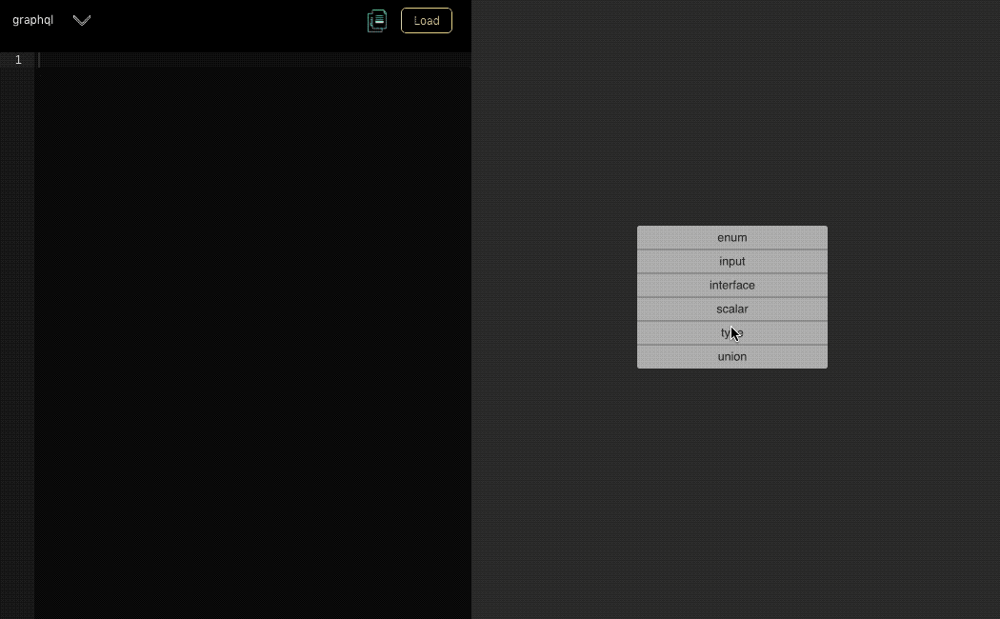
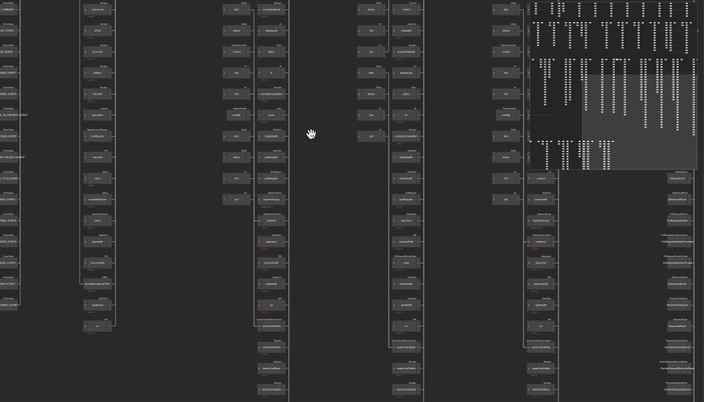
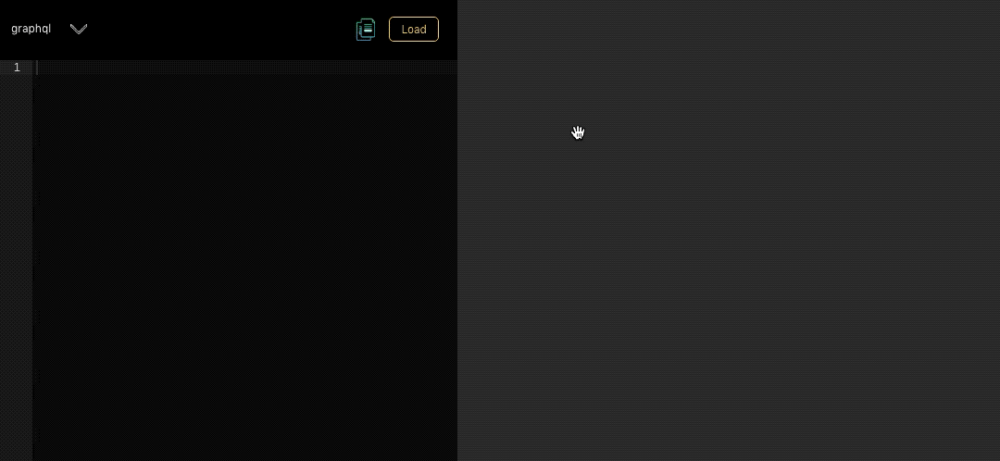
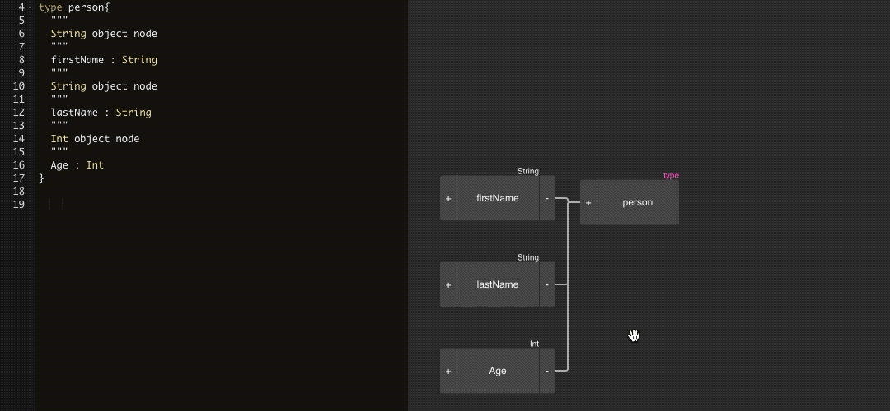
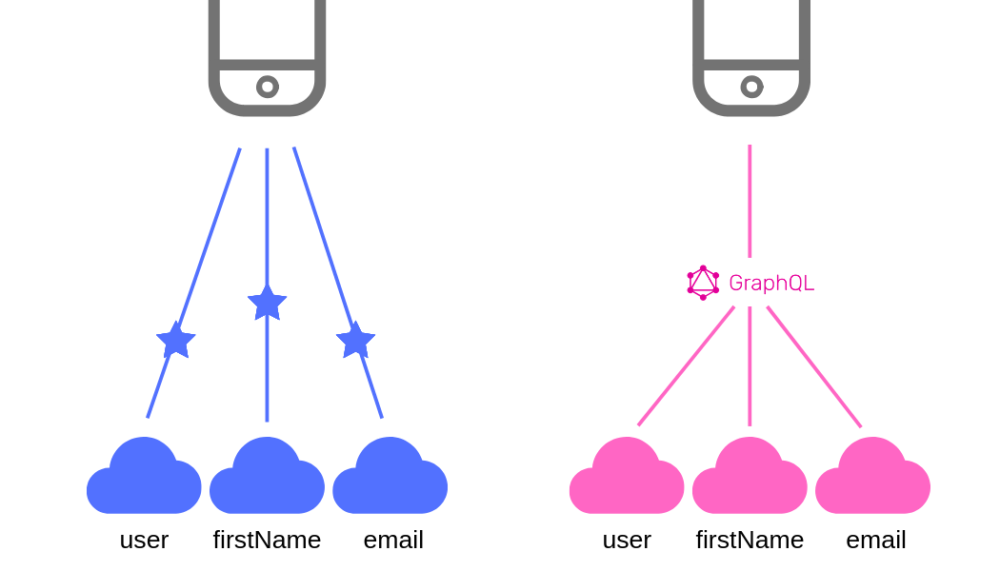

###Introduction
This article covers the basic introduction and advantages of GraphQL and [GraphQL Editor](https://app.graphqleditor.com) for business users. 

###What is GraphQL?
Have you heard tech terms like frontend, backend or API? Well, those are essential components of every web application. The front end is what you see; the backend is the hidden engine that powers every action of your visual interface. API is a connector in between those two which allows them to communicate. It’s a set of clearly defined methods, definitions and routines how apps communicate with each other.

>#GraphQL is a query language to describe an API

So far REST API was the most popular standard of creating API’s. GraphQL was introduced in 2015 by Facebook as an alternative to REST. Back then It wasn’t just an experiment - it was already in production inside facebook mobile apps since 2012. Just after public release, It became extremely popular, and around that time many companies were working on similar solutions. This technology started to gain attention since it can be used with many other languages and there’re many ready to go libraries to most popular styles. Right now according to Stackshare there’re nearly 2k companies using it. Early adopters included Coursera, Github, ProductHunt, Yelp or Twitter.

###Visual tool for app prototyping
GraphQL from its core name is something more than new API standard. Some users describe it as a tool for the specification of new solutions. Thanks to graph sourcing we can visualise existing database schema and show existing solutions on the screen. From the other side, you can prototype new business applications. With visualised graph possibilities are endless. Think about the potential advantages of giving access to internal systems for a business manager at company meeting or speeding up onboarding of new developers. Some companies have significant and complex systems; therefore it slows down digital transformation. Check below how Github’s schema in action.

###Easy to learn
GraphQL is easy to learn. You have to learn 15-20 definitions to start understanding it. Not joking! Check below a list of the most important ones. Don’t get overwhelmed by too many definitions at the start. Start by checking object type - in definition is a group of fields.

Basic type definitions

- Type - it's a group of object.
- Input - it's used to create or update objects in database.
- Scalar types - add characteristics for type object.
- Interface - it's a type object that has certain set of the same fields.
- Union - mostly used for search purpose.
- Enum - specific scalar user mostly when dealing with allowed values.

Graphql is strongly typed, which means that each definition must have a particular type. The Type System comes with the help, which provides several possibilities for defining elements of our API. Another exciting thing about strongly typed is the visual part.

###Communication with all developers
The most important feature of GraphQL for business users is that it’s language agnostic. It’s not created to work with a specific technology. It’s a query language with its own rules which for most popular programming languages. There’re many supportive libraries on the internet for C#/.NET, PHP. Javascript, Java, Python, Ruby and many more. Therefore learning a little bit of schema definition language, you’re able to communicate with all kind of developers. 

###Flexibility
GraphQL is flexible and efficient. In traditional REST approach developers had to send many requests to show data on one screen. It’s not super efficient when it comes to mobile apps - it slows them down and needs more internet data transfer. GraphQL allows a user to create only one endpoint and get exactly required data. Thanks to technology introduced by Facebook engineers communication between client and a server is better optimised.

That’s the power of GraphQL - flexibility. You don’t need to create endpoints for different screens. Various clients can use a once defined schema in a way that they need to.

