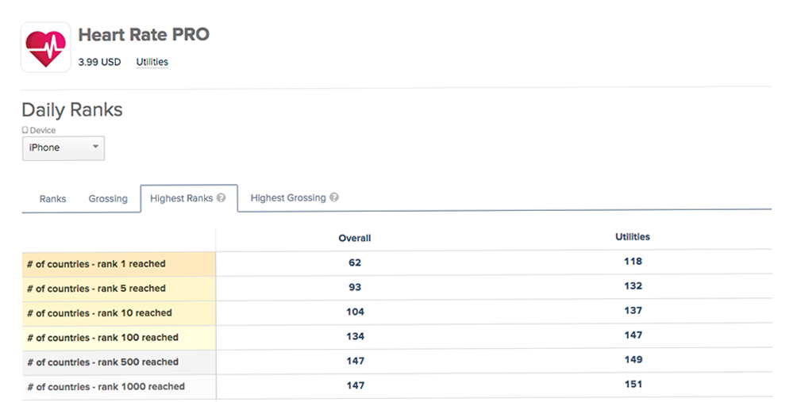
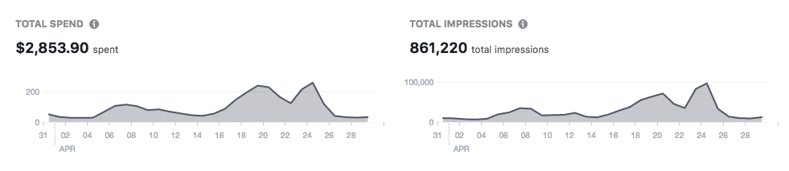
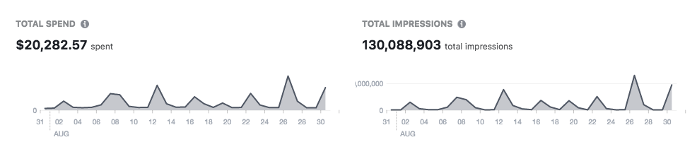

Yes, we have increased our marketing reach by 16250%. How we made it? 
Automation!

## Hello!

I’m Tomek and I’m responsible for marketing/sales in Aexol. Let me introduce you our company profile so you could understand better our business model and have a better understanding of below case study.

## We make mobile apps

We make mobile apps, what's more important, we make mobile apps that last. Creating mobile apps is easy.  You can build a mobile app and have it published in one of the app stores in relatively a short time, then you just sit back and watch like money magically appears on your account. If you have ever tried marketing an app you know that the last part is far from reality, it takes a lot more for an app to become successful and the real challenges appear when you think that you have already broken the code and you dream about scaling up your project.

## Scaling up
Let’s skip couple steps and move to a point where we already have:
- A decent mobile app
- Marketing research is done
- A monetization model that suits our product 
- Our marketing campaigns are up and running

The next natural step is intensifying your activities in order to achieve better results. This usually means hiring additional people, preparing more working stations, buying additional software license or hiring an agency which will do it for us, anyhow scaling is strictly related with an increase of cost in general. You can also try to automate the process and that's what we did.

## The automation in our business model

Scaling up our mobile ads was a big challenge for us. We didn’t want to expand our marketing team, but also we were aspiring to be present in top charts across the App Store (we mostly sell paid apps). Creating multiple ad campaigns targeting different users basing on their languages, locations, interest or age is a very time-consuming task. After spending some time on thinking how could we solve this problem we came across the idea of building a very simple web app.

## Tool made with GraphQL Editor

We have created an in-house tool which we called Visual Ad Composer. The logic for this app was made with a beta version of GraphQL Editor and it was made in 8 hours by one developer, no design, simple graphics, pure technology. How does it work? It’s very simple. We define different targeting aspects (let’s use Facebook targeting as an example) we want to use in our ads, basic things like how much we want to spend and … that’s it!

Let’s say we want to try out combinations of:
- Gender (two values),
- Country (let’s say we want to create ads for 10 countries),
- Age (let’s take all age groups available on Facebook so 7).

Our tool will create 140 campaigns covering every combination of the target groups we have picked above … with a single click!  The simple automation of ad creating process saved use thousands of hours which will need to spend to create these multiple ads manually. This helped us increase our ads reach by 16250% and cost us only 10 times more than before which give us a nice quite a nice leverage level and help us made some money from our apps.

## Before

## After

## Final thoughts
No matter if you are a graphics designer, marketing manager, a developer or doing any other job, you should think about how simple programmes could help you save time you spend daily on performing mechanical tasks.
