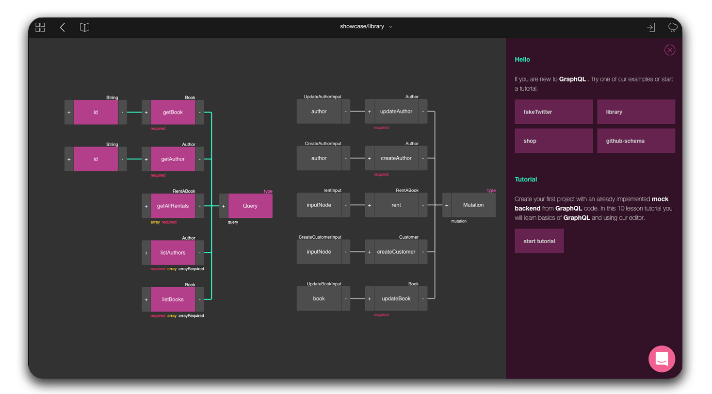
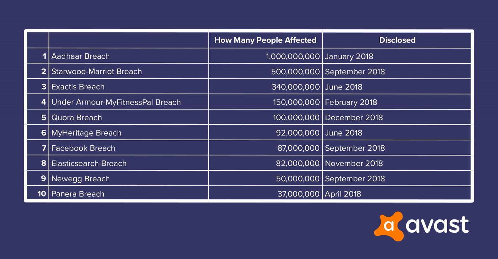

This year will for sure bring new ideas to the web development as well as cultivate some well-known ones. To provide you with an insight into what is going to happen this year, these are the trends that will continue to dominate the development of the network.

### Progressive Web Apps
Progressive Web Apps (PWA) is a new approach to building applications by combing the best features of the web with the top qualities of mobile apps. PWA has no entry barrier as no install is required. From the very launch in a browser, PWA slowly builds a “relationship” with its user over time by providing features like blazingly fast loading time (even on low-performing networks), communicating relevant information with push notifications or as simple things as easier access by the home-screen icon.

The key advantages of Progressive Web App are:
- **Progressive & responsive** - *works the same for every user, regardless of browser choice or device*
- **Connectivity independent** - *designed to work offline or on a low-performing network connection.*
- **Engageable & shareable** - *users can add apps to their home screen (by-passes app stores) & share easily via URL.*

###### Source: [Google Developers](https://developers.google.com/web/progressive-web-apps/)

### Low-code development solutions
LCDPs are visual-based design system which means that the amount of coding is often reduced to zero and that of most of it is replaced by a draw/drag-and-drop system. The rising demand for automation and innovation in many different industries requires:
- *Faster development process*,
- *Easier deployment*,
- *Cost reduction*.

This allows building apps faster (shorter time-to-market) and is expected to push the low-code development trend into its highest high in the next couple of years, which would make tools like [Fuse Open](https://fuseopen.com/) (*mobile apps*), [BuildBox](https://www.buildbox.com/) (*mobile games*), [Airtable](https://airtable.com/product) (*spreadsheet-database*) or  [GraphQL Editor](https://graphqleditor.com/) (*GraphQL schema design*) observe the rise of popularity.

### Cybersecurity

> *We no longer go online, we live online.*

It's a truth hard to swallow but we are ruled by the Internet. It took control of our lives. We work, learn, shop & spend our free time online. More and more aspects of our lives are becoming digitalized so no wonder that our security online has become one of the most (if not the most) important issue. Since we are more tend to upload our confidential data like credit cards, IDs and other to the web, it makes data breaches & cyber threats becoming more frightening than ever before. As recent history has shown, no one is safe. In 2018 we had some major data breaches including Starwood-Marriot (500 million users data), Quora (100 million) and 2019 started with shocking information that since 2012 Facebook has not properly secured the passwords of as many as 600 million users. These passwords were stored in plain text and able to be accessed by more than 20,000 of Facebook’s employees. 

###### Source: [Avast Blog](https://blog.avast.com/biggest-data-breaches)

With that in mind, companies need to improve their security system to protect their (and their users) private data. Cybercriminals won’t stop to look for vulnerabilities and new solutions are necessary to battle new cybersecurity challenges.

