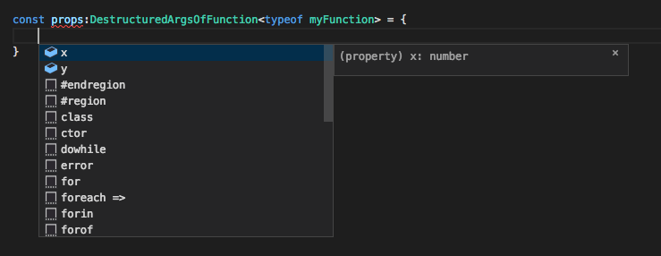

Hello This is starting article for advanced typescript tutorial series. Today I'll cover basic usage of

```typescript
infer
```

keyword. For me it was hard to understand at the beginning what I can really do with infer. Lets start with really basic example.

```typescript
type FlattenIfArray<T> = T extends (infer R)[] ? R : T
```

So lets analyze this code:

1. We check if our generic Type is array
2. If it is array extract real type from it
3. If it is not leave it as is

Still its not clear what infer is doing, so lets proceed with another example

```typescript
type Unpromisify<T> = T extends Promise<infer R> ? R : T
```

This one looks more clear as it doesn't have parenthesis:

1. We check if type extends Promise
2. If it do we extract type from promise
3. If it is not leave it as is

See? If you use extends only just to check if type is a promise you would use

```typescript
type Unpromisify<T> = T extends Promise<any> ? T : never
```

And in infer instead of any keyword you infer the value from type. Lets try with more advanced types then:

```typescript
type FuncWithOneObjectArgument<P extends { [x: string]: any }, R> = (
  props: P
) => R;

type DestructuredArgsOfFunction<
  F extends FuncWithOneObjectArgument<any, any>
> = F extends FuncWithOneObjectArgument<infer P, any> ? P : never;

const myFunction = (props: { x: number; y: number }): string => {
  return "OK";
};

const props: DestructuredArgsOfFunction<typeof myFunction> = {
  x: 1,
  y: 2
};
```

Intellisense for props works like this:


You can make use of it inferring React Component props for example or another function that uses destructured params.