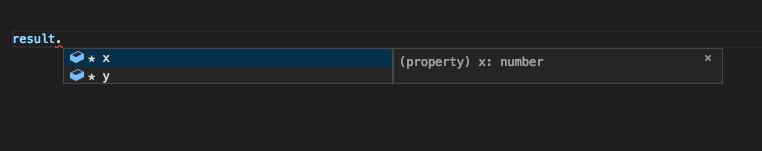

Hello This is third article of advanced typescript tutorial series. Today I'll cover basic usage of generic functions

```typescript
type Point = {
  x?: number
  y?: number
  z?: number
}
const myFunc = <T extends Point>(args: T): T => {
  return args
}
```

As arguments I'll provide object containing Point properties. This function will only return Partial of `Point` based on provided paramaters in `args` argument;

```typescript
const result = myFunc({
  x: 1,
  y: 1,
})
```

And the intellisense for such function is


As you see there is no `z` property here. Typescript aleready knows we provided these 2 args and it should return only them!

This part is super short as I can provide infinite number of generic functions usages. Thank you for your support on `/r/typescript/ reddit ! It gives me power to write blog-post-a-day!

