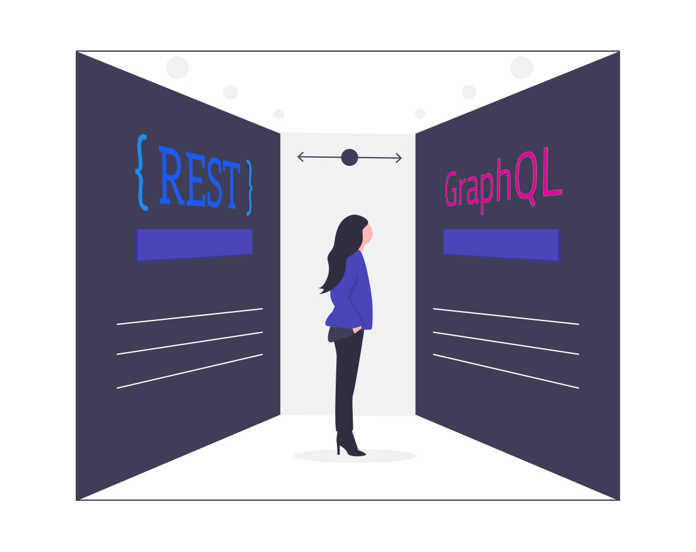

Since its public release in 2015, GraphQL has been on the rise both in popularity and widespread use. The addition of the data graph changed the development process forever, bringing together data and services in a comprehensive and secure way. An ever-growing number of companies have recognized its vast capabilities, with such entities as Shopify, Microsoft or Yelp adding GraphQL to their development stacks.

GraphQL is alive and well, but how did it grow from a hermetic language used by very few to a widely recognized, almost indispensable tool? It wouldn't be here without quite a few success stories surrounding it.

A perfect example would be a recent migration of Airbnb's API. It has been discussed at length by [Brie Bunge, one of their software engineers, at GraphQL summit](https://www.youtube.com/watch?v=pywcFELoU8E&feature=youtu.be), where she described the process in some detail. I wanted to take a look at some of the distinct advantages of using GraphQL in these operations in the hope that you, dear reader, might find a solution to one of your problems.

##### Source: [undraw.co](https://undraw.co/)

## Better data access

The adoption of GraphQL for their API resulted in quicker access to data and a much more enjoyable interface. Thanks to the step-by-step approach to migration, with hardly any downtime during the whole process. Instead of trying to convert preexisting code at once or even rebuilding from the ground up, Airbnb opted for gradual changes. Consequently, this allowed for a smooth transition without the need to put any services on pause. 

## Over-fetching problem

Another improvement gained through switching over to [GraphQL](https://graphqleditor.com/) was the significant reduction in over-fetching. The data has been shaped in a way that doesn’t allow for requesting any more than is needed in a particular instance. This severely reduces unnecessary costs that may have been incurred beforehand, something that must be considered when designing data architecture. 

After the whole conversion process was complete, the result was a dependable, streamlined and far-reaching tool. It is able to quickly and reliably access requested data by combining the strengths of its components while getting rid of needlessly complicated code. Furthermore, should the need arise, Airbnb’s implementation of GraphQL is ready to be scaled within reason. According to [Adam Neary](https://medium.com/@AdamRNeary), another software engineer at the aforementioned company, other benefits [include](https://medium.com/airbnb-engineering/reconciling-graphql-and-thrift-at-airbnb-a97e8d290712): 

- a strongly typed API schema,
- flexibility in field selection,
- cross-platform client-side development

... and many more.

Despite the indisputable gains from using [GraphQL](https://graphqleditor.com/), this project is far from complete. There are numerous improvements that can be developed sooner or later.

By reshaping the schema into a more data-centric one, they hope to cut down on duplicate requests, further increasing the efficiency and speeding up the caching, which has been a major bottleneck up till then. 

This is but one of many examples of GraphQL being a prime choice for data handling at a major company. Nearly a thousand businesses from various branches using this language for all their dealings with queries, showing just how flexible and efficient it is.
