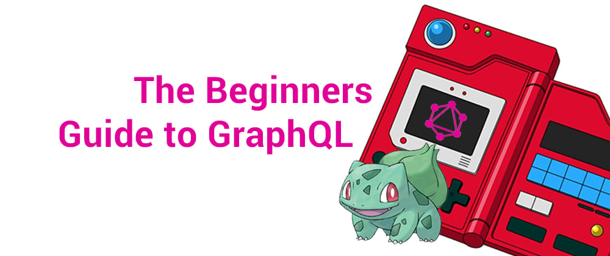
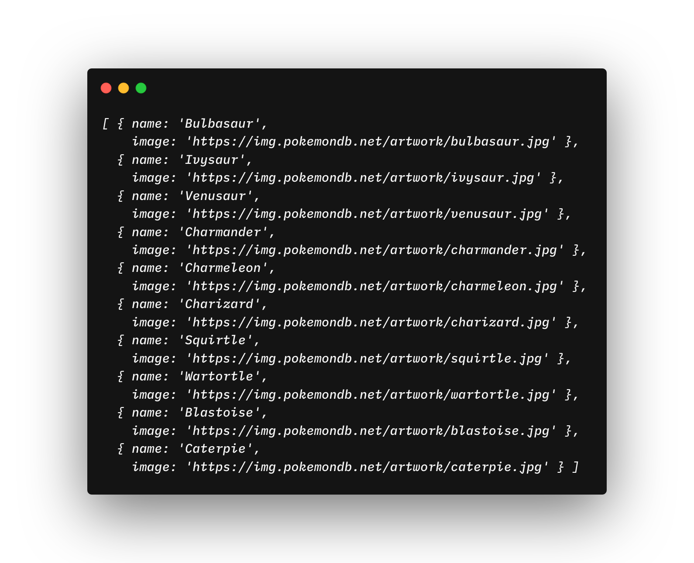

First of all, I want to tell you I created the tool `graphql-zeus` it is GraphQL client on top of the fetch function. What it means? Basically, you point Zeus to the GraphQL schema and it generates libraries for you.

Sounds fun? It is even more fun because you don't have to know `gql` the query language of GraphQL because Zeus provides you with its own GraphQL query like autocompleted syntax.

Create a project folder:
```sh
mkdir zeus-tutorial
cd zeus-tutorial
```

Let's start then. First, you will have to init a new npm package:
```sh
npm init
```
click enter enter enter etc.

Install dev dependencies.
```sh
npm i -D @babel/core @babel/node @babel/preset-env
```

Install dependencies.
```sh
npm i node-fetch
```


Then Create .babelrc file
```sh
echo '{ "presets": ["@babel/preset-env"] }' >> .babelrc
```

Then Create the src directory
```sh
mkdir src
```
and create a `index.js` file
```sh
touch src/index.js
```

Add script to your package.json
```json
{
  "scripts": {
    "start": "babel-node src/index.js"
  },
}
```

Your whole package.json should look like this:
```json
{
  "name": "zeustutorial",
  "version": "1.0.0",
  "description": "",
  "main": "main/index.js",
  "scripts": {
    "start": "babel-node src/index.js"
  },
  "author": "Aexol <aexol@aexol.com> (http://aexol.com)",
  "license": "ISC",
  "devDependencies": {
    "@babel/core": "^7.5.5",
    "@babel/node": "^7.5.5",
    "@babel/preset-env": "^7.5.5"
  },
  "dependencies": {
    "node-fetch": "^2.6.0"
  }
}
```

Now it is high time to generate some code from GraphQL. Go ahead install `graphql-zeus`.

install `graphql-zeus`
```sh
npm i -g graphql-zeus
```

Generate files from pokemon schema
```sh
zeus https://graphql-pokemon.now.sh/ ./src
```

Hurray! You should have definition files generated in ./src folder.
Now go and open some editor of choice - I prefer VSCode but it is up to you. I can guarantee it works with VSCode though.

Open package directory with editor. Open `src/index.js`
In the first part of the series, we will write simple query loading first ten pokemon names and images and display it in the terminal.

```js
import { Chain } from "./graphql-zeus";

const chain = Chain("https://graphql-pokemon.now.sh");

const run = async () => {
  const { pokemons } = await chain.Query({
    pokemons: [
      {
        first: 10
      },
      {
        name: true,
        image: true
      }
    ]
  });
  console.log(pokemons);
  return pokemons;
};
run();

```

In zeus everything is typed so when you write `chain.` You should see Query and when you open `{}` parentheses you should see all the possible queries. 

In zeus everything is autocompleted so you don't have to learn `gql` syntax.

And run it with being in the project folder
```sh
npm run start
```

You should see the first ten pokemon in the output! Congratulations you've just done your first GraphQL query.




## Support

If you want to support me creating `graphql-zeus` visit

[Github Zeus Repo](https://github.com/graphql-editor/graphql-zeus)

and leave a star. That's it. 