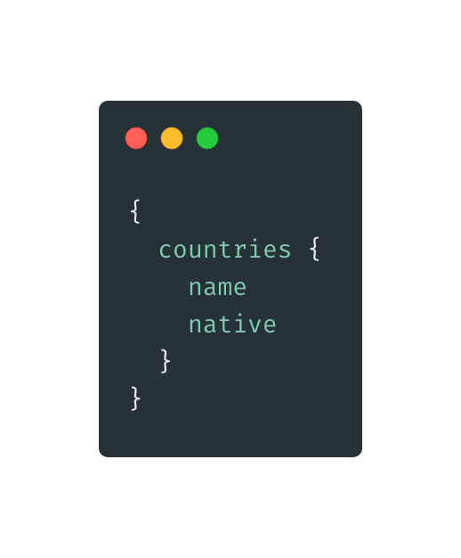
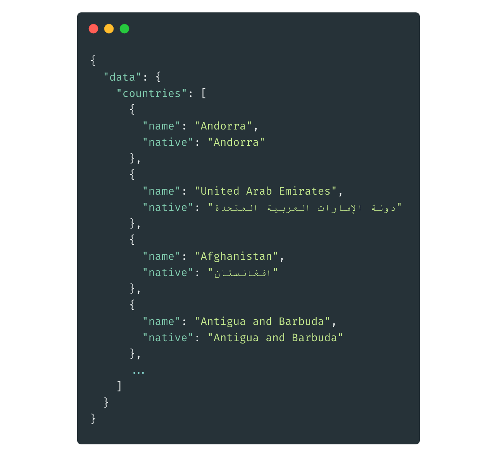
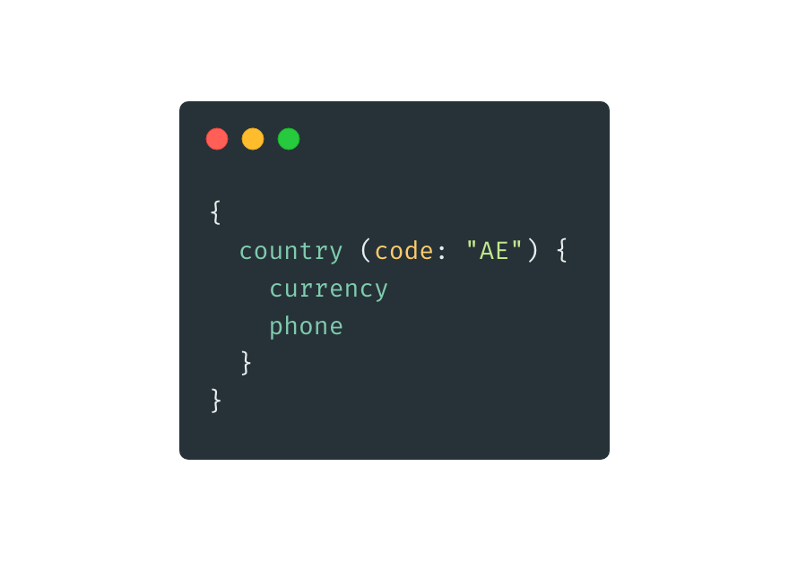
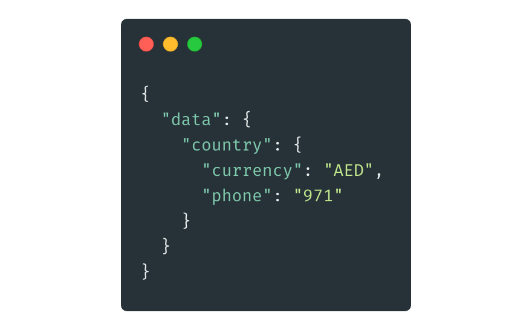
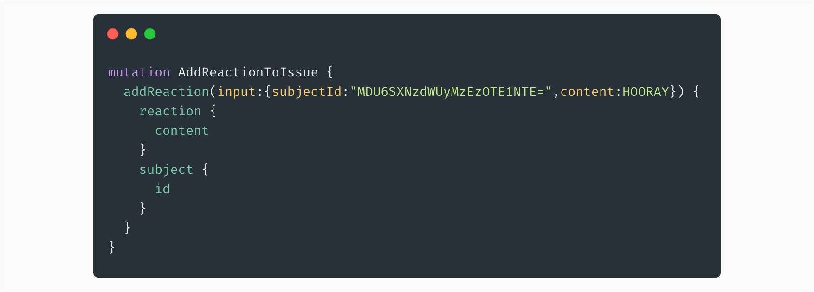
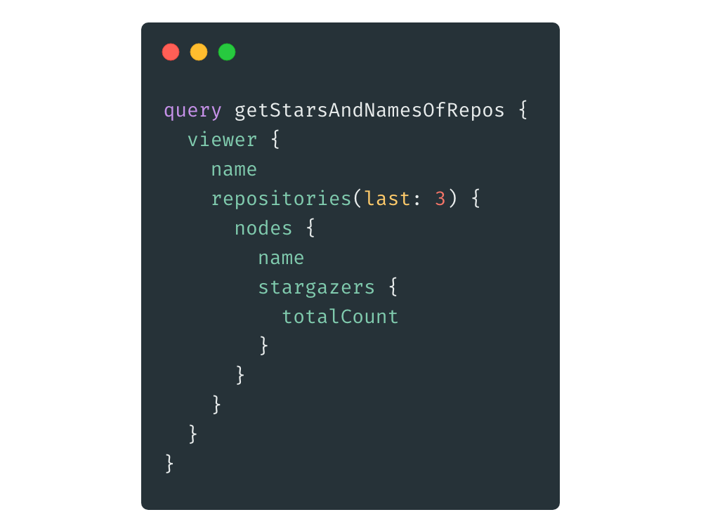
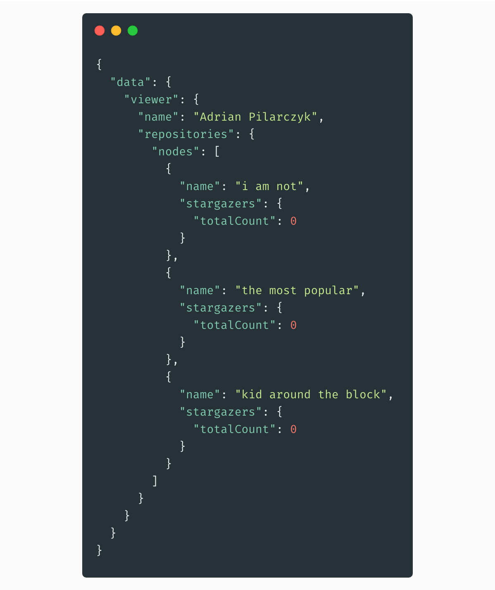
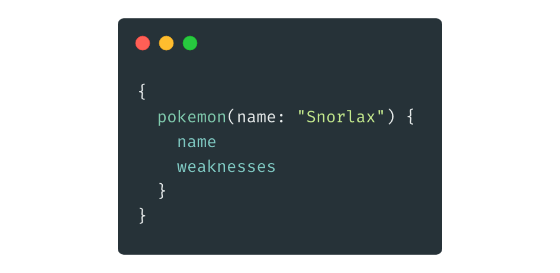
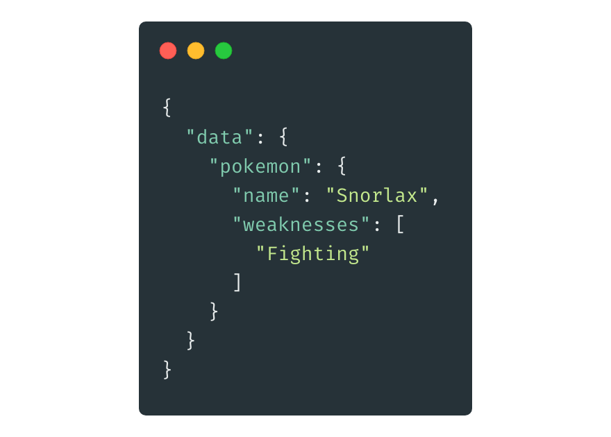
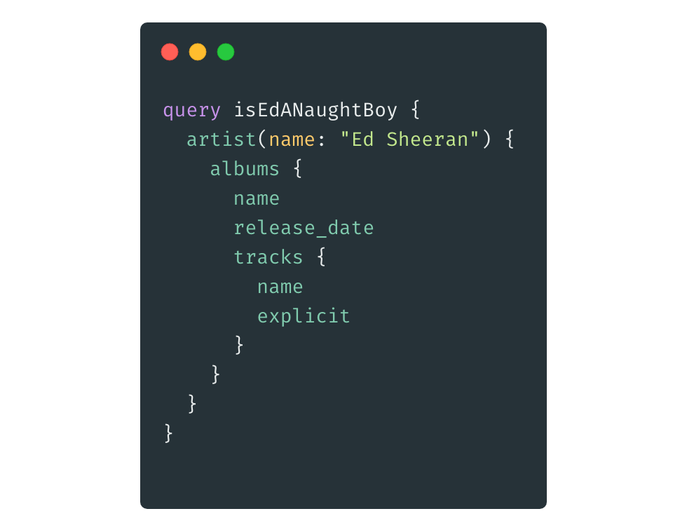

  
Over the last couple of years, [GraphQL](https://graphql.org/) has been making a name for itself as a powerful alternative for REST API. No wonder that gradually more and more people want to jump in on that sweet GraphQL hype train, but certainly not everyone wants to get their hands dirty, building an API by themselves. While doing that using one of the most popular tools out there (like [Express](https://github.com/graphql/express-graphql) or [Apollo](https://github.com/apollographql)) doesn’t have to be a chore, there is a way to have some fun with GraphQL without touching the server side. 

Let’s have a look at our list of some public GraphQL APIs you can play with:

### 1. [Countries GraphQL API](https://github.com/trevorblades/countries)
For a nice warm-up, let’s dive into Countries API built by GitHub user Trevor Blades, who used [Countries List](https://annexare.github.io/Countries/) as his source of data. Thanks to that, we can now query the API for fields such as:

- name and native name
- currency
- languages
    - name and native name
    - rtl
- phone (for countries’ mobile prefixes)
- emoji

Here are some example queries:

- Get a list of all the countries’ names and their respective native versions. 

- Get the currency and phone prefix in United Arab Emirates by its code.

After getting familiar with the API, you can make use of it by building a quiz app or have a look at [byrichardpowell’s implementation](https://github.com/byrichardpowell/Country-Quiz). Using React, TypeScript and Apollo, he managed to build a PWA fueled by Trevor Blades’ work.

You can check out the API’s playground [here](https://countries.trevorblades.com/).

### 2. [Contentful - Content Delivery API](https://www.contentful.com/developers/docs/tutorials/general/graphql/)
Contentful is a popular headless CMS, which offers plenty of flexibility in implementation. You can decide on choosing your own Front-End framework, as well as whether you want to get the data through REST or GraphQL API. 

The team behind this product put in a large effort to make the experience of interacting with their GraphQL API as painless as possible. Thanks to that, every user has access to an [open-source](https://github.com/contentful/the-example-app.nodejs#readme) demo [app](https://the-example-app-nodejs.contentful.com/), whose resources you can query from an [interactive playground](https://graphql.contentful.com/content/v1/spaces/f8bqpb154z8p/explore?access_token=9d5de88248563ebc0d2ad688d0473f56fcd31c600e419d6c8962f6aed0150599&query=%7B%0A%20%20lessonCollection(where%3A%20%7B%20%0A%09%09OR%3A%20%5B%0A%09%09%09%7B%20title_contains%3A%20%22content%22%20%7D%2C%0A%09%09%09%7B%20title_contains%3A%20%22SDK%22%20%7D%0A%09%09%5D%0A%20%20%7D)%20%7B%0A%20%20%20%20items%20%7B%0A%20%20%20%20%20%20title%0A%20%20%20%20%20%20slug%0A%20%20%20%20%20%20modulesCollection(limit%3A%202%2C%20skip%3A%201)%20%7B%0A%20%20%20%20%20%20%20%20total%0A%09%09%09%09limit%0A%09%09%09%09skip%0A%20%20%20%20%20%20%20%20items%20%7B%0A%20%20%20%20%20%20%20%20%20%20...imageUrl%0A%09%09%09%09%09...%20on%20LessonCodeSnippets%20%7B%0A%20%20%20%20%20%20%20%20%20%20%20%20title%0A%20%20%20%20%20%20%20%20%20%20%7D%0A%20%20%20%20%20%20%20%20%20%20...%20on%20LessonCopy%20%7B%0A%20%20%20%20%20%20%20%20%20%20%20%20sys%20%7B%0A%20%20%20%20%20%20%20%20%20%20%20%20%20%20id%0A%20%20%20%20%20%20%20%20%20%20%20%20%7D%0A%20%20%20%20%20%20%20%20%20%20%20%20title%0A%20%20%20%20%20%20%20%20%20%20%7D%0A%20%20%20%20%20%20%20%20%7D%0A%20%20%20%20%20%20%7D%0A%20%20%20%20%7D%0A%20%20%7D%0A%7D%0A%0Afragment%20imageUrl%20on%20LessonImage%20%7B%0A%20%20title%0A%20%20image%20%7B%0A%20%20%20%20url%0A%20%20%7D%0A%7D). 

Contentful helps bring to fruition plans of creating easy to manage and pleasant to write dev blog or portfolio. Very nature of headless CMS puts a solid line between Front-End and Back-End and because of that, swapping a view framework is just a matter of delivering the data where it should be, what makes it a perfect fit for GraphQL.

### 3. [GitHub](https://developer.github.com/v4/) / 4. [GitLab](https://docs.gitlab.com/ee/api/graphql/)
Two of the largest players in the software development version control based hosting providers go toe to toe with adding new, cutting-edge features. No wonder then that both of them offer a GraphQL API for their users to consume. GitHub’s docs describe perfectly the motivation that pushes more and more companies towards GraphQL, which is mostly about speed and precision:

> *GitHub chose GraphQL for our API v4 because it offers significantly more flexibility for our integrators. The ability to define precisely the data you want—and only the data you want—is a powerful advantage over the REST API v3 endpoints. GraphQL lets you replace multiple REST requests with a single call to fetch the data you specify.* 

Their API is a great starting point for people that are eager to dive into GraphQL world and [GraphQL Editor](https://graphqleditor.com/) makes it significantly easier to browse through the vast structure of its schemas, which you can see in action here. It allows for both querying and mutating the data, which means you can even create your custom reactions to issues: 

But for simple getting all of your repositories and its stars, this snippet will do:

You can play around with it right here. 

GitLab, on the other hand, offers slightly less humane docs, but more straight-forward ones. We have some nice [reference resources](https://docs.gitlab.com/ee/api/graphql/reference/) and also mentions of an IDE available on your instance on http://gitlab.example.com/-/graphql-explorer , but sadly nothing based on a demo app that you can play without prior setup.

### 5. [GraphQL Pokemon](https://github.com/lucasbento/graphql-pokemon)
If you always dreamed about creating your own version of Pokédex ([just like creators of this API](https://react-relay-pokemon.now.sh/#/)) or even a Pokémon game, this may be your best shot. 

Thanks to [Lucas Bento](https://github.com/lucasbento), you can get every information needed for describing childhood heroes of plenty of us. As usual, you can try the API out in the [interactive console](https://graphql-pokemon.now.sh/)), so if I want to remind myself what is my common feature with Snorlax, I look no further than sending:

Quickly getting in response:

### 6. [Star Wars GraphQL API](https://github.com/graphql/swapi-graphql)
I already winked at Pokémon fans, so I could not leave out possibly the biggest fanbase in the world - Star Wars fans. [Star Wars REST API](https://swapi.co/) has already made a name for itself and now it’s time to swap it with its GraphQL counterpart. 

If you would ever come across Princess Leia and asked her about her weight, you would get slapped so hard that even getting carbon-frozen would seem like a pleasant alternative. With SWAPI GraphQL API [you can learn the number without any risk of an injury](https://graphql.org/swapi-graphql?query=%7B%0A%09person%20(id%3A%20%22cGVvcGxlOjU%3D%22)%20%7B%0A%20%20%20%20name%0A%20%20%20%20mass%0A%20%20%7D%0A%7D%0A). The resources are mapped from the [original API](https://swapi.co/documentation), so you can expect to be able to query starships, vehicles, planets, species, characters and plenty more. It does not get any better than that for developers among Star Wars fans.

### 7. [Spotify - GraphQL API](https://github.com/wittydeveloper/spotify-graphql)
While Spotify already has a pretty powerful API, there is no official GraphQL support on the horizon. Fortunately, for a service that big and community that productive, you can be sure that someone will pull off an unofficial version for our use.

That was the case with [wittydeveloper](https://github.com/wittydeveloper)’s Spotify-GraphQL, which makes it seamless to check if, for example, Ed Sheeran started swearing more over time. It’s just a matter of typing:

...into the [interactive console](https://spotify-api-graphql-console.herokuapp.com/) (which requires you to authenticate the app with your Spotify account). 

The creator also offers a handful of [Node + TypeScript query examples](https://github.com/wittydeveloper/spotify-graphql-examples), where you can find ways of getting data of the user’s playlist or top artist’s tracks. 
