I've decided to create a list of top resources to learn for two modern and trending technologies after checking results of [The stage of Javascript 2018 Survey](https://2018.stateofjs.com). The survey was completed by 20k users. React is, of course, the most popular among front end frameworks. 

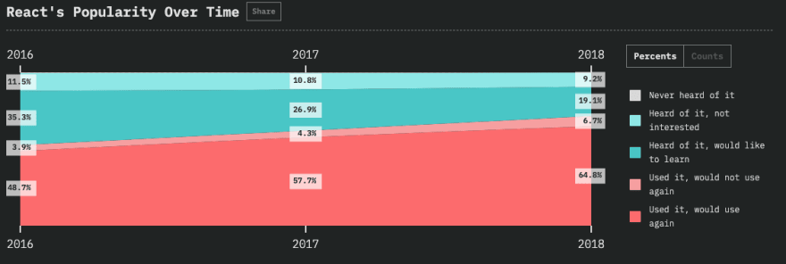

GraphQL is the top wanted to learn technology.

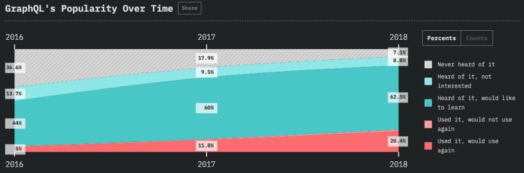

# Clients

- [Apollo GraphQL ](https://www.github.com/apollographql/apollo-client): A fully-featured, production ready caching GraphQL client for every UI framework and GraphQL server

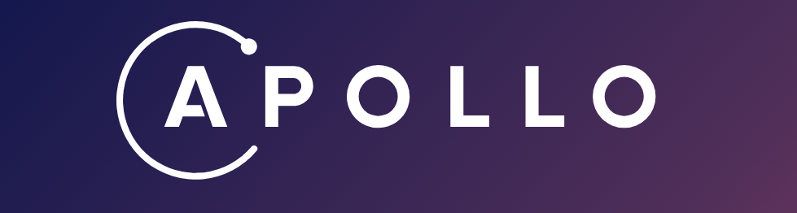

- [Relay Modern](https://facebook.github.io/relay/): A JavaScript framework for building data-driven React applications

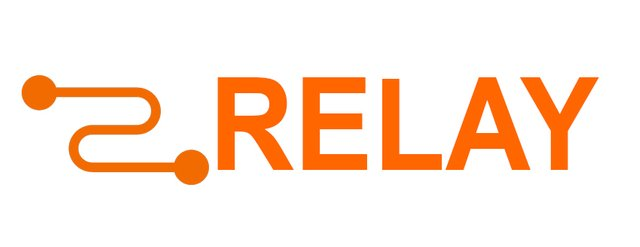

- [AppSync](https://github.com/awslabs/aws-mobile-appsync-sdk-js): JavaScript GraphQL library for Offline, Sync, Sigv4. includes support for React Native

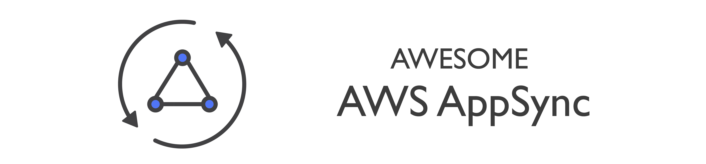

- [FormidableLabs - urql](https://github.com/FormidableLabs/urql): A highly customizable and versatile GraphQL client for React

- [Graphql.js](https://github.com/f/graphql.js):A Simple and Isomorphic GraphQL Client for JavaScripy

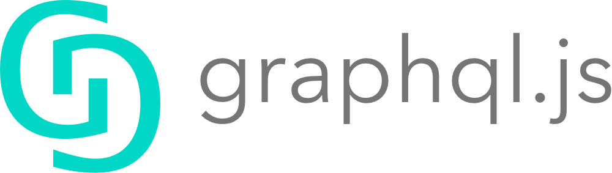

# Tutorials

- React
  - [A complete React with GraphQL Tutorial](https://www.robinwieruch.de/react-with-graphql-tutorial/)
  - [A complete React with Apollo and GraphQL Tutorial](https://www.robinwieruch.de/react-graphql-apollo-tutorial/)
  - [React + Apollo Tutorial](https://www.howtographql.com/react-apollo/0-introduction/)
  - [React + Relay Tutorial](https://www.howtographql.com/react-relay/0-introduction/)

- React Native
  - [Code an App With GraphQL, React Native, and AWS AppSync: The API](https://code.tutsplus.com/tutorials/code-an-app-with-graphql-and-react-native--cms-30511)
  - [Code an App With GraphQL, React Native and AWS AppSync: The App](https://code.tutsplus.com/tutorials/code-an-app-with-graphql-react-native-and-aws-appsync-the-app--cms-30569)
  - [How to setup React Native + GraphQL + Relay Modern](https://codeburst.io/how-to-setup-a-react-native-graphql-relay-modern-a6a5f6c18353)
  - [Building Chatty](https://medium.com/react-native-training/building-chatty-a-whatsapp-clone-with-react-native-and-apollo-part-1-setup-68a02f7e11): A WhatsApp clone with React Native and Apollo

# Developer Tools

  - [GraphQL Playground](https://github.com/graphcool/graphql-playground): Powerful GraphQL IDE built on top of GraphiQL

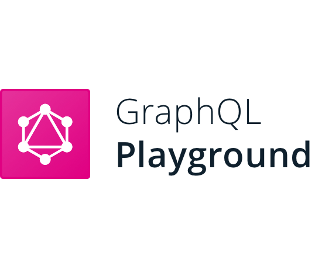

  - [GraphiQL Online](https://graphiql-online.com): An online version of GraphiQL with a configurable endpoint and headers.

  - [GraphQL Editor](https://graphqleditor.com): a visual graphql editor that allows you to visualize graphql schema and create fake backend out of schema.

[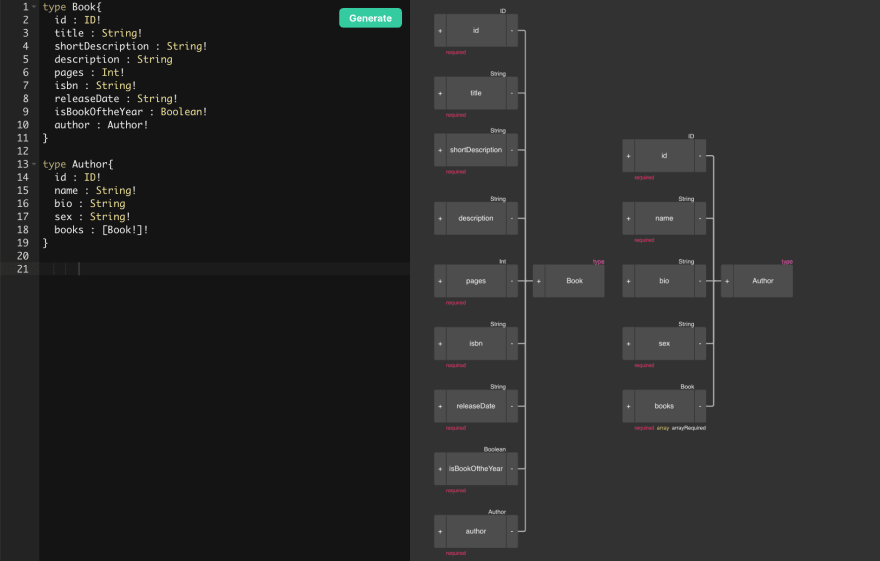](https://app.graphqleditor.com/demo/blog-sample)

  - [apollo-tooling](https://github.com/apollographql/apollo-tooling): Tooling for development and production Apollo workflows

  - [graphql-code-generator](https://github.com/dotansimha/graphql-code-generator): GraphQL code generator with flexible support for custom templates

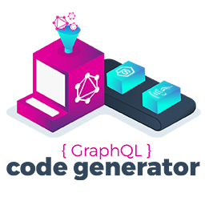

  - [eslint-plugin-graphql](https://github.com/apollographql/eslint-plugin-graphql): Check your GraphQL query strings against a schema.

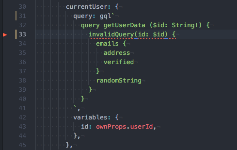

  - [Apollo Client Developer Tools](https://chrome.google.com/webstore/detail/apollo-client-developer-t): Chrome extension for Apollo Client developer tools

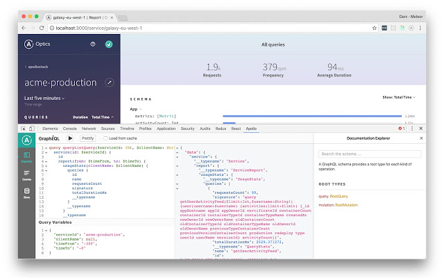

  - [Relay DevTools](https://chrome.google.com/webstore/detail/relay-devtools/oppikflppfjfdpjimpdadhelffjpciba): A Chrome Extension that creates a Relay tab in the developer tools interface for debugging apps in Chrome

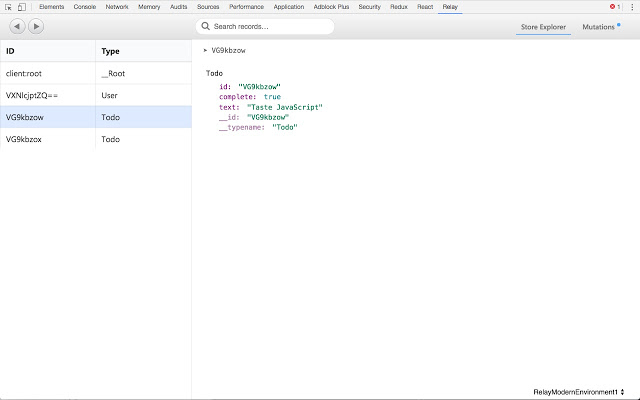

  - [Relay Devtools Electron](https://www.npmjs.com/package/relay-devtools): Standalone Relay DevTools App for debugging Relay outside Chrome

