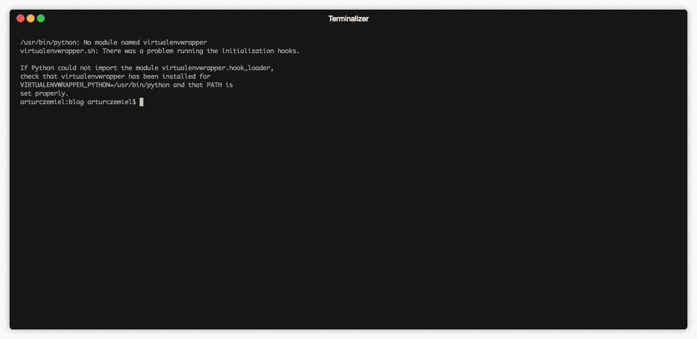
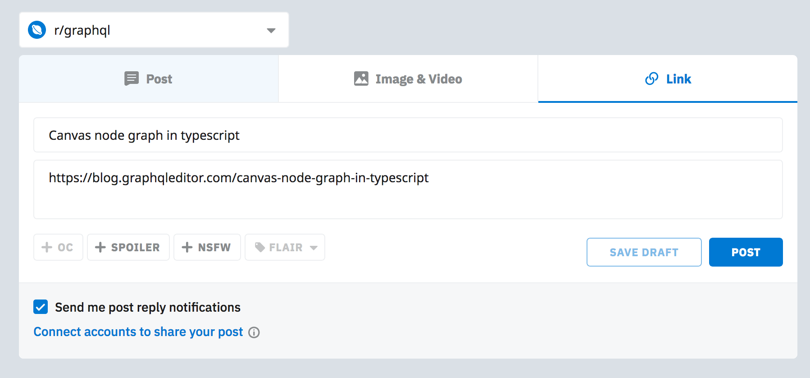

## Introduction

Hello, today I will write a little bit about tooling. 2 weeks ago I thought about starting this blog. I asked my friend who blogs what blog engine should I use. His answer was rather suprising as he told me I should have used static website and commit blog posts as pull requests to it :O.

## Searching for the perfect solution

So, I started exploring the internet to find the best blog layout ( reactjs ) tool to write my static blog. I was able to dig out `gatsby starter blog` from hundreds of chinese repos which github is flooded with right now. At the moment I created this blog I had no experience with Gatsby ecosystem but it looked promising for me.

## Running

Running this kind of gatsby package required me only to install `gatsby-cli` and run command `gatsby develop`. Pretty easy? Huh?

## Modifications

I decided to add some tweaks to this simple blog package as it was really pure blog with one author. So to add other authors( who I don't have yet :( ) I added authors folder, so to add you as an author you need to create folder with your name and create `index.js` file with this kind of content inside it:

```js
export const Artur = {
  photo: require('./Artur.jpeg'),
  desc:
    'GraphQL passionate. Code generation guru. Short code lover. Father. CTO. CEO.',
  name: 'Artur Czemiel',
  email: 'aexol@aexol.com',
}
```

and add of course this line to `authors/index.js` :

```js
import { Artur } from './Artur'
export const Authors = {
  Artur,
}
```

Later on you can use it inside your blogpost.

## How to add your blog post

Adding your blog post is pretty easy though. Again you have to create a folder inside pages folder with blog post slug like `my-very-interesting-article`. Add an `index.md` file to it with this kind of header which is formatted by `graymatter` package then:
```yaml
---
title: My very interesting article
date: '2018-10-27T13:23:04.284Z'
author: Artur
---
```
ł
That's it. After writing article you just submit pull request to your fork. I merge the pull request and publish your article to website.

## Publish tools

Sometimes I am kinda lazy person. I added small publish CLI to this project, which automatically using `opn` opens browser with prefilled url and title fields for: `reddit` `LinkedIn` `twitter` `hackernews`. So it is much easier to share your blog posts from this blog. It lives in `bin/index.js` folder of this blog and uses `yargs` and `inquirer` and `graymatter` which I mentioned before.



After that it opens a window so I can post on reddit. Simple and beautiful!



## Your support

If you want to support me just star GraphqlBlog repo. The link is in the navigation bar. Of course you can write your own article here and submit a pull request. I promise I will improve the bloggin system to be the best open source blog in the world ; ).