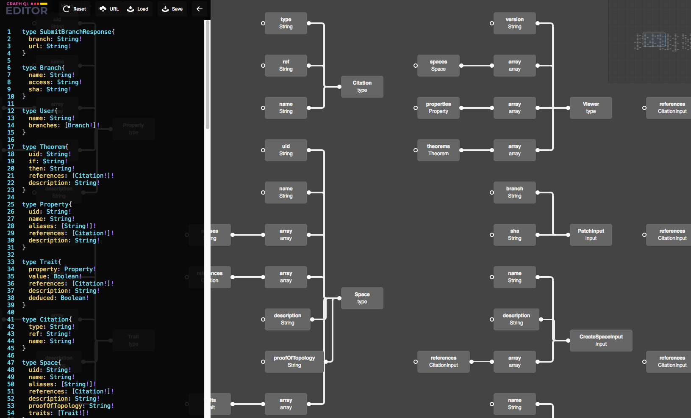

A story about one [Diagram](https://github.com/slothking-online/diagram)

with a [Live Demo](https://demo.graphqleditor.com/)

## How it looks



## Introduction

Hello again. Today I am going to present my journey with node diagrams. I used to love them when I was working as a VFX scripter 8 years ago especially Maya dependency graph. For years as a Frontend developer I had been looking for totally abstracted way of creating visual diagram. After that I have not found satysfying solution, this year I decided to write my own library for that

## First Version

First version was based on react DOM Nodes!


Yeah it was a crazy idea. However, ux handled by dom was cool and the overall experience satysfying.... with 30 nodes. With bigger number of nodes things started getting slower and slower.

## Going canvas

After trying many possible optimizations I decided again to rewrite everything( almost! as space bar menu looks cool in react(for now)). Also leaving some components in react gives me an opportunity to find contributors for this project. Now the performance of it is stunning. I don't know why it was so slow on DOM engine?

## Abstracting the renderer

Right now I am keeping the diagram data inside state and renderer separatly. That means you can write another renderer for example Augmented Reality renderer and it should just work with drawing functions only. How? Because all the picking is done inside ts functions and its not connected to for example canvas pixel color.

## How it works

```tsx
import { Graph } from '@slothking-online/diagram'
import * as React from 'react'
let allCategories = [
  {
    name: 'middlewares',
    items: [
      {
        name: 'middleware',
        type: 'middleware',
        inputs: [
          {
            name: '',
          },
        ],
        outputs: [
          {
            name: '',
          },
        ],
      },
    ],
  },
]

export const MyGraphComponent = () => (
  <Graph
    serialize={(nodes, links, tabs) => {
      // Do whatever you want with node data from diagram
    }}
    categories={allCategories}
  />
)
```

So you can use it inside any React JS/TS application

## Support Me!

If you like my Idea and want to support me, please give me a star or even contribute to my projects!

[Diagram](https://github.com/slothking-online/diagram)

[Editor](https://github.com/slothking-online/graphql-editor)