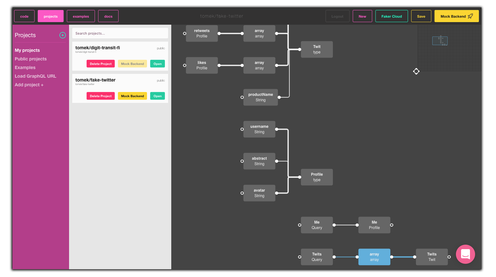
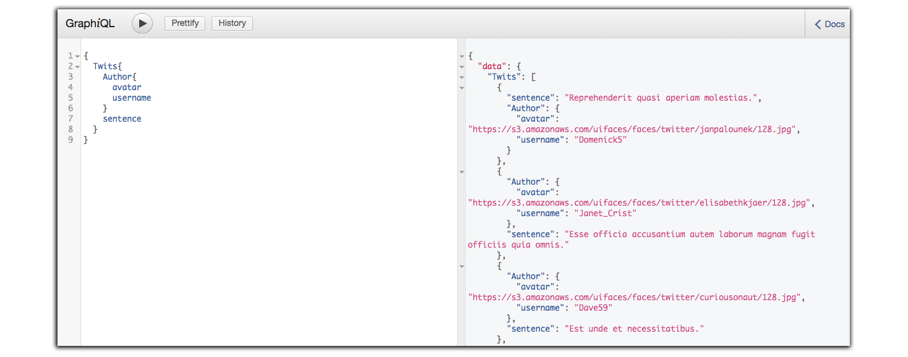

Welcome in yet another episode of our Code Academy series. This week we will show you how 
easy you can create a fake backend with a [GraphQL Editor](https://graphqleditor.com) tool.

[Mocking](https://en.wikipedia.org/wiki/Mock_object) is primarily used in unit testing. What is mocking? In short, it’s a practice of creating a fake version of an object or a component, so you can isolate its behavior to develop other parts of your software independently (tested objects might have dependencies on other components). 

## Importance of mocking data in modern projects

Creating a mock backend is considered a good practice because it:
### 1. Speed up development 
It’s still a very popular (unfortunately) practice to start a frontend and a backend development at the same time. Clients often insist on it as they see this as a faster approach (nothing more wrong!).  Having a mock backend let you work on frontend server-depended tasks even if you don’t have a working backend yet. 

### 2. It’s a safe way
Fake backend lets you run local tests. When you don’t need to connect to a real backend it's much safer (and faster). As the project becoming more and more complex, preparing a server infrastructure just to run some tests can be a very unpleasant task and might cause you a lot of trouble.

## Is it hard to create a mock backend?

As you see having a mock backend is definitely a huge benefit, then you must be asking yourself why this solution still isn’t that popular? I bet that the first reason that would appear in your mind is that it’s probably too difficult or time-consuming.  If that came to your mind you are partially right - creating a mock backend used to be difficult, but it’s not anymore! 

GraphQL made mocking data super easy! GraphQL is a strongly typed language. Type System defines various data types that can be used in a GraphQL application and these types can be easily shared between frontend and backend as they have all the information required to mock data.

We went a step further, our [GraphQL Editor](https://graphqleditor.com) allows you to created mock backend with a single click! Don’t believe? Test it yourself. First, go to https://app.graphqleditor.com/ :

All you need to have is a valid [GraphQL schema](https://graphql.org/learn/schema/). You can upload an existing schema from a link or use one of our sample schemas. Once you have it loaded just save it and click “Mock Backend” button:

And that’s it! You have a ready to use fake backend endpoint ready for some tests. Use the [GraphiQL](https://github.com/graphql/graphiql) window and play around with your fresh mock backend:

