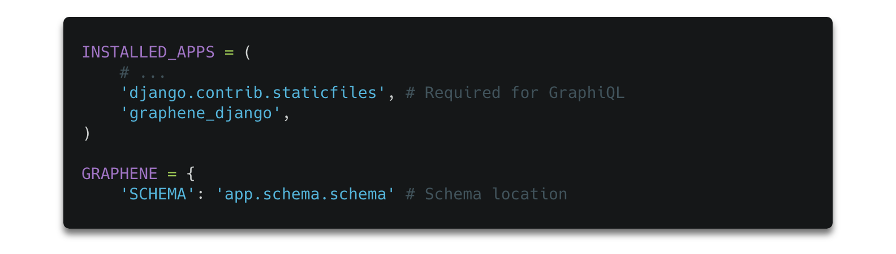
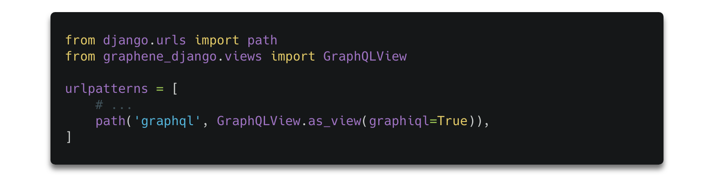
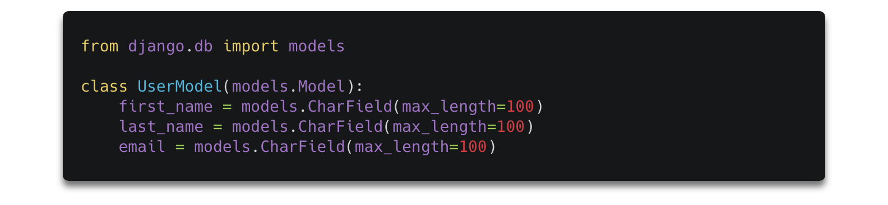
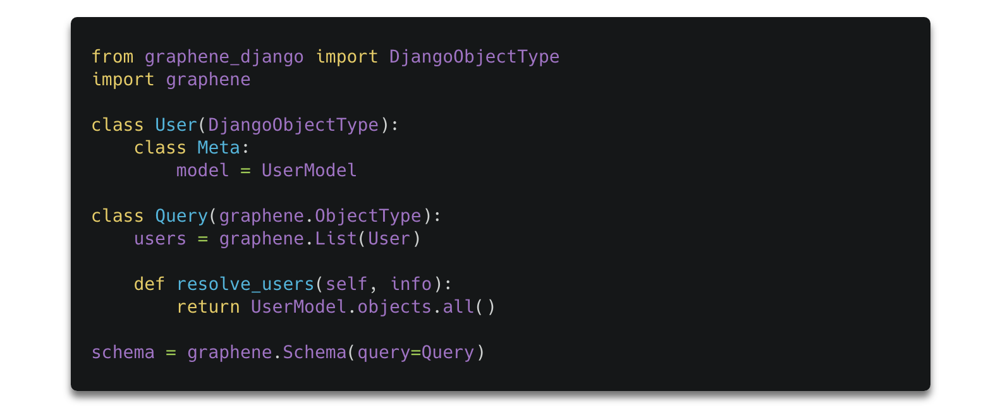
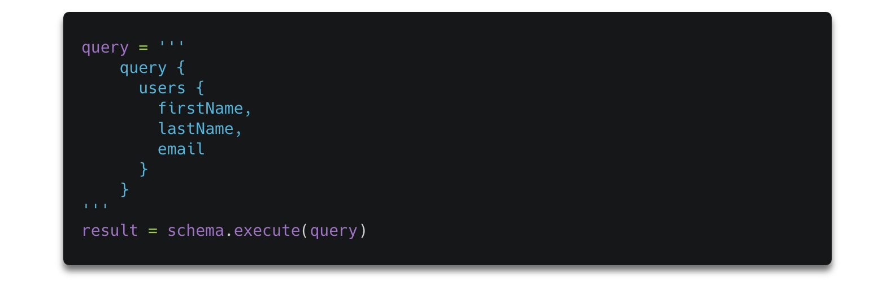

Modern frameworks come and go. Some of them manage to become a new standard. With a rise of modern JavaScript libraries like [React](https://reactjs.org/), new approaches to data fetching like GraphQL APIs are becoming more popular. While [Node.js](https://nodejs.org/en/) is still being the most popular technology for [GraphQL](https://graphql.org/) based backend, there are many other options.

If Python is your preferred choice you would be very keen to hear that Django has decent support for [GraphQL](https://graphqleditor.com/). Being more specific [Graphene](https://graphene-python.org/), a product with a goal to ease developers lives by providing a library for building GraphQL APIs. Before we move on let's take a look at how it all has started.


#### The need for a new approach

In the early 2010s, the IT industry had to face a new challenge. The significant rise of mobile usage shown weaknesses of architecture many big social services where data structures take the form of graphs. The significant increase of mobile usage led to many performances some issues with low-powered devices and sloppy networks and the development teams discovered that REST isn’t optimal to deal with this kind of issue.


***"Adapt or die"***

Identifying this as a crucial part of mobile app performance, Facebook started working on a solution to meet their newsfeed's data management requirements, which was later on open-sourced under a name GraphQL.  In parallel, a couple of other companies identified the same problem with their data fetching model. Many of them abandoned their projects after GraphQL was made publicly available and decided to adopt this great tech. Unlike others, Netflix continued to work on their own REST alternative [Falcor](https://github.com/Netflix/falcor), which they decided to open-sourced as well.

#### What's a GraphQL

GraphQL is a query language for APIs. It’s becoming more popular because, unlike to REST, it offers smarter & a lot more elastic data fetching.

Let's take s look at simple GraphQL query:
```
query {
  user {
    name
  }
}
```
and a server response it would return:
```
{
  "user": {
    "name": "Tomek Poniatowicz",
   }
}
```

Now imagine that you are fetching data for a Facebook feed, where you have a user, posts of that user's friends, comments for those posts made by other users, etc. There is a lot of data that need to be requested, which may lead to over/under-fetching problems in REST. Since GraphQL gives power to the client to fetch the needed data only, nothing slows down, as it's very simple to just add a new field to a query.


#### Django integration for Graphene

We need to install `graphene-django` library and include it in our `settings.py` file

```
pip install "graphene-django>=2.0"
```


and set up a GraphQL endpoint in Django app



Now let's prepare a simple Django data model in our `app/models.py` file
and define our schema in `app/schema.py`:


and



and we are all set. Now you can query your simple schema:




#### The main benefits of using GraphQL

There’s a lot of hype on GraphQL and debate on [GraphQL vs REST](https://blog.graphqleditor.com/graphql-vs-rest-performance/).
The main benefit of using GraphQL is the fact that it's way more elastic in terms of fetching data than REST, which results in fewer round-trips to the server. GraphQL makes problems of under & over-fetching disappear. 
As GraphQL is in an early stage of adoption, it has some weaknesses (i.e caching), but it's gaining a lot of momentum & becoming a force to reckon.

