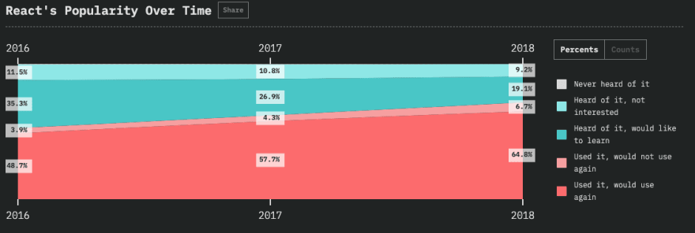
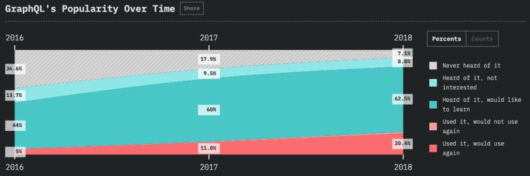

[The stage of Javascript 2018 Survey](https://2018.stateofjs.com) was completed by 20k users and contains an analysis of what aspects people like & dislike about web technologies. I found React & GraphQL interesting since they're completing each other and stand out from surveys conclusions: 

> React is the most popular among front end frameworks.

> GraphQL is the top most wanted technology to learn.

Following that, I've combined popular boilerplates and starter apps to start using React with GraphQL. There's so much stuff on the internet that I've decided to split article two articles. 

#Agenda:

1. ReactQL
2. SaaS Boilerplate
3. React apollo todo app
4. Universal React Apollo app
5. Relay Skeleton

# [1. ReactQL](https://reactql.org/)

###Universal React+GraphQL starter kit: React 16, Apollo 2, MobX, Emotion, Webpack 4, GraphQL Code Generator, React Router 4, PostCSS, SSR.

### Front-end stack

- [React v16.8](https://facebook.github.io/react/) (the one with [hooks](https://reactjs.org/docs/hooks-intro.html)!) for UI.
- [Apollo Client 2.5 (React)](http://dev.apollodata.com/react/) for connecting to GraphQL.
- [MobX-React-Lite](https://github.com/mobxjs/mobx-react-lite) for declarative, type-safe flux/store state management.
- [Emotion](https://emotion.sh/) CSS-in-JS, with inline `<style>` tag generation that contains only the CSS that needs to be rendered.
- [Sass](https://sass-lang.com/), [Less](http://lesscss.org/) and [PostCSS](https://postcss.org/) when importing `.css/.scss/.less` files.
- [React Router 4](https://reacttraining.com/react-router/) for declarative browser + server routes.
- [GraphQL Code Generator v1.1](https://graphql-code-generator.com/) for parsing remote GraphQL server schemas, for automatically building fully-typed Apollo React HOCs instead of writing `<Query>` / `<Mutation>` queries manually
- Declarative/dynamic `<head>` section, using [react-helmet](https://github.com/nfl/react-helmet).

### Server stack

- Built-in [Koa 2](http://koajs.com/) web server, with async/await routing.
- Full route-aware server-side rendering (SSR) of initial HTML.
- Universal building - both browser + Node.js web server compile down to static files, for fast server re-spawning.
- Per-request GraphQL store. Store state is dehydrated via SSR, and rehydrated automatically on the client.
- MobX for app-wide flux/store state, for automatically re-rendering any React component that 'listens' to state. Fully typed state!
- Full page React via built-in SSR component - every byte of your HTML is React.
- SSR in both development and production, even with hot-code reload.

### Real-time

- Hot code reloading; zero refresh, real-time updates in development.
- Development web server that automatically sends patches on code changes, and restarts the built-in Web server for SSR renders that reflect what you'd see in production.
- WebSocket `subscription` query support for real-time data (just set `WS_SUBSCRIPTIONS=1` in [.env](.env))

### Code optimisation

- [Webpack v4](https://webpack.js.org/), with [tree shaking](https://webpack.js.org/guides/tree-shaking/) -- dead code paths are automatically eliminated.
- Asynchronous code loading when `import()`'ing inside a function.
- Automatic per-vendor chunk splitting/hashing, for aggressive caching (especially good behind a HTTP/2 proxy!)
- Gzip/Brotli minification of static assets.
- CSS code is combined, minified and optimised automatically - even if you use SASS, LESS and CSS together!

### Styles

- [Emotion](https://emotion.sh/), for writing CSS styles inline and generating the minimal CSS required to properly render your components.
- [PostCSS v7](http://postcss.org/) with [next-gen CSS](https://preset-env.cssdb.org/) and automatic vendor prefixing when importing `.css`, `.scss` or `.less` files.
- [SASS](http://sass-lang.com) and [LESS](http://lesscss.org/) support (also parsed through PostCSS.)
- Automatic vendor prefixing - write modern CSS, and let the compiler take care of browser compatibility.
- Mix and match SASS, LESS and regular CSS - without conflicts!
- CSS modules - your classes are hashed automatically, to avoid namespace conflicts.
- Compatible with Foundation, Bootstrap, Material UI and more. Simply configure via a `.global.(css|scss|less)` import to preserve class names.

### Production-ready

- Production bundling via `npm run production`, that generates optimised server and client code.
- [Static compression](https://webpack.js.org/plugins/compression-webpack-plugin/) using the Gzip and [Brotli](https://opensource.googleblog.com/2015/09/introducing-brotli-new-compression.html) algorithms for the serving of static assets as pre-compressed `.gz` and `.br` files (your entire app's `main.js.bz` - including all dependencies - goes from 346kb -> 89kb!)
- Static bundling via `npm run build:static`. Don't need server-side rendering? No problem. Easily deploy a client-only SPA to any static web host (Netlify, etc.)

# [2. SaaS Boilerplate](http://codefoundries.com/products/UniversalRelayBoilerplate.html)

###SaaS Boilerplate + examples using React, Relay, GraphQL, Node.js, and Cassandra/Elassandra.

### Front-end stack

| **Technology** | **Description**|
|----------------|----------------|
| [found](https://github.com/4Catalyzer/found)                    | Extensible route-based routing for React applications. |
| [GraphQL](http://graphql.org/docs/getting-started/)             | A query language for describing the capabilities and requirements of data models for client‐server applications. |
| [JSS](http://cssinjs.org/)                                      | JSS is a more powerful abstraction over CSS. It uses JavaScript as a language to describe styles in a declarative and maintainable way. |
| [Material UI](http://www.material-ui.com/)                      | Library for implementing [Material Design](https://www.google.com/design/spec/material-design/introduction.html) in React. All user interface in this kit is built predominantly using Material UI components. |
| [React](https://facebook.github.io/react/)                      | The best library for building modern browser-based and mobile UIs. |
| [React Helmet](https://github.com/nfl/react-helmet)             | Reusable React component will manage all of your changes to the document head with support for document title, meta, link, script, and base tags. |
| [Relay](https://facebook.github.io/relay/)                      | A Javascript framework for building data-driven react applications. |

### Server stack

| **Technology** | **Description**|
|----------------|----------------|
| [Apache Cassandra](http://cassandra.apache.org/)                | The right choice when you need scalability and high availability without compromising performance. Linear scalability and proven fault-tolerance on commodity hardware or cloud infrastructure make it the perfect platform for mission-critical data. Cassandra's support for replicating across multiple datacenters is best-in-class, providing lower latency for your users and the peace of mind of knowing that you can survive regional outages. |
| [Data Loader](https://github.com/facebook/dataloader)           | Generic utility to be used as part of your application's data fetching layer to provide a consistent API over various backends and reduce requests to those backends via batching and caching. |
| [Elassandra](http://www.strapdata.com/)                         | Elassandra Combines Cassandra And Elasticsearch In A Single Powerful Integrated Solution. URB works well with Elassandra. |
| [Express](https://expressjs.com)                                | Fast, unopinionated, minimalist web framework for Node.js |
| [express-cassandra](https://express-cassandra.readthedocs.io)   | Cassandra ORM/ODM/OGM for Node.js with optional support for Elassandra & JanusGraph |
| [Express GraphQL](https://github.com/graphql/express-graphql)   | A Node.js express library that allows the creation of GraphQL servers. |
| [JWT](https://jwt.io/)                                          | JSON Web Tokens is an industry standard [RFC 7519](https://tools.ietf.org/html/rfc7519) method for representing claims securely between two parties. |
| [Node.js](https://nodejs.org/en/)                               | Event-driven, non-blocking I/O runtime based on JavaScript that is lightweight and efficient. |
| [Winston](https://github.com/winstonjs/winston)                 | A logger for just about everything. |

### Development tools

| **Technology** | **Description**|
|----------------|----------------|
| [Babel](http://babeljs.io)                                      | Transpiles ESX to ESX and performs relay transformations. |
| [concurrently](https://www.npmjs.com/package/concurrently)      | Run multiple commands concurrently. |
| [ESLint](https://eslint.org)                                    | A fully pluggable tool for identifying and reporting on patterns in JavaScript. |
| [Flow](http://flowtype.org/)                                    | Static type checker, designed to find type errors in JavaScript programs. |
| [Husky](https://github.com/typicode/husky)                      | Git hooks for eslint and prettier. |
| [LocalTunnel](https://localtunnel.github.io/www/)               | Expose yourself to the world. |
| [Prettier](https://github.com/prettier/prettier/)               | Code formatter for javaScript. |
| [React Hot Loader](gaearon.github.io/react-hot-loader/)         | Allows tweaking of React components in real time. |
| [Webpack](http://webpack.github.io)                             | Bundles npm packages, application Java Script, CSS, images, etc. into bundles. |

# [3. React apollo todo app](https://github.com/k8s-platform-hub/react-apollo-todo-app)

###A simple todo app build on react using the graphql queries of hasura

This is a basic todo app built on react. The app uses Hasura for its backend, leveraging the following features of Hasura:

- Deploy the react app
- Hasura Authentication the Auth UI Kit
- Hasura Database
- GraphQL queries provided by Hasura

This project comes with the following custom microservice - a React TODO app made using GraphQL with Apollo Client

# [4. Universal React Apollo app](https://github.com/WeLikeGraphQL/universal-react-apollo-example)

###Universal React Apollo App (GraphQL) consuming

### Features

 - [GraphQL](http://graphql.org/) for fetching data! The most awesome part of the project!
 - Universal Rendering (Server Side Rendering)
 - ES6/ES2015 with [Babel](https://babeljs.io/)
 - React data container for the [Apollo Client](http://dev.apollodata.com/react/) 
 - Integrating predictable state container [Redux](http://redux.js.org) with Apollo
 - Hot reloading using [React-Hot-Loader](https://github.com/gaearon/react-hot-loader)
 - [Recompose](https://github.com/acdlite/recompose) as a React utility belt for higher order components
 - Development and production bundling by [Webpack](https://webpack.github.io)
 - [CSSNext](http://cssnext.io/): use of official W3C syntax of the future CSS
 - Transforming styles with JS plugins by [PostCSS](http://postcss.org/)
 - [Wow.js](http://mynameismatthieu.com/WOW/) for CSS animations
 - [Flexbox](https://css-tricks.com/snippets/css/a-guide-to-flexbox/) for resolving [layout fatigue](http://blog.karenmenezes.com/2014/apr/13/floats-inline-block-or-display-table-or-flexbox/) and making the app responsive (open the app in desktop, mobile, whatever...). Doesn't work on IE 9, but it should not be a problem nowadays. See [browsers usage](http://caniuse.com/usage-table).
 - [CSS Modules](https://github.com/css-modules/css-modules): say goodbye to global scope in CSS and most of conflicts
 - [Jest Snapshot Testng](https://facebook.github.io/jest/blog/2016/07/27/jest-14.html), some parts in [Enzyme](http://airbnb.io/enzyme/) and [Sinon](http://sinonjs.org/)
 - Linting both JS and CSS, respectively by: [ESLint](http://eslint.org/) and [Stylelint](http://stylelint.io/)

# [5. Relay Skeleton](https://github.com/fortruce/relay-skeleton)

###React, Relay, GraphQL project skeleton

This skeleton project is meant to scaffold a fullstack React, Relay, and GraphQL project. The skeleton uses webpack and gulp to manage the build and provide a great development experience. The frontend stack is React, and Relay. All React changes are automatically hot reloaded using react-hot-loader. Also, the backend server is automatically
restarted upon any changes using nodemon.

Both the server and frontend code are built and transpiled using webpack, while gulp is used primarily to start the webpack-dev-server and nodemon.

### Typical Usage

This skeleton was designed with a typical use case of having a backend api serve a React SPA. The skeleton automatically proxies all requests to `/graphql` thru the webpack-dev-server to the backend GraphQL server.

The frontend is automatically hot reloaded whenever you save a file. See
[react-hot-loader] for more details on how this works. It enables you to immediately see changes in React components without losing application state or having to reload your page!

The backend server is automatically restarted whenever you save a file.
If, for example, you modify the GraphQL schema, then the GraphQL server will be restarted to reflect the changes, the `schema.json` will be regenerated using an introspection query, and the frontend code will be recompiled to re-run `Relay.QL` queries through the `babel-relay-plugin`.

