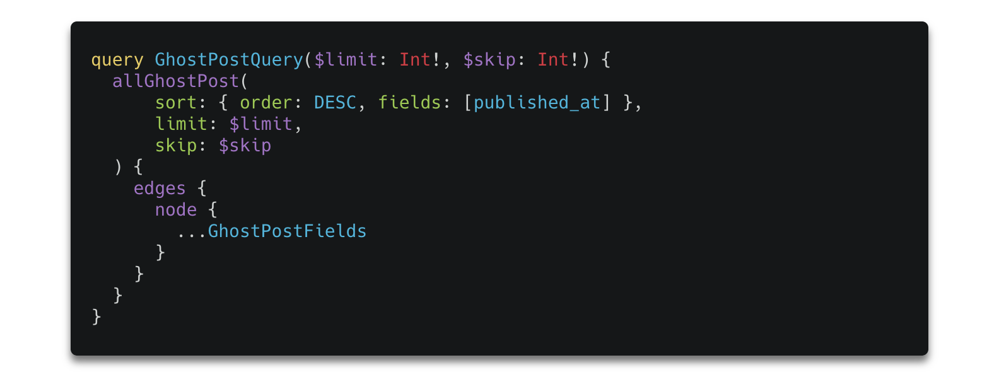
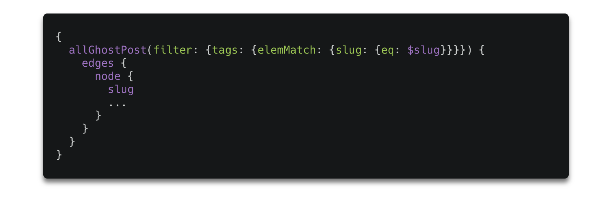
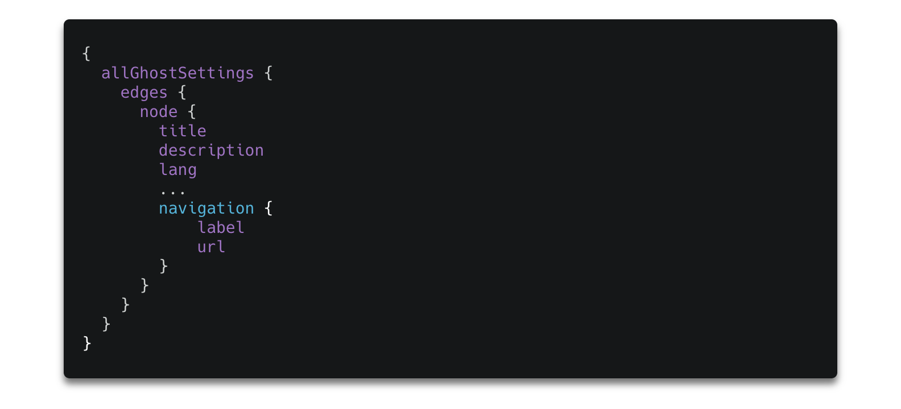
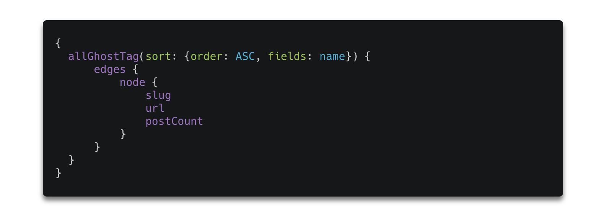

[Ghost](https://ghost.org/) is a very popular open-source publishing platform, described by many as a modern alternative to WordPress. Their premise is making publishing as easy as possible and they do deliver!

Ghost has proven its usability by gaining the trust of such tech giants like [Mozilla](https://www.mozilla.org), [OpenAI](https://openai.com/), [Apple](https://www.apple.com/), [Tinder](https://tinder.com/), [DuckDuckGo](https://duckduckgo.com/) and thousands of small & medium companies.

A week ago big news hit the Internet that the new version of Ghost is available and I think that the release timing wasn't a coincidence ...  **Happy Halloween ;)**

As mentioned by its developers, [Ghost 3.0](https://ghost.org/3/) is all about enabling new business models for publishers.

#### Ghost 3.0 features:
- **Native support for memberships** - allowing you to easily turn your anonymous page viewers into registered users, 
- **Stripe integration** - to enable subscription business model for all publishers (Ghost takes 0% transaction fees!)
- **JAMstack native architecture** -  documented integrations with [Gatsby](https://www.gatsbyjs.org/), [Next](https://nextjs.org/), [VuePress](https://vuepress.vuejs.org/), and more.
- **many new integrations** - you can use your favorite services with Ghost, the full list is available [here](https://ghost.org/integrations/)
- and of course, it remains **an open-source platform**!

If that's not enough and you are still hesitating if you should give Ghost a try it is also worth mentioning that:
- has blazing-fast & modern codebase,
- fully open-source permissive **MIT license**,
- much **cheaper than WordPress** (see below)

###### Source: [ghost.org](https://ghost.org/vs/wordpress/)

#### Ghost + Gatsby (GraphQL)

One of my favorite things about Ghost is that it works great with [Gatsby](https://www.gatsbyjs.org/) & Gatsby equals [GraphQL](https://www.gatsbyjs.org/docs/graphql-concepts/). GraphQL is a query language for APIs where when you ask for data you get exactly what you need - nothing more, nothing less. This how it looks compared to REST.

###### Source: [blog.apollographql.com](https://blog.apollographql.com/graphql-vs-rest-5d425123e34b)

Fetching data from the Ghost API for a Gatsby site is very simple, especially when using GraphQL. Let's take a look at some basic operations that can be done to retrieve data from the Ghost API with GraphQL.
Take a look at these common examples of operation you probably need to perform when using GraphQL to query the Ghost API for your company page, news site or blog. All examples come from [Ghost docs](https://ghost.org/docs/api/v3/gatsby/graphql-recipes-for-ghost/).

#### Fetching posts
In this example, we take a limited amount of posts per page & use ‘skip’ to paginate through pages containing those posts:

###### Source: [ghost.org](https://ghost.org/docs/api/v3/gatsby/graphql-recipes-for-ghost/)

#### Filtering Posts
Filtering posts by tag is a widely used case:

###### Source: [ghost.org](https://ghost.org/docs/api/v3/gatsby/graphql-recipes-for-ghost/)

#### Retrieving settings
The Ghost settings node differs from other nodes (it’s a single object). To query it you need to:

###### Source: [ghost.org](https://ghost.org/docs/api/v3/gatsby/graphql-recipes-for-ghost/)

#### Retrieving the list of all tags
Getting all tags from a Ghost site is simple. You could them to form a tag cloud or a keywords list:

###### Source: [ghost.org](https://ghost.org/docs/api/v3/gatsby/graphql-recipes-for-ghost/)
