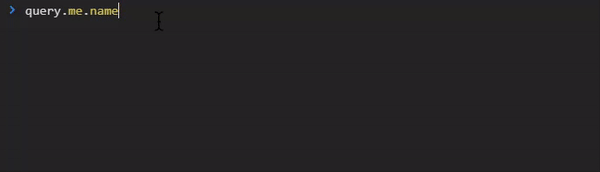
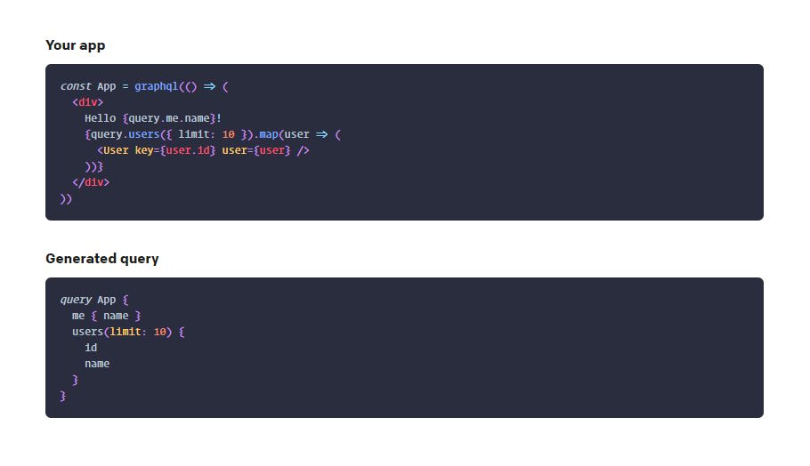

GraphQL was publicly released in 2015. Following this, a new ecosystem began to shape around it as it's premise was well-received by the dev community. GraphQL is basically a **query-language for your API** which is language & database-agnostic. A GraphQL query is a string sent to the runtime that returns JSON to the client. This simple idea began the creation of a wide set of open-source libraries, tools, clients etc., aiming to make using GraphQL an effortless experience.

**GraphQL popularity is constantly rising**. As the number of companies incorporating GraphQL is growing, the awesome tools supporting GraphQL are being developed daily. gqless is one of them!




# How does it work?

**[gqless](https://gqless.dev/)** is an awesome GraphQL client built by Sam Denty. It's allowing you to wrap components in `graphql()` which makes gqless perform an additional render of your entire application with all the available GraphQL objects, but without the data i.e.:

- Arrays will have a length of 1
- Scalars will return null

After this is done the gqless will generate queries & fetch data to re-render the whole app with the newly available data as a final outcome.

gqless is a new & very interesting approach to a GraphQL client offering:

- **Invisible data fetching** - runtime generated queries with JS getters
- **Strongly typed** - built-in TypeScript support 
- **Production-ready features** - it offers built-in cache,e extensions and more



##### Source: [gqless.dev](https://gqless.dev/)

Try gqless and find out how enjoyable & easy it is to use GraphQL with auto-generated queries offered by gqless.

```
yarn add gqless
yarn add @gqless/cli -D

# or
npm install gqless
npm install @gqless/cli --save-dev
```

Have fun!
