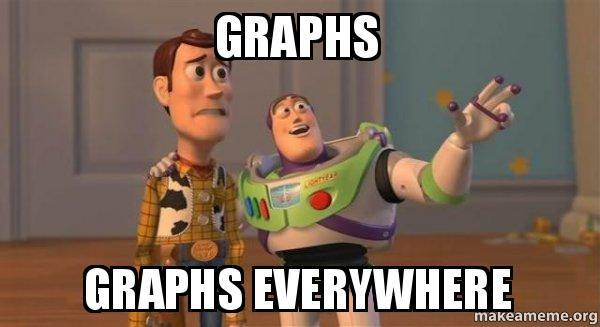
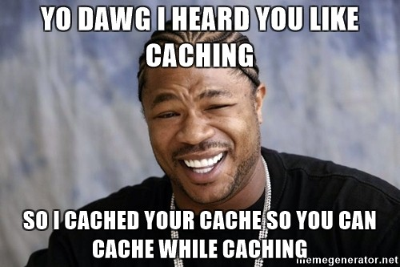

## Graphs, graphs everywhere!

Graphs are powerful tools for modeling complicated structures. In [GraphQL](https://graphql.org/) you model your business model as a graph by defining a schema, then within your [GraphQL schema](https://graphql.org/learn/schema/), you define different types of nodes and how they relate with other nodes. This creates a well-known pattern (Object-Oriented Programming) on the client side. Think of your [GraphQL schema](https://www.apollographql.com/docs/graphql-tools/generate-schema.html) as a common language spoken by your business team, development team as well as your users. Defining your schema is a crucial thing for the GraphQL project. Since GraphQL only defines the interface you have the freedom to use it with any backend.

There are plenty of tools and extensions helping with its creation, among them our [Visual GraphQL Editor](https://graphqleditor.com/).

## Authorization

Authorization is a type of business logic that describes whether a given user, session or context has permission to perform some action or read data. Defining authorization logic inside the resolver is fine when prototyping, however, you should delegate authorization logic to the business logic layer for production. It's recommended having a single source of truth for authorization instead of a token or API key, this allows better handling of authorization and authentication in different stages of the request processing pipeline.

## Caching

Caching is an integral part of the HTTP specification. Because of the way GraphQL operates, it does not follow the HTTP specification for caching and instead uses a single endpoint, so it is up to the developer to make sure that caching is implemented properly for non-mutable queries. Fortunately, there are some libraries that can help GraphQL solve this problem like [Apollo](https://www.apollographql.com/) or [FlacheQL](http://www.flacheql.io/). You can read more about them in [GraphQL vs REST - Caching](https://blog.graphqleditor.com/grapqhl-vs-rest-caching/) blog post.

## Pagination

A common practice in GraphQL is to trace the interactions between sets of objects. There are many ways in which these dependencies can be disclosed. In GraphQL we could do pagination as:
- `friends(first:2 offset:2)` to ask for the next two on the list.
- `friends(first:2 after:$friendId)`, to ask for the next two after the last friend we fetched.
- `friends(first:2 after:$friendCursor)`, where we get a cursor from the last item and use that to paginate.

Different pagination models enable different client capabilities

