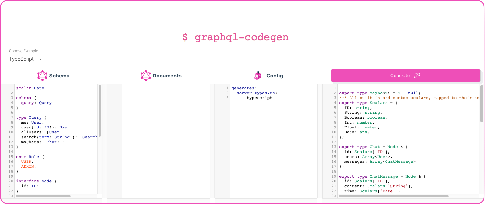

[GraphQL](https://graphqleditor.com/) is a hot technology. Its recent rise created a niche for multiple tools, like [GraphQL Code Generator](https://graphql-code-generator.com/), having one thing in common - making using GraphQL easier & more pleasant experience.

GraphQL Code Generator is a tool that generates code out of your GraphQL schema. How? By analyzing the GraphQL schema & documents and parsing it, then GraphQL Code Generator outputs code at a wide variety of formats. 

The creators currently support & maintain plugins for:
- TypeScript
- Flow
- React
- Angular
- MongoDB
- Stencil
- Reason

GraphQL Code Generator let you choose the output that you need, based on available plugins,  which can also be easily customized. As it 100% open-source you can write your own plugins to generate custom outputs that you need.

I got your attentiopn?  Good, now go try it out online:

or just explore its [GitHub repo](https://github.com/dotansimha/graphql-code-generator) if that's what you prefer. 