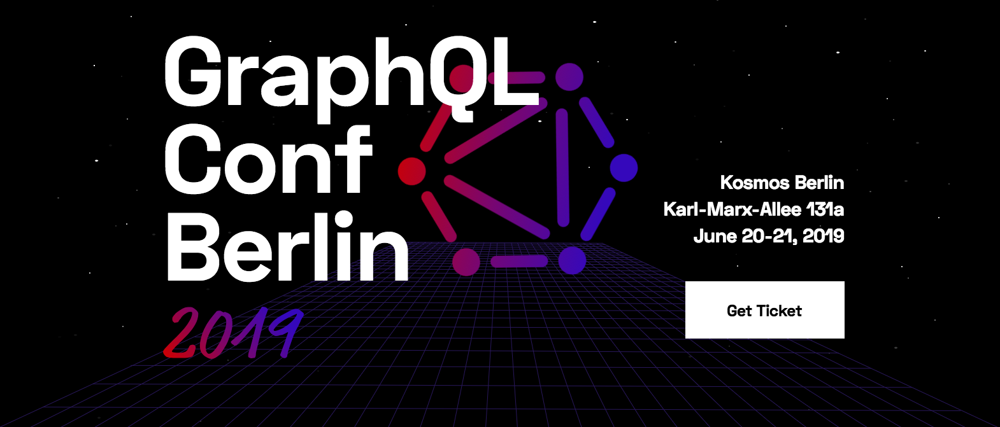

2019 is going to be a good year for [GraphQL](https://graphql.org/). A lot of new tools to bridge the implementation gap, hundreds of interesting meetups across the whole globe and a couple conferences you can not afford to miss like the [GraphlQL Conf  in Berlin](https://www.graphqlconf.org/).

### **GraphQL Conf** 
The [GraphlQL Conf](https://www.graphqlconf.org/) is the biggest, non-profit GraphQL conference in Europe. Speakers from all around the world are coming to talk about GraphQL best practices and the latest trends. GraphQL Conf Berlin is the best place to meet industry experts and become part of the rising GraphQL community. The last year edition gathered ~270 attendees and 19 speakers from across the world.

###### Source: [https://www.graphqlconf.org/](https://www.graphqlconf.org/)

### **Confirmed Speakers for 2019**

The line up for the upcoming year is not fully confirmed yet.  So far we have three speakers and it looks promising, just take a look!

**Lee Byron**\
Ex-Facebook, [GraphQL](https://graphql.org/) co-creator
Currently responsible for designing, building software and teams at Robinhood - the app that lets you invest in the stock market for free, directly from your phone or desktop.

 
###### Source: [https://www.graphqlconf.org/](https://www.graphqlconf.org/static/speakers/lee-byron.jpg)

**Dan Schafer**\
[Facebook](https://developers.facebook.com/), [GraphQL](https://graphql.org/) co-creator
Dan Schafer is a software engineer at Facebook and a co-creator of GraphQL. He worked on the implementations of both GraphQL Mutations and Subscriptions.

###### Source: [https://www.graphqlconf.org/](https://www.graphqlconf.org/static/speakers/dan-scghafer.jpg)

**Mirela Iclodean**\
Software Engineer at [Twitter](https://twitter.com/)
Mirela is a software engineer at Twitter, working on TweetDeck. In the last year, she worked closely with Twitter’s GraphQL team to build the new Tweets streaming service using GraphQL Subscriptions.

###### Source: [https://www.graphqlconf.org/](https://www.graphqlconf.org/static/speakers/mirela-iclodean.jpg)

### **How to register?**

Viist the link below for more details on how to praticipate as a atendees or a speaker. See you in Berlin!

**GraphQL Conf Berlin 2019**\
Date: June 20-21, 2019\
Location: Berlin, Germany\
Organizers: [Prisma](https://www.prisma.io/) and [Honeypot](https://www.honeypot.io/)\
Link: https://www.graphqlconf.org/

