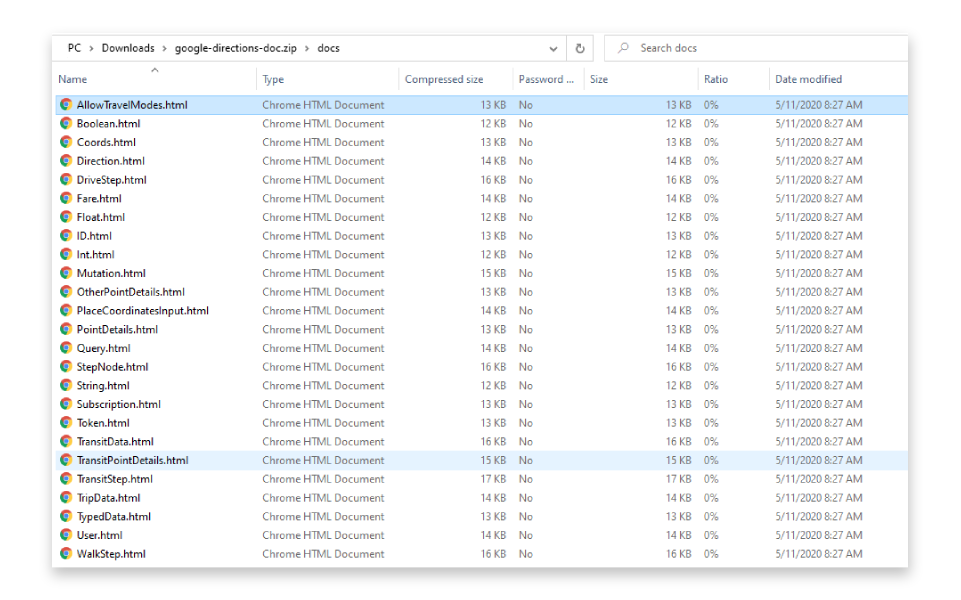

Despite project documentation is very important for both people who will use our software as well as fellow developers who will work on our code in the future, creating it is a tedious job and has always been a least like part of the software development process. 

Automatization has always been a holy grail for us here at **[GraphQL Editor](https://graphqleditor.com/)**. We believe that we should simplify the process by its automation where it's possible and focus on what we love the most - writing code.

##### Credits: [undraw.co](https://undraw.co/)

That's why in the latest update of GraphQL Editor we have presented the **[Dynamic Documentation Generation](https://app.graphqleditor.com/)** feature. GraphQL Editor's built-in documentation generator lets you focus on writing great schema code instead of constantly changing your documentation to keep it always up-to-date as it's generated directly from a **GraphQL schema in less than 5 seconds!**

Your fully documented **GraphQL schema** is just a couple clicks away, all you need is:
1. A valid GraphQL Schema designed or imported to GraphQL Editor (you can import from file or URL)
2. Click the 🚀 icon in the top-right part of the interface to deploy a *Mock Backend* for your schema
3. Click the 📖 icon in the top-left area to *Generate the documentation*

And that's all! Now you can enjoy your **Autogenerated documentation of your GraphQL Schema**.

Dynamically generated schema documentation will allow you to:

- keep your documentation up-to-date with zero effort,
- export your docs to a folder with static generated HTML files,
- save your precious time
- make your users and fellow developers happy!

**GraphQL Documentation Generator** is the first small milestone on our automatization road map. We believe it would save GraphQL users a lot of time allowing them to focus their force on crucial issues. Some major automatizations are yet to come so stay tuned! 
