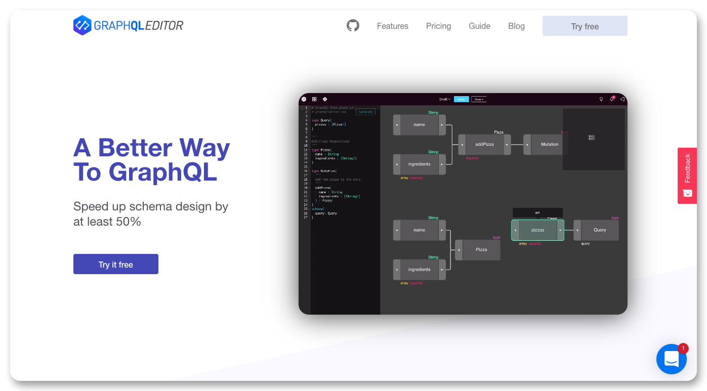

  
A while ago we have launched a new version of [GraphQL Editor](https://graphqleditor.com/) packed with features we believe can help developers save a lot of time & effort creating their GraphQL based APIs.

The [GraphQL Editor](https://graphqleditor.com/) is a supportive tool for both advanced GraphQL users as well as those making their first steps with GraphQL APIs. We still aim to solve two basic issues:

- make web development easier (both frontend & backend side)
- fix communication issues within a development team

## GraphQL Editor Features

Some of them are totally new features, some might be well-known for [GraphQL Editor](https://graphqleditor.com/) early adopters but undergone some serious upgrades. Among them, you can find such features as:

- **GraphQL IDE** - Prototype your schema or import your own and start working with GraphQL right away.

- **Built-in GraphiQL** - Built-in most popular in-browser IDE for exploring GraphQL. No need to set up your own environment.

- **GraphQL Libraries** -  An idea similar to schema stitching, a much stable approach. Create new GraphQL schema from multiple underlying GraphQL APIs without conflicts.

- **Instant Fake Backend** - Generate fake backend out of your schema in a no time thanks to Levenshtein algorithm.

- **Schema Visualization** - Import your schema to the editor. You can do it both by importing GQL file or copying directly code.

And a lot more! You can read about the features [here](https://graphqleditor.com/features).

