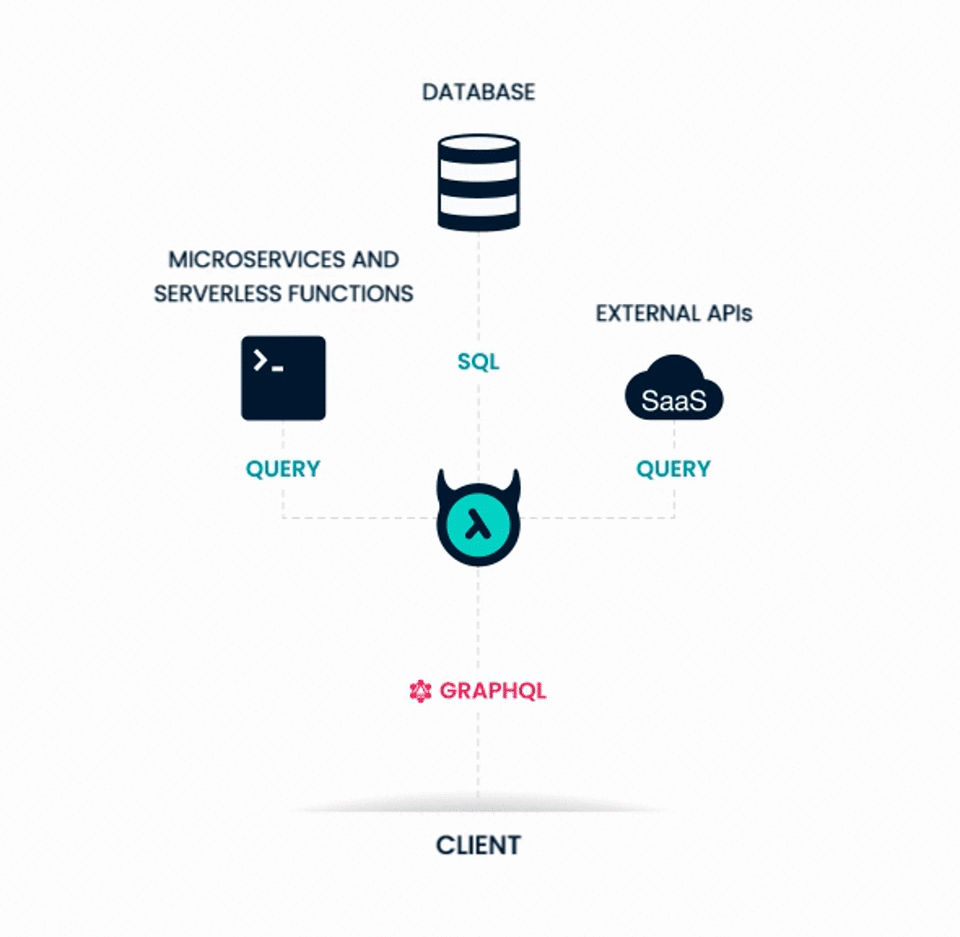

Another piece of great news for the GraphQL community surfaced last week. A San Francisco-based startup **Hasura Inc. announced a $9.9M Series A investment!**

Originally **Hasura** was a company aiming to help developers to simplify Kubernetes, but over time the team has realized that there was a much bigger problem they could address - data access. 

Application developers need better access to data sitting in databases.  The Hasura team wants to solve that issue with the help of **GraphQL**, so they have pivoted into an open-source service that takes your databases & with a little bit of configuration allows you to deploy a production-ready GraphQL backend.

##### Source: [hasura.io](https://hasura.io/)

Hasura's software downloads count is soon going to hit a stunning **30 million**! Its open-source software is used by the thousands of development teams in the biggest wide variety of industries including aerospace and healthcare. 

The new funding would let the company raise its headcount which currently oscillates around 40 employees. This would allow them to scale the number of supported database types as well as prepare for the launch of its new enterprise version which should appear on the market this year. As mentioned on **[Hasura's GraphQL blog](https://hasura.io/blog/hasura-2020-the-next-phase-of-our-journey/)** the biggest goals on their road map as for now are:

- Serve the needs of their production & enterprise users on a level better than ever before
- Deliver the GraphQL features that the Hasura community wants
- Expand the Hasura experience to other databases 
- Invest in Hasura community

---

### Keep up doing a great job, congrats to Hasura team! :)

---
