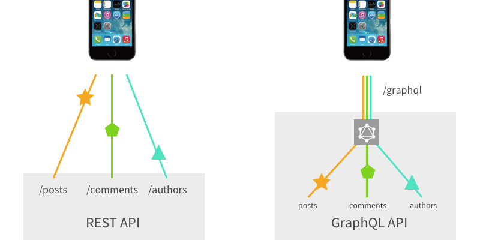
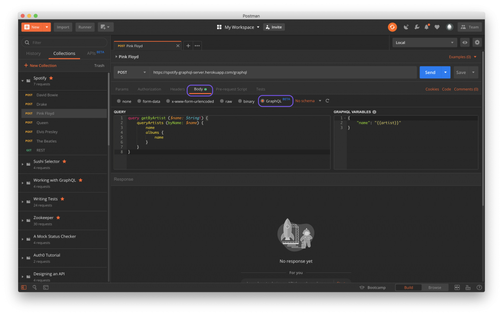

[GraphQL](https://graphql.org/) is a query language for APIs. It's becoming more popular because of the many benefits it offers compared to REST APIs, of which the most important one is smarter data fetching.

The querying model offered by GraphQL is showing its real power when it comes to working with large APIs. 

## GraphQL vs REST

GraphQL allows to specify what data we need in a query and that's what's going to be included in a response – nothing more, nothing less, just the data we asked for in a single request. On the other hand, when fetching for the same data with REST we would end up with multiple REST roundtrips ...

###### Source: [blog.apollographql.com](https://blog.apollographql.com/graphql-vs-rest-5d425123e34b)

 ... or imagine it this way:

###### Source: [crystallize.com](https://crystallize.com/comics/rest-vs-graphql)

## GraphQL in Postman

[Postman](https://www.getpostman.com/) joins the group of companies acknowledging the GraphQL qualities and has recently [announced the support for GraphQL](https://blog.getpostman.com/2019/06/18/postman-v7-2-supports-graphql/) in their service. The latest release of Postman v7.2 enables:

- sending GraphQL queries in the request body,
- GraphQL variables,
- GraphQL query autocompletion.

This is a great complement to the previous update which introduced schema support, all that combined makes it possible to create & store GraphQL schemas directly in Postman itself!

###### Source: [blog.getpostman.com](https://blog.getpostman.com/2019/06/18/postman-v7-2-supports-graphql/)