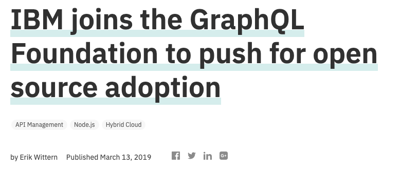
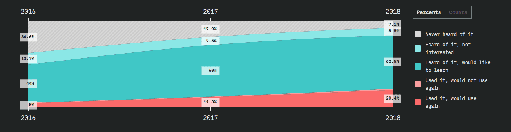

NPM posted [javascript predictions](https://blog.graphqleditor.com/javascript-predictions-for-2019-by-npm) at the begging of this year with GraphQL as an essential point. They mentioned it twice and stated that you'd have to learn GraphQL this year. We are in the middle of 2019, and I’ve decided to write my predictions focused only on future of GraphQL! There’re five bullet points:

# Lee Byron & foundation will make GraphQL technology an industry standard. 

In November 2018, GraphQL co-creator Lee Byron announced the creation of a GraphQL foundation. The GraphQL foundation from the start is supported by the Linux Foundation and aims to grow a neutral GraphQL ecosystem.

In March 2019 - The GraphQL Foundation declared a collaboration with the Joint Development Foundation to promote Open Source and Open Standards.  With JDF, the GraphQL community can create and popularize open standards more quickly than ever.

In March 2019 - GraphQL Foundation was joined by IBM to grow open source adoption. At IBM they’ve created OASGraph (a GraphQL wrapper for REST APIs), and they see several opportunities to make GraphQL enterprise-level, for example in API Management.

# Majority of the community will experience GraphQL. 

Analyzing the latest editions of The State of Javascript survey, we can spot massive growth in desire to experience GraphQL. In the most recent 2018 edition, just 7.1% of the respondent has never heard of GraphQL (matching to 36.% in 2016, and 17.9% in 2017). The 62.5% people say that they would like to learn GraphQL when 20.4% applied it and would use again (it's a 200% growth matching to 2017), and only 1.3% have already given it a try, but would not use it again.

The number of quality learning materials is growing thanks to the community-driven effort.  Resources like How to GraphQL, Learn Hasura and Open GraphQL are free, easy to use, and top quality.  Youtube is full of great videos - i.e., enterprise case studies from Shopify, GitHub, Medium, Docker, or Twitter at GraphQL Europe Conference.  Facebook also recently posted a video on how they used GraphQL with a new version of their UI on their developer page.

#GraphQL events will boom all over the globe!

Right now on meetup.com, there are 124 GraphQL meetups with over 61229 members all over the world. Last year we had two major conferences and a lot of smaller full-day events.  GraphQL Day has been organized three times in Toronto, Amsterdam, and southern Germany (Lake Constance).  Apollo Day happened twice last year (once in New York as well in San Francisco).  The most significant events for 2019 are already published: 

- GraphQL Conf Berlin - June 20-21, 2019
- GraphQL Summit SF - 29-31 October, 2019

We already past two amazing events: 

- GraphQL Day in Toronto (Feb) 
- GraphQL Asia in India (April)

# GraphQL will be a dominant API Management tool.

From home automation to apps like Zapier, the tech industry is taking more investment in APIs than ever. Combine this with a desire to learn GraphQL, and we may well have something of a  hurricane of adoption.

The number of big companies adopting GraphQL is growing. According to stackshare.io, there are more than 500 companies already adopted.  At GraphQL Europe last year, several big players presented case studies of how they’re using GraphQL: 

Smaller tech companies are usually influenced by what the “big boys” in tech are doing…not because they may need to understand it to plug into those APIs. As a result, the ongoing adoption of GraphQL by big companies is a step towards ubiquity.

#Schema First will be the dominant approach 

Schema first is the most popular approach with GraphQL. I believe it will remain this way as a dominant, cause of the few reasons. 

- Faster Development: having a common, accepted specification means that development is much faster than traditional methods would allow. Frontend teams can instantly start building components regardless of backend components.

- Choosing a constrained schema forces teams to talk to one another and to work more efficiently and closely by updating specification.

- Cleaner Development means cleaner codebase, in which expected functionality is presented cleanly without duplication of code and effort.

- All of these interests come together to one bigger picture of why schema-first is a great idea – a single source of truth.

Schema-first design is easy, and the benefits gathered from its adoption are huge can’t be ignored. A single source of truth is remarkably powerful, and should be done at the start in a development process – and adopting schema-first design is the easiest way to establish such a source.

