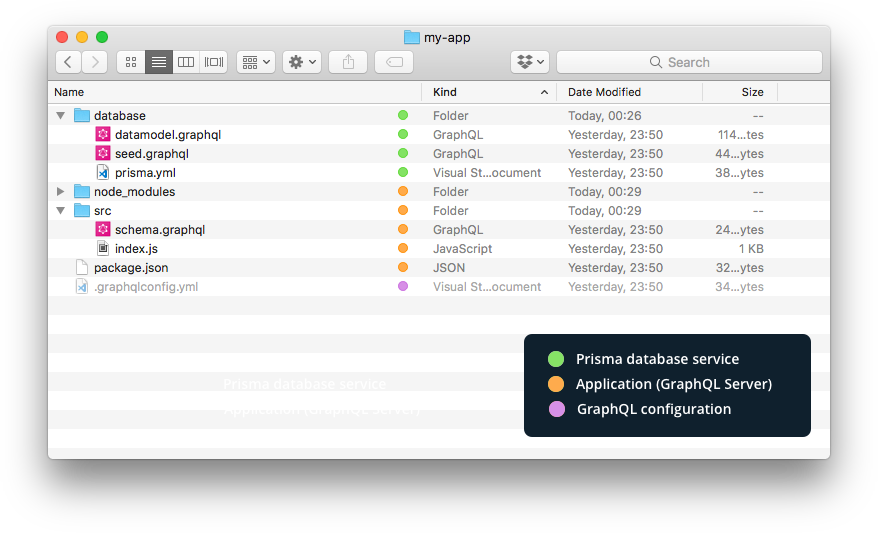

In the previous week, we looked into a [basic GraphQL Server implementation in TypeScript](https://blog.graphqleditor.com/graphql-server-typescript/). In this episode of ...
 >*GraphQL Server in under 5 minutes series*

... we will take a look at the full-stack template of React GraphQL app.


The Fullstack React GraphQL Boilerplate repo contains minimal, basic & advanced boilerplates, each allowing to bootstrap a GraphQL server in no time, whether you want to build a simple "Hello world!" or a fully-featured enterprise app.

||[Minimal](https://github.com/graphql-boilerplates/react-fullstack-graphql/tree/master/minimal)|[Basic](https://github.com/graphql-boilerplates/react-fullstack-graphql/tree/master/basic)|[Advanced](https://github.com/graphql-boilerplates/react-fullstack-graphql/tree/master/advanced)|
|-|:----:|:----:|:--------:|
|**Scalable GraphQL server:** The server uses graphql-yoga which is based on Apollo Server & Express|✔️|✔️|✔️|
|**Pre-configured Apollo Client:** The project comes with a preconfigured setup for Apollo Client|✔️|✔️|✔️|
|**GraphQL database:** Includes GraphQL database binding to Prisma (running on MySQL)|❌|✔️|✔️|
|**Tooling:** Out-of-the-box support for GraphQL Playground & query performance tracing|❌|✔️|✔️|
|**Extensible:** Simple and flexible data model – easy to adjust and extend|❌|✔️|✔️|
|**No configuration overhead:** Preconfigured graphql-config setup|❌|✔️|✔️|


### Getting started

The `minimal` boilerplate is only two commands away. Just go for:

```
npm install -g graphql-cli
graphql create my-app --boilerplate react-fullstack-minimal
```

Then `yarn start` or `npm run start` will start your basic GraphQL server on a `localhost:4000`.  Basic & advanced setup requires a couple more steps. 

After installing [GraphQL CLI](https://github.com/graphql-cli/graphql-cli), bootstrap GraphQL server with:
```
graphql create my-app --boilerplate react-fullstack-basic (or advance)
```
when prompted deploy the Prisma service to a `_public cluster_`, then navigate into `server` directory of your new project and start it:
```
cd my-app/server

yarn dev
```
this will run a server on localhost:4000, along with GraphQL Playground; open new terminal tab & navigate back to `my-app`, then run the app
```
cd ..
yarn start
```




##### Source: [react-fullstack-graphql](https://github.com/graphql-boilerplates/react-fullstack-graphql)


 
