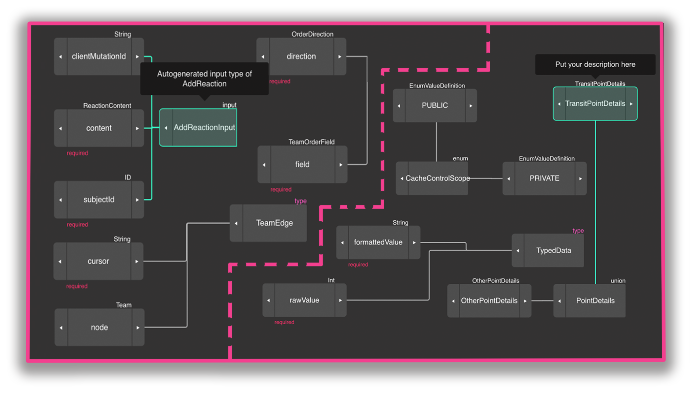
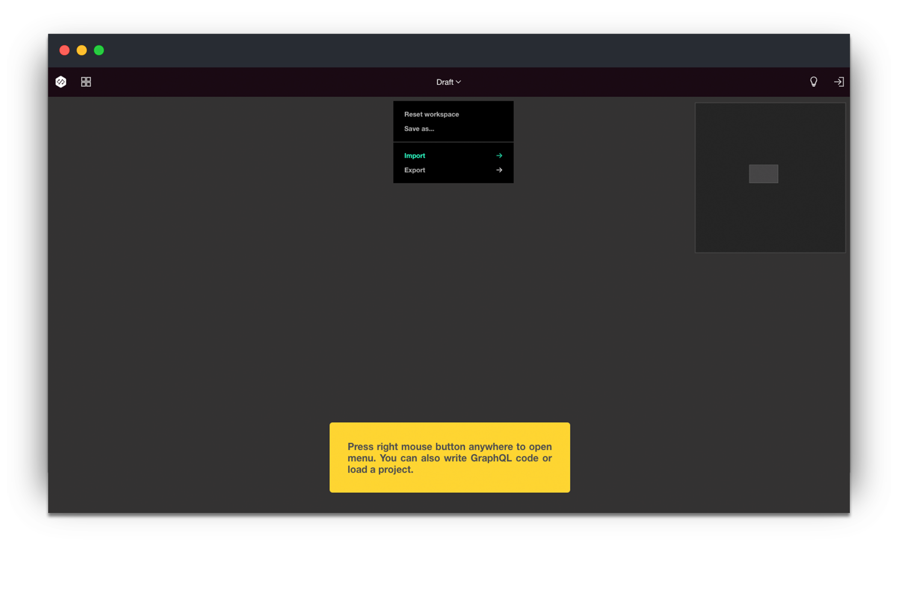
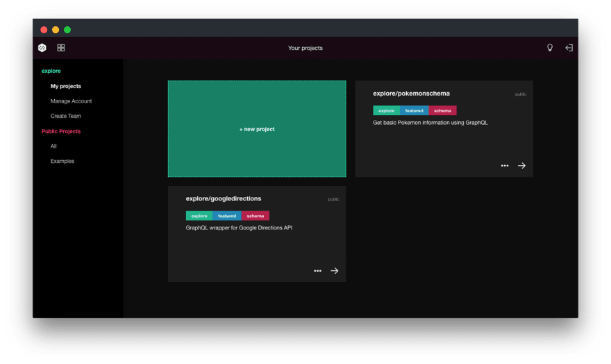
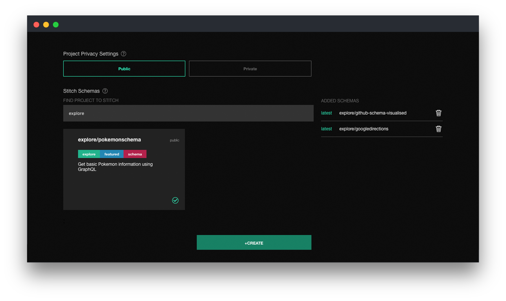
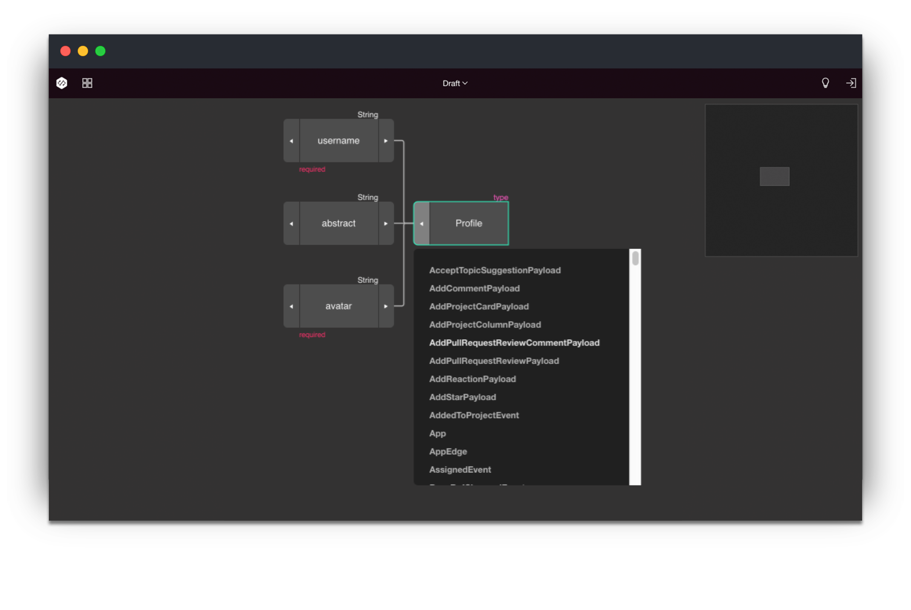

[Schema](https://blog.graphqleditor.com/graphql-schemas-and-types-part-1/) is the most important part of any [GraphQL](https://graphql.org/learn/) implementation. Schema is a centerpiece of any GraphQL service and defines the data-sets that can be queried by the client.

#### What's a schema stitching?
Imagine having a project where multiple teams are involved in each team:
- handles different aspects crucial to that service, 
- has to work on the schema to make sure that their part of the project would work as expected,
- must make sure that everything would work properly as a whole.

Cooperating on a huge project schema might be confusing...

###### A piece of [GitHub's schema](https://developer.github.com/v4/) containing 9182 lines of code in total!

Schema stitching is a process of merging multiple GraphQL schemas into one that can be queried. It’s an incredibly useful approach when it comes to building projects that require having both, unified & transparent access to a data split across multiple APIs (even without understanding where exactly it’s located). It can be also used to customize an existing GraphQL API like adding custom resolvers or overriding existing ones of third-party [GraphQL service](https://graphqleditor.com/) or adding more fields to an existing type whose data comes from another data source.

#### Performing a schema stitching can cause troubles

Although putting two schemas into one in a way where there are no name collisions seems quite simple, but that's not a real schema stitching. What we want to achieve is one consistent schema, merged from multiple underlying GraphQL APIs. That's a way more difficult, but what if a told you that there is an app for that?

#### A better way

The latest release of [GraphQL Editor](https://graphqleditor.com/) introduced an easy way to collaborate on schemas. All we need to do is:

**1. Add two or more schemas to our account - you can load them from URL or .gql file**

**2. Initiate a new project**

**3. Pick schemas we want to have access to in our newly generated schema from the list & create a project**

... **and that's it!**

As long as we have managed to avoid conflicts between our underlying schemas, we should have access to all their elements in our newly generated project 👌

