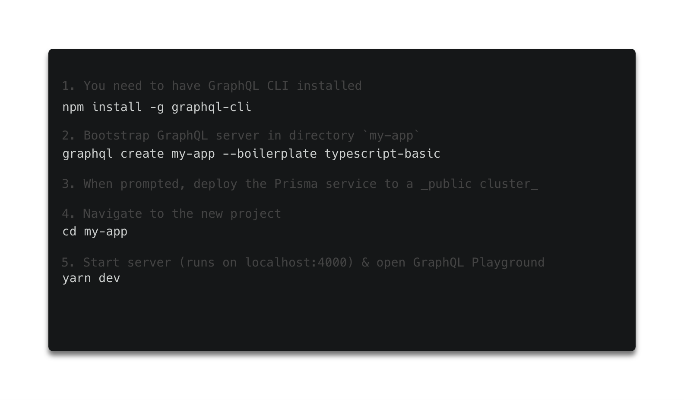
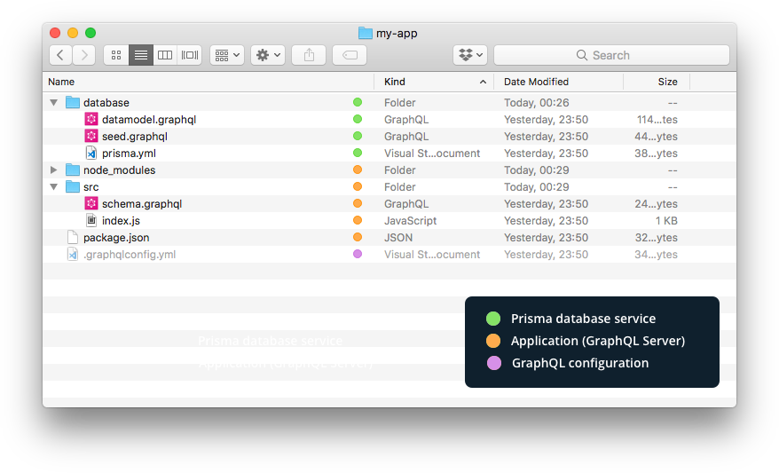

If you think that setting up a GraphQL server is a difficult task, [GraphQL Boilerplates ](https://github.com/graphql-boilerplates) Github repo will prove you that you're very wrong.

The best thing about GraphQL is that is can be used with any technology. Let's take a look at starter projects for most popular web technologies, provided by one of [the finest GraphQL devs](https://github.com/orgs/graphql-boilerplates/people). Now first off, let's take a look at [TypeScript](https://www.typescriptlang.org/).

### **TypeScript-graphql-server**

TypeScript is a typed superset of JavaScript that compiles to plain JavaScript, which popularity constantly rising. The TypeScript Boilerplate repo contains two starter kits:

- [Basic](https://github.com/graphql-boilerplates/typescript-graphql-server/tree/master/basic)
- [Advanced](https://github.com/graphql-boilerplates/typescript-graphql-server/tree/master/advanced)

Both allowing to bootstrap your GraphQL server with TypeScript within seconds. No matter if you need a **[Basic option](https://github.com/graphql-boilerplates/typescript-graphql-server/tree/master/basic)** for a simple personal project or **[Advanced boilerplate](https://github.com/graphql-boilerplates/typescript-graphql-server/tree/master/advanced)** with more features you are getting scalable, production-ready GraphQL server.

All projects are based on `graphql-yoga`, a GraphQL server library focused on providing the easiest possible setup.

Let's take a look at features available in those versions:

||[Basic](https://github.com/graphql-boilerplates/typescript-graphql-server/tree/master/basic)|[Advanced](https://github.com/graphql-boilerplates/typescript-graphql-server/tree/master/advanced)|
|-|:----:|:--------:|
|**Scalable GraphQL server:** The server uses graphql-yoga which is based on Apollo Server & Express|✔️|✔️|
|**Static type generation:** TypeScript types for GraphQL queries & mutations are generated in a build step|✔️|✔️|
|**GraphQL database:** Includes GraphQL database binding to Prisma (running on MySQL)|✔️|✔️|
|**Tooling:** Out-of-the-box support for GraphQL Playground & query performance tracing|✔️|✔️|
|**Extensible:** Simple and flexible data model – easy to adjust and extend|✔️|✔️|
|**No configuration overhead:** Preconfigured graphql-config setup|✔️|✔️|
|**Realtime updates:** Support for GraphQL subscriptions|❌|✔️|
|**Authentication:** Signup and login workflows are ready to use for your users|❌|✔️|

The setup is the same for both versions:

and our project structure will look like this:

##### Source: [Graphql-boilerplates](https://github.com/graphql-boilerplates/typescript-graphql-server)

