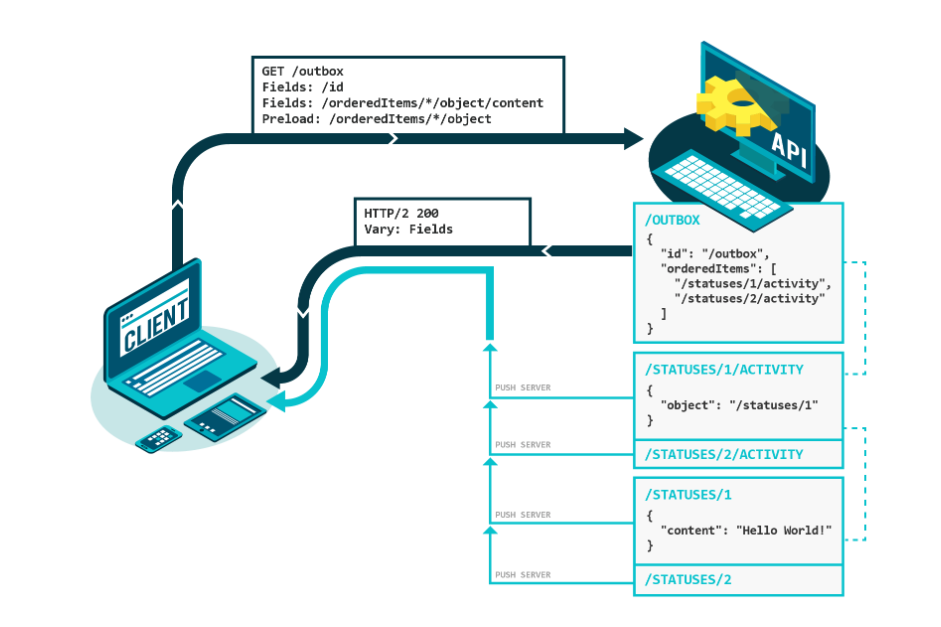

**GraphQL has been around for a couple of years now**, steadily increasing in popularity. With more and more companies adopting this language both internally and in external uses, this query language seems to have found a permanent spot in the global development landscape.
  
Despite all this expansion & improvement there are quite a few areas which require further work. I would like to list a few examples below.

## Serialization

Since performance is a huge factor when maintaining [GraphQL](https://graphql.org/) servers, establishing a guideline for transporting optimizations between projects would be a great development direction. 

In reality, one of the biggest drawbacks of GraphQL is that it uses a single large request, a blast from the HTTP/1 past. This can make it slow and clumsy, which is everything HTTP/2 aspires not to be. 

One of the biggest challenges for GraphQL engineers for the near future is keeping all of the benefits while getting rid of that unwieldy single request model. There have been numerous attempts at achieving this functionality, `@defer` and `@stream` come to mind, but none of them are without their drawbacks. Other examples include [Vulcain](https://github.com/dunglas/vulcain) an HTTP/2 Server Push to create fast and idiomatic client-driven REST APIs or [GraphQL over HTTP](https://github.com/APIs-guru/graphql-over-http) a working draft of "GraphQL over HTTP" specification.



###### Source: [vulcain.rocks](https://vulcain.rocks)

## Execution Algorithm Substitutes

GraphQL comes with a sophisticated execution engine which makes it the flexible tool it was designed to be. However, most clients don’t require the plethora of functions that come with this engine. Any streamlining that developers come up with will most likely improve a majority of GraphQL APIs. One such improvement could be [Graphql JIT](https://github.com/zalando-incubator/graphql-jit). A GraphQL execution using a JIT compiler provides much better performance.

####Benchmarks

```
$ ts-node -T ./src/__benchmarks__/benchmarks.ts skip-json
Starting introspection
graphql-js x 1,155 ops/sec ±1.55% (215 runs sampled)
graphql-jit x 5,961 ops/sec ±5.34% (216 runs sampled)
Starting fewResolvers
graphql-js x 14,313 ops/sec ±1.43% (224 runs sampled)
graphql-jit x 409,587 ops/sec ±1.08% (216 runs sampled)
Starting manyResolvers
graphql-js x 13,201 ops/sec ±1.50% (216 runs sampled)
graphql-jit x 229,025 ops/sec ±1.18% (216 runs sampled)
Starting nestedArrays
graphql-js x 108 ops/sec ±1.30% (216 runs sampled)
graphql-jit x 1,317 ops/sec ±2.38% (213 runs sampled)
Done in 141.94s.
```

## Miscellaneous opportunities for improvement

With the number of companies employing GraphQL growing ever so steadily, more and more not-so-obvious features are being exposed for what they are. It should not be seen as a bad thing, I believe that transparency is of great importance when it comes to tools like this. In fact, exposing certain weaknesses can lead to finding a solution and, consequently, improving the language as a whole. 

Some of the areas of GraphQL that need to be improved in 2020 are: 

- Without a firm hand in their management, GraphQL servers can become cumbersome and bloated
- HTTP caching is non-existent
- Earlier Facebook drawbacks (eg. FQL) can be spotted within GraphQL

Solving any of these would be a huge step into mainstreaming GraphQL. I’m convinced that with more and more brilliant engineering minds being put to work on GraphQL it will become dominant technology very soon.
