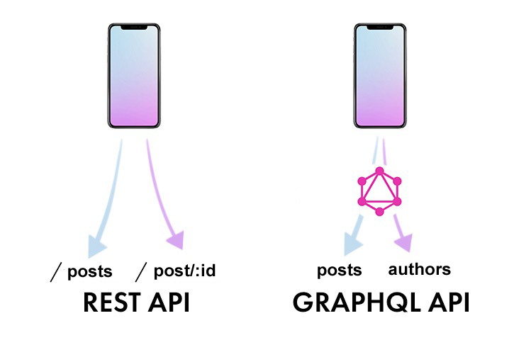

Any **"The Office"** fans here?

Do you remember the episode in which Jim put Dwight's stuff into a vending machine? This seems to be one of the best examples of the major difference between **GraphQL vs REST** according to, one of the GraphQL’s creators, **Lee Byron**.

  

## The Vending Machine Case

In that episode, Jim puts Dwight's belongings into a vending machine. Among them where coffee mug, bobble-head, nameplate, pencil cup ... and Dwight's wallet. Not to leave him empty-handed, Jim provided Dwight a bag of nickels. 

To retrieve his item from a vending machine Dwight should:
1. Use nickles to retrieve his wallet
2. Use quartes, halves to retrieve the first object
3. Repeat the procedure for every item he wants to retrieve

That's the way the vending machine operates. The pattern is similar to those we know from using the **REST API**. Imagine we want to retrieve posts from a company blog using rest:

and if you want to add authors you will need to fetch the from another resource (or modify your resource containing posts) you'll end up with two server requests instead of one (or extra work), and as you continue to scale, you may have even more requests to different endpoints in order to fetch all the needed data:

This is exactly our vending machine, where to get one item you need to press one button. If you want to get more items you need to get the one-by-one, repeating the procedure for different items.

## A vending machine with **special buttons**

Now imagine a vending machine with special buttons allowing you to get multiple things at once. This kind of super vending would help Dwight's get his stuff back super fast and it's exactly what **GraphQL API** does in terms of retrieving data.

In GraphQL we have a single endpoint being able to process complex requests. You query the **GraphQL server** for specific data and it will respond with what was requested, which results in fewer bits transferred over the wire.

