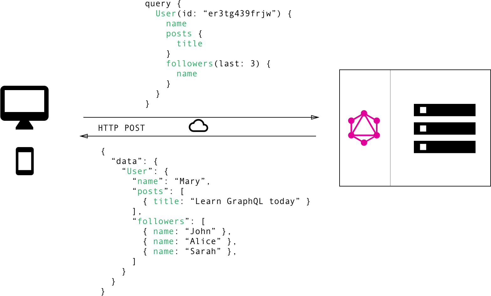

## Is GraphQL a nail to the REST coffin or a tool to empower your REST APIs?

REST has become the standard for designing web APIs. It introduced some great ideas like stateless servers or structured access to resources. Over the past years REST API was the best (only) available solution but due to the rapid evolution of web development REST wasn't able to keep up with changing requirements of the clients that access them.

In 2012  the GraphQL was developed. The main goal for GraphQL was to solve many of the shortcomings and inefficiencies that developers were experiencing while working with REST APIs.

## Data Fetching with REST vs GraphQL

When using a REST API you would gather the data by accessing multiple endpoints. In the example, you would first call endpoint to fetch the initial user data, then make a sperate call to fetch its all properties.

Source: [howtographql.com](https://www.howtographql.com/basics/1-graphql-is-the-better-rest/)

In GraphQL it’s handled totally different. The specification for queries is encoded in the client rather than on the server side. You would simply send a single query to the GraphQL server that includes the concrete data requirements and the server will respond with a JSON object where it will returns exactly what you required, nothing more.

Source: [howtographql.com](https://www.howtographql.com/basics/1-graphql-is-the-better-rest/)

## Nothing is perfect

New approach definitely has its pros and fixed many issues that developers complained about while working with REST, but there are some issues that trouble both technologies and on some fields REST is still a better solution. To summarize cons and pros take a look at below juxtaposition.

|                                    | GraphQL | REST API |
| ---------------------------------- | :-----: | :------: |
| No Over/Under Fetching Problem     |    +    |    -     |
| Easy Fetching of Related Resources |    +    |    -     |
| Great Client Performance           |    +    |    -     |
| Easy Caching                       |    -    |    +     |
| Scoped Includes                    |    -    |    -     |
| Easy Deprecations                  |    +    |    -     |