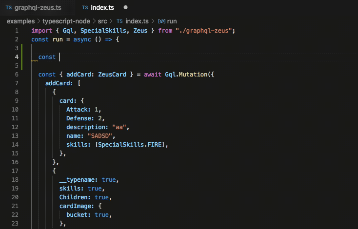
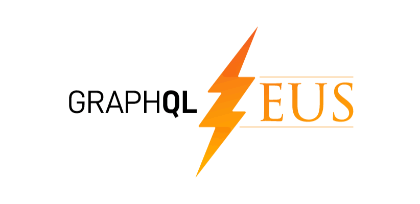

[GraphQL Zeus](https://github.com/graphql-editor/graphql-zeus) is an open-source ([MIT](https://github.com/graphql-editor/graphql-zeus/blob/master/LICENSE.md)) graphql client & code generator working with a **Browser, Node.js & React Native**. It provides an auto-complete client library for JavaScript or TypeScript supporting auto-completion for strongly typed queries. It's maintained by [Artur Czemiel](https://twitter.com/ACzemiel) (follow him on Twitter for latest GraphQL Zeus news & updates).

## Installation & Basic usage

To play with it use npm install:

```
$ npm i -g graphql-zeus
```

Zeus supports:
- Javascript (Browser, NodeJS, React Native)
- TypeScript (Browser, NodeJS, React Native)



[GraphQL Zeus](https://github.com/graphql-editor/graphql-zeus) provides many useful solutions among which you can find such as:

- **Chain** - Chain is the main function responsible for forming a GraphQL Query. It provides auto-complete in Zeus Syntax. Returned data is mapped accordingly to GraphQL query, so you get type-safe completion for both query and response in both *TypeScript* and *JavaScript*.


- **Aliases** - You can alias each query just like in GraphQL original specification. To use `alias` you just need to provide `__alias:{[YOUR_ALIAS]:YOUR QUERY}`

- **Selectors** - If you use same GraphQL query many times you can use `Selectors` which you can later inject into the `Chain` function


###JavaScript &  React Native:

```
$ zeus schema.graphql ./
```

### TypeScript:

```
$ zeus schema.graphql ./  --ts 
```

### Node.JS:

```
$ zeus schema.graphql ./  --node 
```

## Want to contribute? 
Awesome, just:
1. Fork this repo
2. Create your feature branch: `git checkout -b feature-name`
3. Commit your changes: `git commit -am 'Add some feature'`
4. Push to the branch: `git push origin my-new-feature`
5. Submit a pull request




