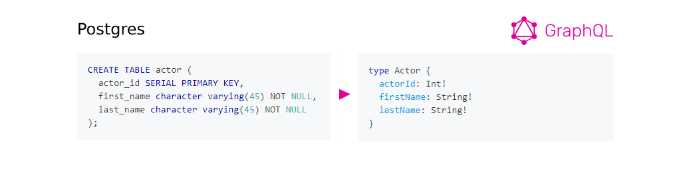
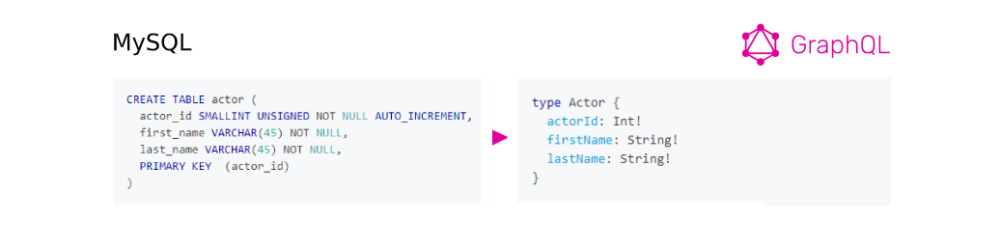
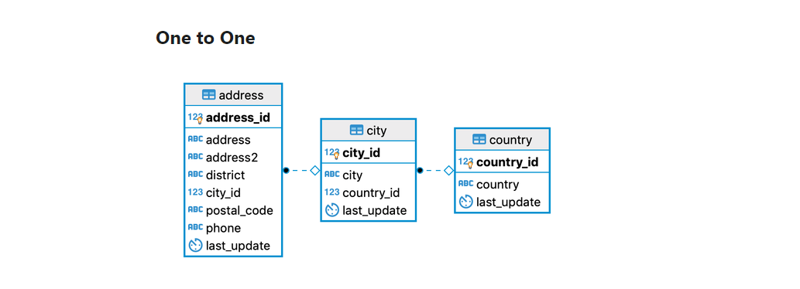
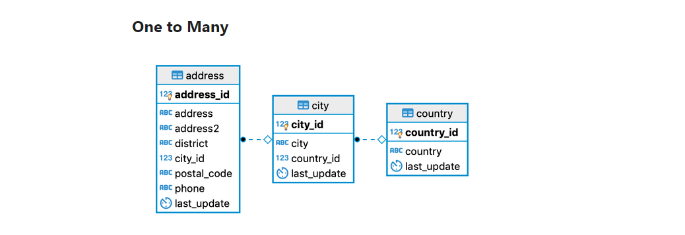
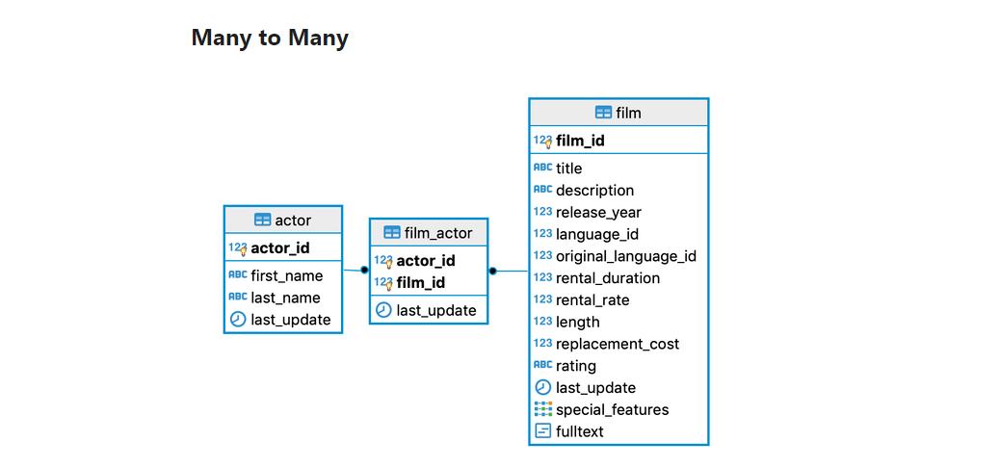

As GraphQL's premise was well-received by the dev community a new ecosystem of GraphQL-facilitating tools is growing rapidly. Libraries, editors, generators are showing up regularly having one thing in common, to make GraphQL adoption an easy-ride. GraphQLize is one of them. 

## What is GraphQLize?

**GraphQLize** is an open-source library JVM library written in Clojure with Java interoperability, aiming to simplify the process of exposing GraphQL APIs over relational databases like **PostgreSQL or MySQL**. How does it work? GraphQLize is generating the GraphQL schema & queries resolvers using JDBC metadata. So basically GraphQLize will help provides **fully-featured GraphQL implementation with just a few lines of code**.

## Getting started 

GraphQLize currently supports:
- Postgres 9.4+
- MySQL 8.0+

Getting started is quite simple. In general, you will need to:

1. Add the GraphQLize dependency to your project.
2. Initialize GraphQLize Resolver providing the Java SQL data-source.
3. Add a GraphQL API endpoint and use the GraphQlize resolver

The actual implementation of these steps will vary based on which language and framework you are using. Right now GraphQLize works with:
- Java,
- Kotlin,
- Scala,
- Clojure.

The detailed implementation guide is available in [GraphQLize official documentation](https://www.graphqlize.org/docs/graphqlize/intro).

## How it works

### Types & fields

**GraphQLize uses JDBC metadata to generate GraphQL types & queries**. It takes your database and for every table & view, it generates a GraphQL type. The `field` names of a generated GraphQL `type` represent the column names of the corresponding database table or view. GraphQLize generates the field name by converting the column name to its camelCase version. Standard GraphQL scalar types, as well as some custom scalar types, are supported.

###### Source: [graphqlize.org/docs](https://www.graphqlize.org/docs/graphql_schema/types-and-fields)

### Supported relationships

GraphQLize successfully identifies the relationships between tables in our database & use them to generate GraphQL schema containing appropriate fields.

###### Source: [graphqlize.org/docs](https://www.graphqlize.org/docs/graphql_schema/relationships)

## On its way to being production-ready

GraphQLize is in its alpha stage aiming to gather as much feedback from the communities as possible. GraphQLize codebase & API are not stable yet and there might be some breaking changes coming. GraphQLize team claims it will be production-ready in a few months so stay tuned!
