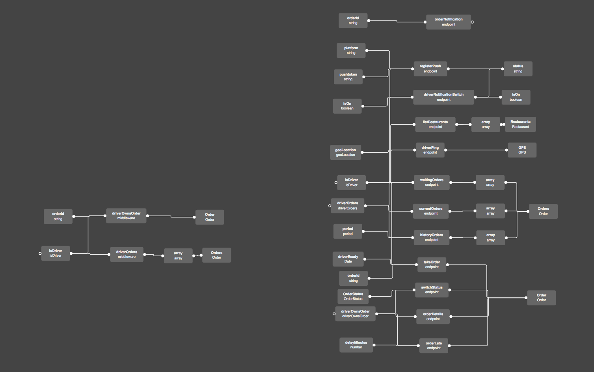

## Introduction

Have you ever heard about graphsourcing? Sure you have. UML system is a system where you make graph that define your system. Then you write code which must meet the requirements of your UML diagram. Then frontend developer also have to write frontend which is compliant with UML diagram and backend. Also graphic designer is the one that should know something about UML technology.

This is too much for me.

## Graphsourcing good way

Few months ago we created our own graphsourcing tool named [Slothking](https://slothking.online). Learning to use it may not be an easy thing, but benefits we have from graphsourcing are huge. First of all you need to create graph which defines your system. Then you generate frontend, backend, app and so on type definitions. So everybody knows whats going on

## One state to rule them all

With all the benefits of graphsourcing, the one I like most is one state. It is possible to make one state with same types on backend and frontend. With fabulous typescript autocomplete you get a superfast workflow where frontend and backend devs dont have to talk to each other.

## Proof of concept



As a proof of concept we rewrote our food delivery service system [Foodeli](https://foodeli.pl) in [Aexol](https://aexol.com). First phase of rewriting backend we finished ( 3 people team) in 8 hours + we had everything in one place.

It's a perfect example because Foodeli ecosystem consist of:

- Administrator panel, Web
- Restaurant individual panels, Web
- Driver app, iOS, Android
- Client app, Web

And all of them have to use the same backend system.

## Code

So how graphsourcing looks in practice?

### Backend

Generation command:

```bash
sloth sync nodets foodeli api.ts
```

Small Part of the generated code

```typescript
export type DriverType = {
  _id?: ObjectId
  name: string
  phone?: string
  Address?: ObjectId | AddressType
  pushToken?: string
  snsEndpoint?: string
  snsSubscriptiom?: string
  foodeliDriver?: boolean
  User: ObjectId | UserType
  PESEL?: string
  deliveryRate?: number
}
export type GPSType = {
  _id?: ObjectId
  geoLocation?: ObjectId | geoLocationType
  Driver?: ObjectId | DriverType
  created?: Date
}
```

Types for endpoint and middlewares are also provided

### Frontend

Generate api and state

```bash
sloth sync fetch-api foodeli api.ts
```

Part of frontend state

```typescript
const endpoints: {
    name: string;
    endpoints: {
      addOrder: (params:{props:         {
          comments?: string;
          paymentForm: string;
          totalPrice: number;
          readyin: number;
          phone: string;
          Address: Partial<AddressType> | string;
          token: string;
        },method?: 'GET'|'POST'|'PATCH'|'DELETE'|'PUT'}) => Promise<        {
          Order: OrderType;
        }>;
      myOrders: (params:{props:         {
          period?: string;
          token: string;
        },method?: 'GET'|'POST'|'PATCH'|'DELETE'|'PUT'}) => Promise<        {
          Orders: OrderType[];
        }>;
      restaurantOrderDetails: (params:{props:         {
          orderId?: string;
          token: string;
        },method?: 'GET'|'POST'|'PATCH'|'DELETE'|'PUT'}) => Promise<        {
          Order: OrderType;
          orderSteps: orderStepType[];
        }>;
      updateOrderStatus: (params:{props:         {
          status?: OrderStatus;
          orderId?: string;
          token: string;
        },method?: 'GET'|'POST'|'PATCH'|'DELETE'|'PUT'}) => Promise<        {
          Order: OrderType;
        }>;
    }
} = foodeli: {
    name: 'foodeli',
    endpoints: {
      addOrder: ({ props, method = 'POST' }) =>
        fn(`${host}foodeli/addOrder`, {
          props,
          method,
        }).then(res => res.json()),
      myOrders: ({ props, method = 'POST' }) =>
        fn(`${host}foodeli/myOrders`, {
          props,
          method,
        }).then(res => res.json()),
      restaurantOrderDetails: ({ props, method = 'POST' }) =>
        fn(`${host}foodeli/restaurantOrderDetails`, {
          props,
          method,
        }).then(res => res.json()),
      updateOrderStatus: ({ props, method = 'POST' }) =>
        fn(`${host}foodeli/updateOrderStatus`, {
          props,
          method,
        }),
    },
  },
}
//Small part of the state
export type foodeliExtensionState = {
  Order: OrderType;
  Orders: OrderType[];
  orderSteps: orderStepType[];
  Restaurant: RestaurantType;
  restaurantDeliveryZone: restaurantDeliveryZoneType[];
  geoParams: geoParams;
  deliveryCost: deliveryCost;
  dishCategoryList: dishCategoryType[];
  DishList: DishType[];
  dishVariantList: dishVariantType[];
  dishAdditionList: dishAdditionType[];
  Drivers: DriverType[];
  Address: AddressType;
  deliveryZones: deliveryZoneType[];
  Settlements: OrderType[];
};
```

So you just call generated endpoint with certain params on front end and you have typed response automatically injected to state using [state](). If everybody were using it , it would be a huge boost to Backend Driven development

### Corona SDK Apps

Yes we are writing apps in corona so we decided we should have Api generator for Corona SDK too. Here is a small part of it.

```lua
local json = require 'json'
local library = {}

function library:init(host,errHandler)
    self.errorHandler = errHandler
    self.host = host
    self.requestTab = {}
end

function library:removeRequest(id)
  for i=1,#self.requestTab do
    if self.requestTab[i] == id then
      table.remove(self.requestTab,i)
    end
  end
end

function library:addRequest(id)
  table.insert(self.requestTab,id)
end

function library:cancelRequest(id)
  for i=1,#self.requestTab do
    if self.requestTab[i] == id then
      network.cancel( self.requestTab[i] )
      table.remove(self.requestTab,i)
    end
  end
end

function library:cancelAllRequests()
  for i=1,#self.requestTab do
    network.cancel( self.requestTab[i] )
  end
  self.requestTab = {}
end
function library:aws_sns_registerDevice(callback,token,platform,applicationArn, method)
  local requestId
  if method == nil then
    method = "POST"
  end
  local function networkListener( event )
    self:removeRequest(requestId)
      if event.isError then
            if self.errorHandler then
                self.errorHandler(event)
            else
                callback(event)
            end
      else
      if callback then
        callback(event)
      end
    end
  end
  local headers = {}
  headers["Content-Type"]="application/json"
  local params = {}
  params.headers = headers
  local bodyParams = {
    token=token;
    platform=platform;
    applicationArn=applicationArn;
  }
  params.body = json.encode(bodyParams)
  requestId = network.request(self.host.."/".."aws_sns".."/".."registerDevice", method, networkListener, params )
  self:addRequest(requestId)
end
```

## Conclusion

Graphsourcing is so powerful man, all this code has been generated from visual graph!

I presented only micro parts of it as it is a huge one!

## Alpha user?

If you want to become an alpha user, mail me for instructions or you can start your self for free, just by using few repos( as this is oopen source technology )

[Slothking app](https://app.slothking.online)
[CLI](https://github.com/slothking-online/sloth)
[Boilerplate to start with backend](https://github.com/slothking-online/backend-nodets-boilerplate)
[State manager based on unstated](https://github.com/slothking-online/state)
