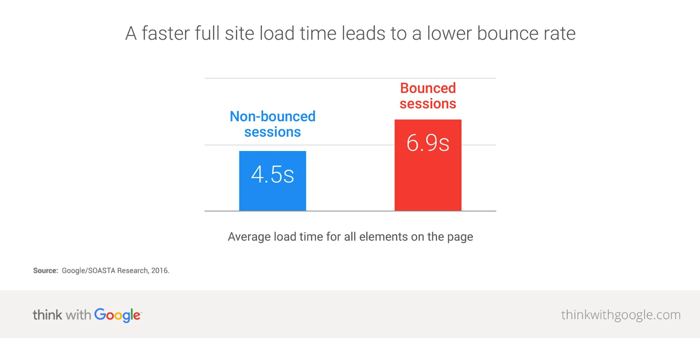

As you all know, a cache is a hardware or software component that stores data (usually as a result of an earlier computation) so that future requests could be served faster. Caching is considered by many developers as one of the GraphQL weaknesses. Is that true? And why caching is so important?

## The importance of caching
We implement caching to increase the performance of our applications and decrease loads on our servers. Google observed that 53% of page visitors leave the page if it takes more than three seconds to load. A neural network trained to predict user behavior with 90% accuracy revealed that as page load time goes from one second to five, the probability of bounce increases by 90%. 

## GraphQL vs REST
Caching is an integral part of the HTTP specification that REST APIs can use. GET vs. POST caching semantics is clearly defined so that browser caches, intermediary proxies, and server frameworks can follow. Because of the way GraphQL operates, it does not follow the HTTP specification for caching and instead uses a single endpoint, so it is up to the developer to make sure that caching is implemented properly for non-mutable queries. The GraphQL page even frankly suggests that the client should take care of the caching on its end. Fortunately, there are some libraries that can help GraphQL solve this problem with the help of developers.

## GraphQL Libraries that can help
Choosing one of them will help you develop more performance-focused applications and reduce the number of sessions being bounced:

- [FlacheQL](https://github.com/FlacheQL/FlacheQL) - [FlacheQL](http://www.flacheql.io/#/) offers partial retrieval of cached data based on search parameters — a feature that no other [GraphQL](https://graphql.org) library offers. Larger implementations like Apollo and Relay can only cache data based on GraphQL query fields. 

- [Apollo GraphQL](https://www.apollographql.com) - [Apollo](https://www.apollographql.com) includes a default cache implementation for Apollo Client 2.0. It's called InMemoryCache and it is a normalized data storage that supports all of Apollo Client 1.0’s features without the dependency on Redux. You can read more about its use-cases [here](https://www.apollographql.com/docs/react/advanced/caching.html#recipes).

- [Relay Library](https://github.com/graphql/graphql-relay-js) - [Relay](https://facebook.github.io/relay/) faciliate creation of Relay-compliant servers using the GraphQL.js reference implementation of a GraphQL server.

## Conclusion
GraphQL definitely needs a better caching system to win the GraphQL vs REST war.
