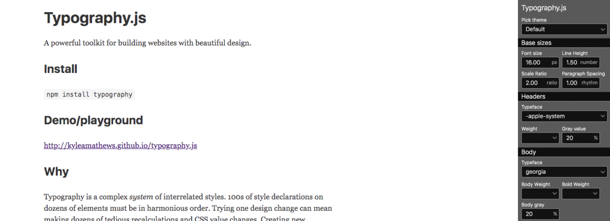

### The importance of a typeface

Communication plays a vital role in web design. In the web context communication usually means text. As the major part of the information that a web site is trying to communicate to an end-user is in the form of written language, modern web design started to put more and more pressure on typography which started becoming a principal element of [designs system](https://blog.graphqleditor.com/Design-System/) in the last years.

Good typography is a factor that distinguishes a mediocre website from a decent one by making the act of reading more pleasant, which eases communication of key content to a user.


##### Source: [Understanding typography](https://material.io/design/typography/understanding-typography.html#type-properties)

### Typography JS

Implementing a tiny design change can become a real nightmare as it might turn into making tons of recalculations & [CSS](https://en.wikipedia.org/wiki/Cascading_Style_Sheets) changes. So how to keep your [Typography](https://material.io/design/typography/understanding-typography.html) tight? 

Typography.js comes with help, making it easier to create a unique design for your project as all you need to do is provide a configuration to the [Typography.js API](https://github.com/KyleAMathews/typography.js) and it will generate CSS for all block and inline elements. The TypoGraphy.js will take care of many details i.e. making sure that the spacings are nice, which will enhance the general UX value of your product.

### Usage

**Typography.js themes** are simple Javascript objects & **Typography Plugins** are functions extending or modifying the core Typography engine. These functions can modify the styles of different website elements.

Let's take a look at basic JS usage:

```jsx
import Typography from 'typography'

const typography = new Typography({
  baseFontSize: '18px',
  baseLineHeight: 1.45,
  headerFontFamily: ['Avenir Next', 'Helvetica Neue', 'Segoe UI', 'Helvetica', 'Arial', 'sans-serif'],
  bodyFontFamily: ['Georgia', 'serif'],
  // See below for the full list of options.
})

// Output CSS as string.
typography.toString()

// Or insert styles directly into the <head> (works well for client-only
// JS web apps.
typography.injectStyles()
```

### How to use themes

Currently, there are around 30 themes maintained, that are ready to pick up for your project. The themes are published separately as NPM packages.  Let's take a look at themes usage on a [typography-theme-github](https://github.com/KyleAMathews/typography.js/tree/master/packages/typography-theme-github) example. First, you need to save the package to your project using:
```
npm install --save typography-theme-github
```
Then import and pass into Typography when initializing
```jsx
import Typography from 'typography'
import githubTheme from 'typography-theme-github'

const typography = new Typography(githubTheme)
```
As previosuly mentioned, themes are javascript object that can be easily custamized i.e. if you want to change the font size of a github theme just:

```jsx
import Typography from 'typography'
import funstonTheme from 'typography-theme-github'
githubTheme.baseFontSize = '22px' // was 20px.

const typography = new Typography(githubTheme)
```

You can play with available themes here:
http://kyleamathews.github.io/typography.js/



