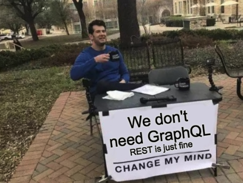
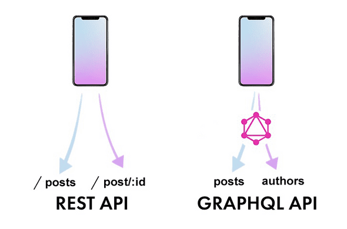
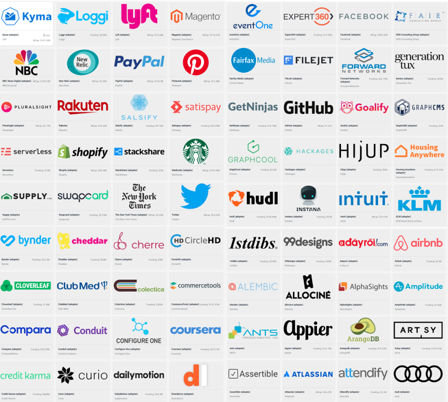

We are digital explores. We love to work on cutting-edge technologies & new frameworks. That's a fact. [GraphQL](https://graphql.org/) is definitely one of those but when it comes to implementing new tech in commercial projects you need to convince your team or Lead Developer that it's worth giving a shot.

How to do it? It obviously not that easy. First of all, you need to explain what exactly is GraphQL and how your project would benefit from it. Then you need to answer some questions ... a lot of questions! 

## Let's begin with "What's GraphQL?" part...

#### What's GraphQL?

GraphQL is a data query language and execution engine open-sourced by Facebook in 2015. Its main benefit is that it works with any backend service. GraphQL API is a new architectural approach that heavily reduces the size of your API & the number of API calls.

If you want to read more about the GraphQL check [graphl.org](https://graphql.org/) or [howtographql.com](https://www.howtographql.com/).

## Now let's move to "You probably will hear that" part ...

#### Why don't stick to REST?

REST no longer gets it done. This observation was made by the Facebook team back in 2012 working on Facebook mobile apps. Standard REST APIs require the frontend team to call multiple URLs to fetch all the data they need, GraphQL uses only one endpoint which results in better performance on slow cellular connections which is still a very important issue.

#### Why should we use it?

Where to start? GraphQL is an interesting approach with much to offer. There are a lot of pros of GraphQL you can pitch to your team. These should do the job:

- **Performance** - with GraphQL you don't have to define dozens of service end-points to fetch data. GraphQL lets you request the amount of data you actually need it, which is difficult to achieve with REST-based services. This greatly improves performance, reduces the number of round trips to the server & reduces the amount of data transferred over the wire.
 
- **Faster prototyping** - GraphQL reduces the amount of code you need to write to achieve simple features. Less code means fewer bugs.

- **Great tooling** - GraphQL's popularity created an ecosystem of different supplementary tools bridging the implementation gap & [making GraphQL easier to adopt](https://graphqleditor.com/).

#### Is GraphQL secure?

GraphQL is no different from any other service end-point. As long as you will follow some of the basic security good-practices you can sleep soundly.

#### Is it production-ready?

Let's not beat around the bush - [YES#1](https://medium.com/airbnb-engineering/how-airbnb-is-moving-10x-faster-at-scale-with-graphql-and-apollo-aa4ec92d69e2), [YES#2](https://medium.com/paypal-engineering/graphql-a-success-story-for-paypal-checkout-3482f724fb53), [YES#3](https://open.nytimes.com/react-relay-and-graphql-under-the-hood-of-the-times-website-redesign-22fb62ea9764).
Not enough? Here are a couple more ...

##### Source: [graphql.org](https://graphql.org/users/)

---
