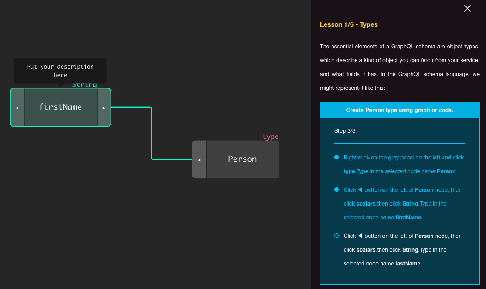

If you would like to start your adventure with the [GraphQL](https://graphql.org/) but you are not sure how we have prepared a small interactive tutorial for you to familiarize yourself with basic **GraphQL syntax** and its elements.

During six short lessons, you will learn the basics allowing you to start working on your first **GraphQL schema** like:
- GraphQL Types
- Queries
- Mutations
- Inputs
- Enums

Click the button below and you will be redirected to the **GraphQL Interactive tutorial** :

If you are looking for more **GraphQL resources** make sure to check:
- [GraphQL Official Documentation](https://graphql.org/learn/)
- [How to GraphQL](https://www.howtographql.com/)

Happy learning!

