  
[Draqula](https://draqulajs.com/) is a lightweight GraphQL client, perfect for smaller and simpler React apps. Most web apps don't need higher-order components, subscriptions or local state management, that’s where Draqula comes in. It focuses on simple apps and execution using React hooks for building queries and mutations.
 
The main focus of Draqula is maintaining simple API and codebase as well as being as straightforward as possible by relying on hooks. It also has basic [cache implementation](https://blog.graphqleditor.com/grapqhl-vs-rest-caching/) and automatic retires for network errors and failed queries. Higher order or render-prop components, and subscriptions will not be supported to maintain the simplicity of the client.  
  
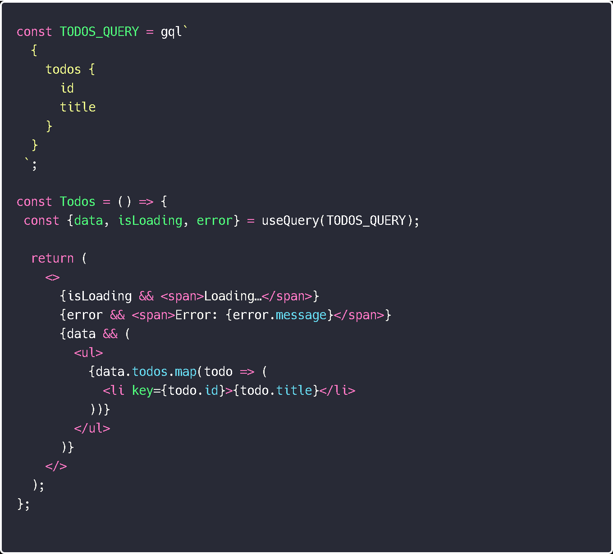  

## Set it up

Installing via Yarn or npm is really simple and Draqula is ready to go in a matter of seconds  

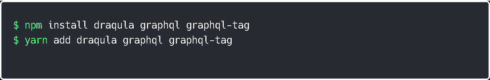

To start it up attach the URL to your [GraphQL](graphqleditor.com) endpoint

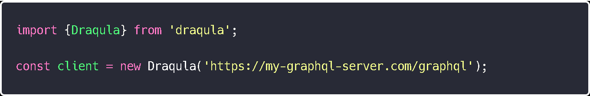  

Now to make Draqula available to React components in your app use `DraqulaProvider`. Then find the `render()` function and modify it to include Draqula, like this:

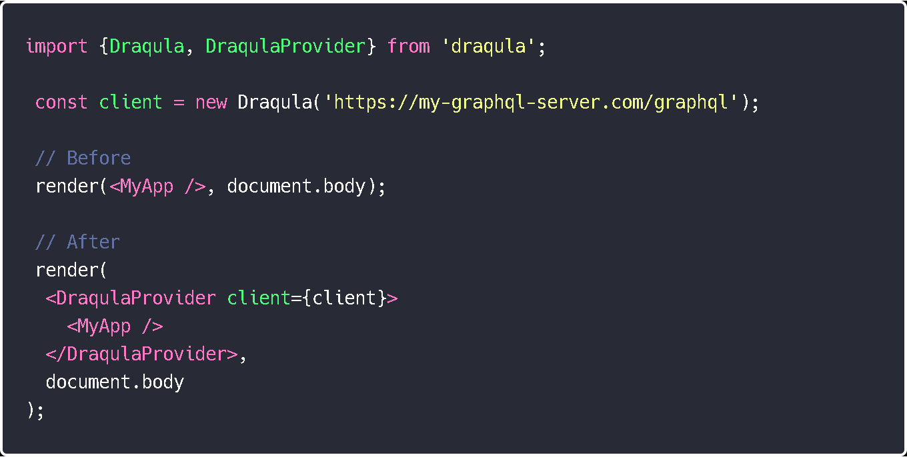  

Now all you need to do is run a [GraphQL]() query in your components:

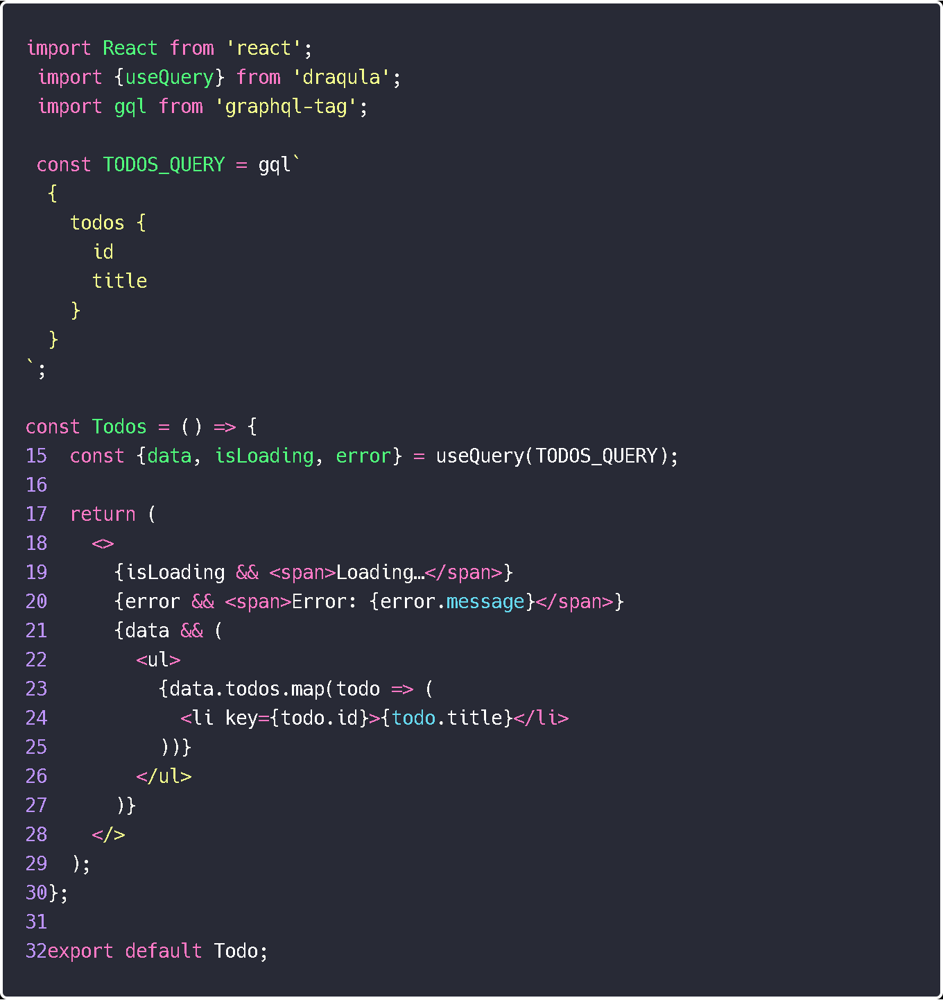

## Take it for a spin

Queries have to be made using the `gql` function from the `graphql-tag` module and have to be defined outside your component. Here’s an example of a basic query without variables:

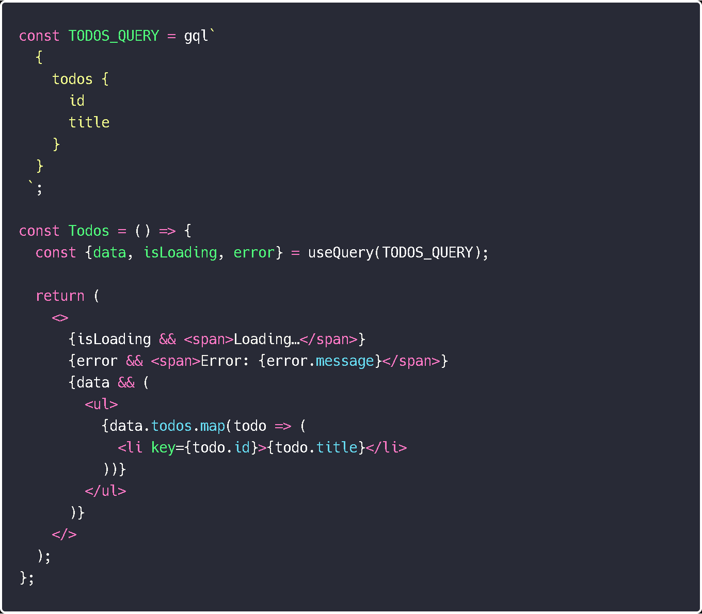  

Now let’s try a Query with a variable by simply adding another argument to `useQuery`:

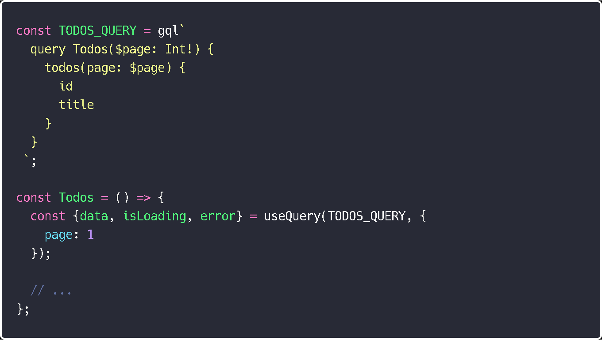  

Similarly Draqula uses a `useMutation` hook for mutations:

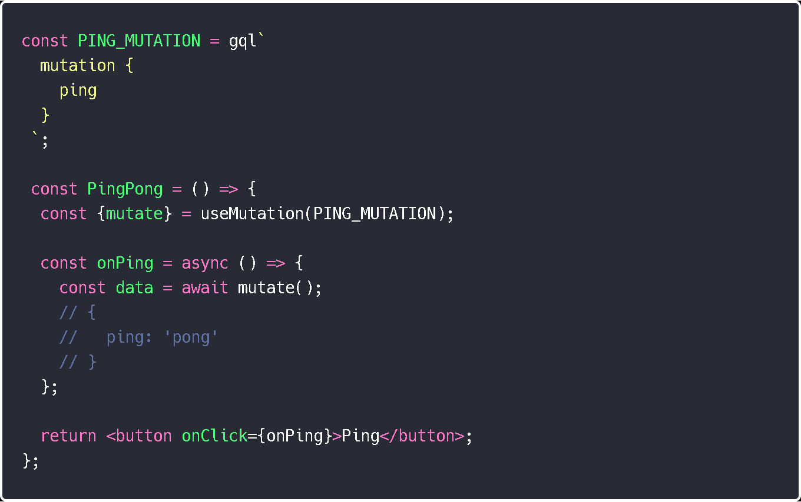

Just like with queries mutations can also use variables, the difference is you don't add them into `useMutation` and use a `mutate` function instead:

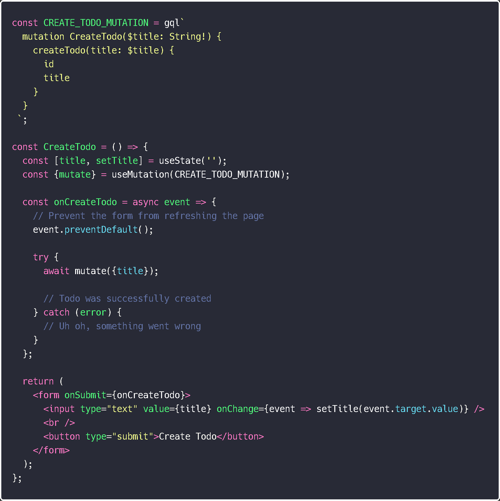

 

## Rounding it out

Draqula has some additional functions like basic caching and refetching. For example if you previously executed a query with a `page = 1` variable the next time you run the same query with that variable Draqula will return the data last stored for that query. It will also send a refetch request in the background in case it’s outdated. Caching can be turned off for an individual query or globally.

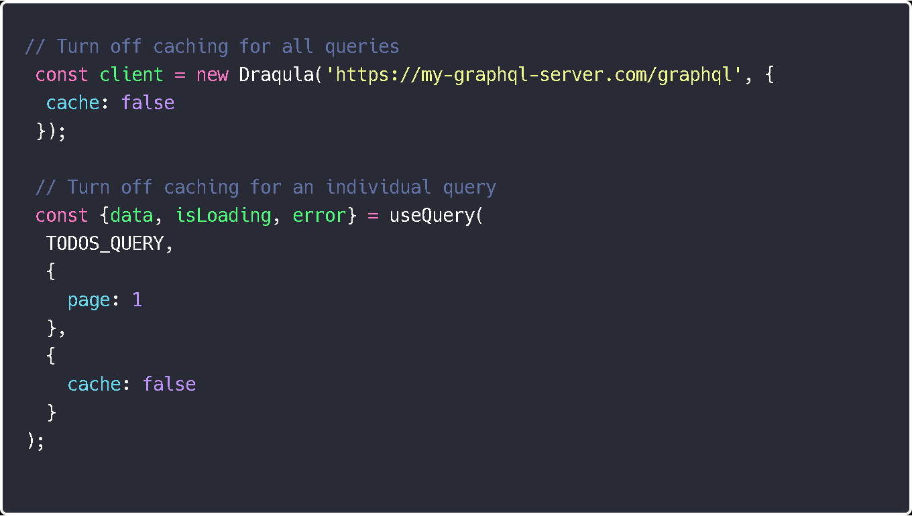  

Refetching can also be done manually:

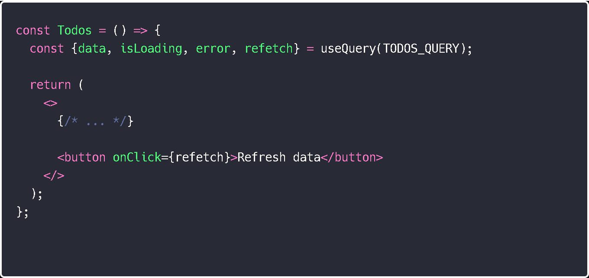  

Draqula also has a `fetchMore` function in case your app needs to add more data to the list without deleting current data.

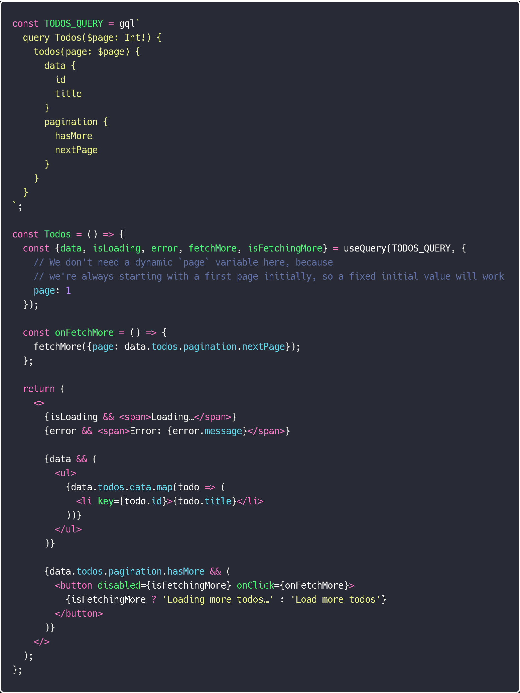  

and a merging function if you want to merge new data with the current one

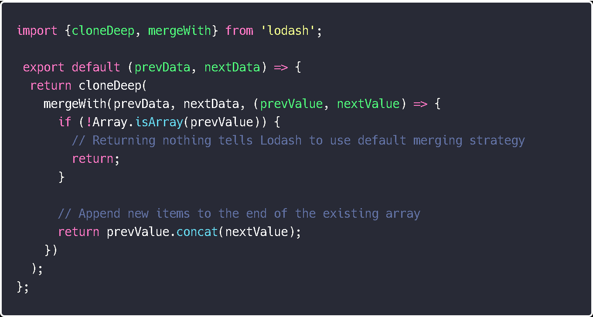  

Overall Draqula is a handy little tool that’s quick and easy to use and the developer is still working on adding new features, so give it a try and see for yourself.
