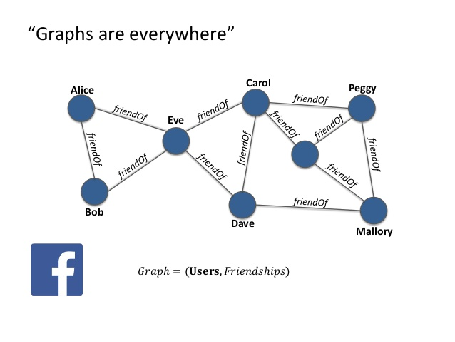
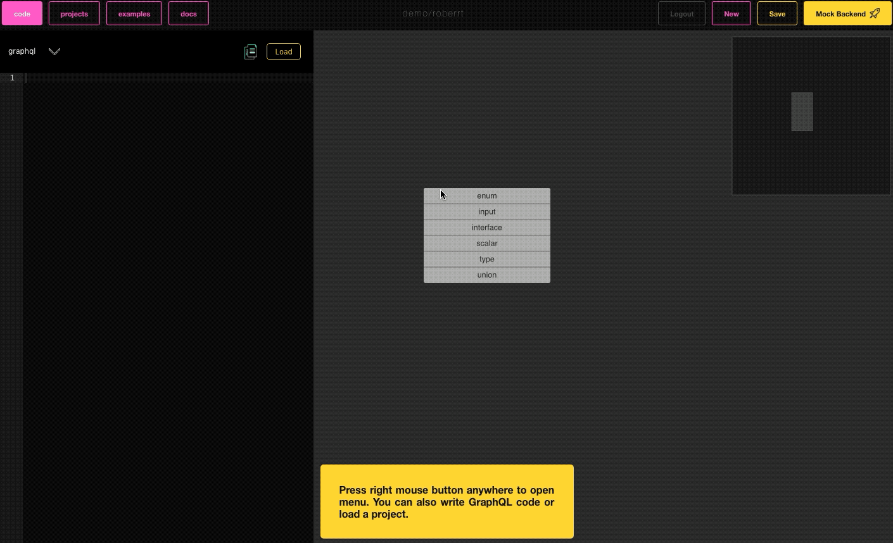
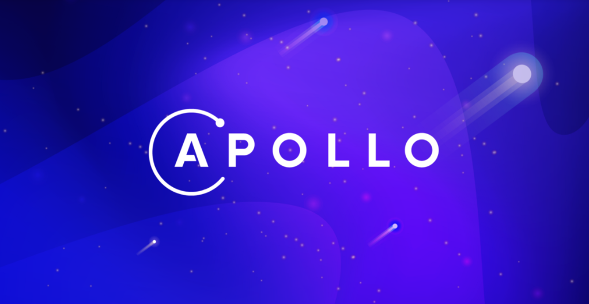

Developing APIs has always been a crucial task for any project. A well-designed API must be flexible and scalable as it always evolves with time. The urge for improvements led to the explosive growth of the data graphs popularity in the last years. This is great news for GraphQL as a lot of companies have started adopting it in their projects. To not be groundless:

- **Audi's e-tron car** with a data graph
- The front page of **NY Times** is based on a data graph
- **Airbnb** uses data graph across all their apps both web & mobile

... the list goes on and on.

## The benefits of data graph

Graphs are everywhere! So what are the main benefits of the data graph structure? First of all, it provides easier access to the date, by better, more clear structure.

This leads to another huge benefit of using data graphs which is a better data understanding which effect in faster project onboarding and more efficient collaborations overall as we can clearly see a cause-effect relation. It's worth mentioning that graph structures are a lot easier to visualize, especially with modern tooling available on the **data graph/GraphQL** market like [GraphQL Birdseye](https://github.com/Novvum/graphql-birdseye) or [GraphQL Editor](https://graphqleditor.com/).

The benefits don’t stop there and go further beyond to faster development, higher code automation, more consistent user experiences across multiple apps and a lot more.

## A bright future

There is no doubt that people in [Apollo](https://www.apollographql.com/), the most popular GraphQL implementation, fully understand the benefits of the data graph structure. Fortunately, more and more people start to see qualities offered by data graphs. Recently, the big news has seen the daylight, the information that ["Apollo raised $22 million"](https://www.businesswire.com/news/home/20190612005247/en/Apollo-Raises-22-Million-Give-GraphQL-based-Data), this shows that also VCs' noticed a business opportunity in GraphQL technology which gives more confidence that GraphQL might be the future of APIs. What do you think?

