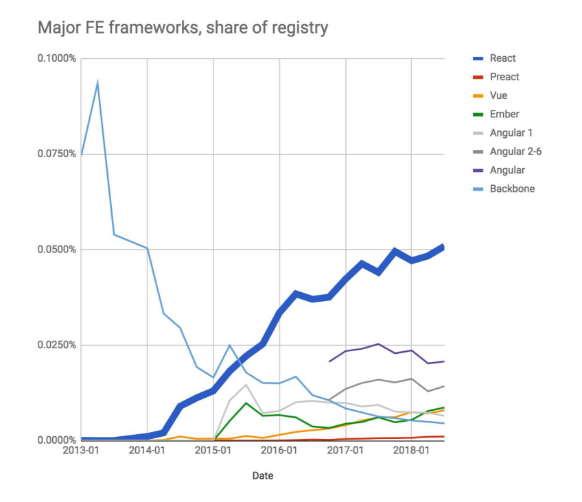
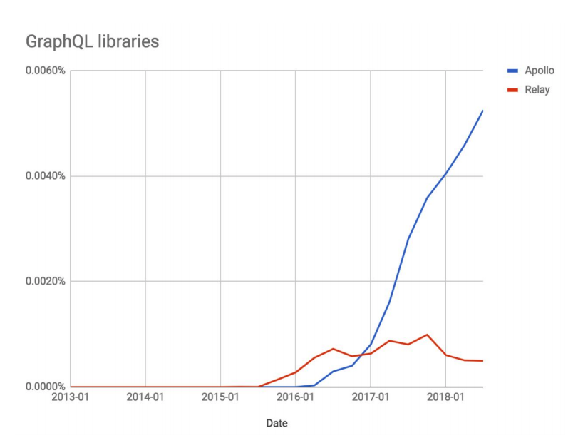

npm, Inc., which runs the world’s biggest software registry and maintains the ‘npm’ software development tool has shared some very interesting read about insights and predictions about JavaScript for 2019 and it's going to be a great year for GraphQL!

The co-founder and Chief Operating Officer of npm during his lecture at the Node+JS Interactive 2018 event made some predction about there direction the web development sector is heading, the future of JavaScript and more. He also covered some development tools used within the npm community, discussed best practices, rising-star frameworks and those fading into oblivion. The predictions were made based on insights reflect feedback from 16,000 developers on JavaScript usage trends and best practices and the top four predictions are:

## 1: You will abandon one of your current tools

Nothing lasts forever and this is very true for frameworks and tools in JavaScript. The average peak phase of popularity lasts from three to five years and is followed by a slow decline, as organizations have to maintain their existing applications, but have already moved to newer frameworks for new projects. For developers, this basically means that it is better to learn new frameworks than to stick to their current tools too hard.

## 2: Somebody on your team will bring in TypeScript ...

... And you should be thankful! A survey of more than 16,000 developers showed that 46% of respondents used Microsoft's TypeScript - a proprietary JavaScript superset that compiles to regular JavaScript. The main reason for this conversion rate by enthusiasts may be the additional security TypeScript provides by type-checking. Adopting TypeScript in 2019 can give you real value, especially if you are a member of a larger team.

## 3: React will be the dominant framework in 2019; you’ll need to learn GraphQL

Despite the fact that React’s growth has slowed down during 2018, it still continues to dominate the web scene. The 60% of npm survey respondents said they are using React. The npm predicts that in 2019 more people will use React for building web applications which will lead to more tutorials, cases and bug's being fixed.

Source: [This year in JavaScript by npm](https://img04.en25.com/Web/NPMInc/%7B82407d56-74c7-4fde-a3b7-59a2df23544f%7D_This_Year_In_JavaScript__2019_Predictions_Copy.pdf)

## 4: You’ll need to learn GraphQL

The 2019 will be the year of GraphQL. There is a strong likelihood that developers will use it in new projects in 2019 and afterwards. GraphQL, tracked by its most popular client library Apollo, continues to explode in popularity. GraphQL it’s going to be a technical force to reckon within 2019.

Source: [This year in JavaScript by npm](https://img04.en25.com/Web/NPMInc/%7B82407d56-74c7-4fde-a3b7-59a2df23544f%7D_This_Year_In_JavaScript__2019_Predictions_Copy.pdf)

## Tl;dr

GraphQL, React and TypeScript are the three technologies you will need to learn in 2019!

